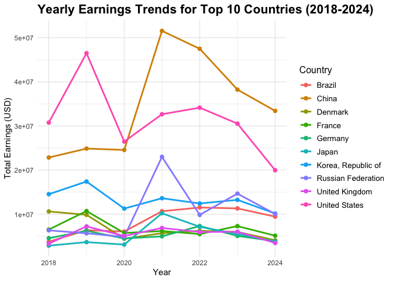

The trend for e-sports players’ earnings and the story behind
e-sport(Worldwide)
================
Xinghao Qiao
2024-11-30

# Motivation

This project aims to analyze the evolving landscape of e-sports,
focusing on patterns in player earnings and engagement strategies across
demographics and game types. By examining trends in income, age and
gender variations, and tournament success, this study will reveal key
factors influencing players’ financial and social adaptability in a
digital-first environment.

# Related Work

We are all graduate students in Mailman’s Biostatistics Department, and
we wanted to do a positive project that combined our shared love of
e-Sports gaming. E-games are becoming an increasingly important part of
our lives nowadays, not only as a pastime making a break from the stress
of our schedules, but also as a livelihood for some. As this may be a
common situation in the world, we were inspired to explore the story
behind the e-Sports industry.

# Key Questions

- Earnings Patterns: What trends exist in overall earnings, top players’
  earnings, and earnings by country?
- Recent Earnings Trends: How have player earnings changed over time?
- The trends of top games

# Data improting and cleaning

1.  **Earnings Data**:
    - [Esports Earnings](https://www.esportsearnings.com/): Detailed
      information on player earnings from tournaments.
    - [Esports Charts](https://escharts.com/): Tournament statistics and
      viewership.

However,these data from websites cannot be used directly in the
analysis, we need to do data importing and cleaning first. From the
[website](https://www.esportsearnings.com/),we have the overall top 100
individuals’ e-sports earning.

``` r
library(rvest)
library(dplyr)
```

    ## 
    ## Attaching package: 'dplyr'

    ## The following objects are masked from 'package:stats':
    ## 
    ##     filter, lag

    ## The following objects are masked from 'package:base':
    ## 
    ##     intersect, setdiff, setequal, union

``` r
library(tidyverse)
```

    ## ── Attaching core tidyverse packages ──────────────────────── tidyverse 2.0.0 ──
    ## ✔ forcats   1.0.0     ✔ readr     2.1.5
    ## ✔ ggplot2   3.5.1     ✔ stringr   1.5.1
    ## ✔ lubridate 1.9.3     ✔ tibble    3.2.1
    ## ✔ purrr     1.0.2     ✔ tidyr     1.3.1

    ## ── Conflicts ────────────────────────────────────────── tidyverse_conflicts() ──
    ## ✖ dplyr::filter()         masks stats::filter()
    ## ✖ readr::guess_encoding() masks rvest::guess_encoding()
    ## ✖ dplyr::lag()            masks stats::lag()
    ## ℹ Use the conflicted package (<http://conflicted.r-lib.org/>) to force all conflicts to become errors

``` r
library(httr)
library(ggplot2)
library(tidyr)
library(maps)
```

    ## 
    ## Attaching package: 'maps'
    ## 
    ## The following object is masked from 'package:purrr':
    ## 
    ##     map

``` r
library(knitr)
library(viridis)
```

    ## Loading required package: viridisLite
    ## 
    ## Attaching package: 'viridis'
    ## 
    ## The following object is masked from 'package:maps':
    ## 
    ##     unemp

``` r
# esports_earnings_top100_overall
url <- 'https://www.esportsearnings.com/players'
webpage <- read_html(url)


rank <- webpage %>% html_nodes("tr td:nth-child(1)") %>% html_text(trim = TRUE)
player_id <- webpage %>% html_nodes("tr td:nth-child(2)") %>% html_text(trim = TRUE)
player_name <- webpage %>% html_nodes("tr td:nth-child(3)") %>% html_text(trim = TRUE)
total_earnings <- webpage %>% html_nodes("tr td:nth-child(4)") %>% html_text(trim = TRUE)
highest_paying_game <- webpage %>% html_nodes("tr td:nth-child(5)") %>% html_text(trim = TRUE)
total_game_earnings <- webpage %>% html_nodes("tr td:nth-child(6)") %>% html_text(trim = TRUE)
percent_of_total <- webpage %>% html_nodes("tr td:nth-child(7)") %>% html_text(trim = TRUE)


data_overall <- data.frame(
  Rank = rank,
  Player_ID = player_id,
  Player_Name = player_name,
  Total_Earnings = total_earnings,
  Highest_Paying_Game = highest_paying_game,
  Total_Game_Earnings = total_game_earnings,
  Percent_of_Total = percent_of_total,
  stringsAsFactors = FALSE
)


data_overall$Rank <- as.numeric(gsub("\\.", "", data_overall$Rank))
print(data_overall)
```

    ##     Rank    Player_ID             Player_Name Total_Earnings
    ## 1      1       N0tail         Johan Sundstein  $7,184,163.05
    ## 2      2        JerAx          Jesse Vainikka  $6,486,623.98
    ## 3      3          ana            Anathan Pham  $6,024,411.96
    ## 4      4          Ceb          Sébastien Debs  $5,945,842.73
    ## 5      5       Topson     Topias Taavitsainen  $5,898,810.60
    ## 6      6     Miposhka       Yaroslav Naidenov  $5,851,271.49
    ## 7      7     Collapse        Magomed Khalilov  $5,589,111.07
    ## 8      8       Yatoro         Ilya Mulyarchuk  $5,581,736.05
    ## 9      9         Mira       Miroslaw Kolpakov  $5,562,899.05
    ## 10    10       KuroKy          Kuro Takhasomi  $5,295,272.93
    ## 11    11     Miracle-         Amer Al-Barkawi  $4,901,085.26
    ## 12    12   Matumbaman        Lasse Urpalainen  $4,873,086.24
    ## 13    13 MinD_ContRoL             Ivan Ivanov  $4,703,101.61
    ## 14    14 TORONTOTOKYO       Alexander Khertek  $4,457,863.50
    ## 15    15       Puppey          Clement Ivanov  $4,339,822.80
    ## 16    16           GH           Maroun Merhej  $4,318,387.60
    ## 17    17          Zai         Ludwig Wåhlberg  $4,292,756.02
    ## 18    18          Ame            Wang, Chunyu  $4,232,479.27
    ## 19    19       SumaiL           Sumail Hassan  $4,088,889.31
    ## 20    20           y`           Zhang, Yiping  $3,997,742.20
    ## 21    21   Faith_bian            Zhang, Ruida  $3,907,981.98
    ## 22    22        Bugha          Kyle Giersdorf  $3,741,025.05
    ## 23    23        Nisha        Michał Jankowski  $3,546,426.48
    ## 24    24       Somnus                 Lu, Yao  $3,311,808.66
    ## 25    25        Saksa           Martin Sazdov  $3,272,777.85
    ## 26    26           fy              Xu, Linsen  $3,159,545.98
    ## 27    27         Cr1t         Andreas Nielsen  $3,103,262.51
    ## 28    28     Sneyking             Wu, Jingjun  $3,058,362.92
    ## 29    29     UNiVeRsE            Saahil Arora  $3,057,237.67
    ## 30    30          ppd             Peter Dager  $3,029,331.36
    ## 31    31           33            Neta Shapira  $3,026,145.70
    ## 32    32          Fly               Tal Aizik  $2,872,570.06
    ## 33    33           s4        Gustav Magnusson  $2,749,194.70
    ## 34    34      Arteezy           Artour Babaev  $2,714,369.91
    ## 35    35       Skiter            Oliver Lepko  $2,707,326.48
    ## 36    36         Fear          Clinton Loomis  $2,564,763.19
    ## 37    37         KaKa            Hu, Liangzhi  $2,548,691.89
    ## 38    38       YapzOr          Yazied Jaradat  $2,297,190.64
    ## 39    39          w33              Aliwi Omar  $2,294,325.43
    ## 40    40         XinQ            Zhao, Zixing  $2,245,760.44
    ## 41    41      dupreeh         Peter Rasmussen  $2,225,525.08
    ## 42    42    RAMZES666         Roman Kushnarev  $2,202,611.08
    ## 43    43         Aqua              David Wang  $2,197,375.23
    ## 44    44        xNova           Yap, Jian Wei  $2,137,091.12
    ## 45    45     Aui_2000             Kurtis Ling  $2,073,582.54
    ## 46    46   Resolut1on           Roman Fominok  $2,062,762.95
    ## 47    47       dev1ce          Nicolai Reedtz  $2,057,714.98
    ## 48    48         Nine            Leon Kirilin  $2,049,260.94
    ## 49    49      Chalice            Yang, Shenyi  $2,040,114.72
    ## 50    50         Solo         Aleksey Berezin  $2,029,998.01
    ## 51    51     karrigan           Finn Andersen  $2,018,902.62
    ## 52    52       iceice                Li, Peng  $2,005,164.63
    ## 53    53        Xyp9x        Andreas Højsleth  $2,003,061.83
    ## 54    54          Ace        Marcus Hoelgaard  $2,001,317.11
    ## 55    55       Shadow               Chu, Zeyu  $1,982,030.82
    ## 56    56        bLink              Zhou, Yang  $1,960,761.59
    ## 57    57        psalm          Harrison Chang  $1,959,500.00
    ## 58    58       HuaHai             Luo, Siyuan  $1,941,993.39
    ## 59    59         Boxi            Samuel Svahn  $1,933,343.66
    ## 60    60      iNsania           Aydin Sarkohi  $1,931,759.69
    ## 61    61       Magisk               Emil Reif  $1,930,723.63
    ## 62    62 NothingToSay        Cheng, Jin Xiang  $1,927,694.93
    ## 63    63        miCKE              Michael Vu  $1,927,336.42
    ## 64    64       gla1ve         Lukas Rossander  $1,925,412.09
    ## 65    65        xiao8             Zhang, Ning  $1,877,518.06
    ## 66    66        aBeZy           Tyler Pharris  $1,875,655.68
    ## 67    67       MidOne         Zheng, Yeik Nai  $1,875,031.44
    ## 68    68        Yinuo             Xu, Bicheng  $1,871,202.59
    ## 69    69         kpii             Damien Chok  $1,865,667.57
    ## 70    70        Quinn          Quinn Callahan  $1,853,470.27
    ## 71    71    EpikWhale            Shane Cotton  $1,838,487.32
    ## 72    72         Simp        Christopher Lehr  $1,819,578.33
    ## 73    73        Faker         Lee, Sang Hyeok  $1,816,084.56
    ## 74    74    iceiceice     Daryl Koh Pei Xiang  $1,812,855.42
    ## 75    75         rain          Håvard Nygaard  $1,779,516.24
    ## 76    76          Fly            Peng, Yunfei  $1,767,497.60
    ## 77    77        Faith            Zeng, Hongda  $1,764,633.21
    ## 78    78        Super             Xie, Junhao  $1,764,310.33
    ## 79    79          Hao            Chen, Zhihao  $1,761,674.53
    ## 80    80      Twistzz       Russel Van Dulken  $1,750,193.10
    ## 81    81        Noone        Vladimir Minenko  $1,743,799.78
    ## 82    82       9pasha        Pavel Khvastunov  $1,728,385.13
    ## 83    83       s1mple     Oleksandr Kostyljev  $1,719,755.32
    ## 84    84          Cat        Chen, Zhengzheng  $1,716,947.58
    ## 85    85         Pang              Li, Daheng  $1,682,659.41
    ## 86    86         Larl           Denis Sigitov  $1,673,224.07
    ## 87    87      Cellium          McArthur Jovel  $1,667,798.93
    ## 88    88         1dao           Zhong, Letian  $1,656,199.27
    ## 89    89       Serral            Joona Sotala  $1,655,960.57
    ## 90    90   electroNic          Denis Sharipov  $1,635,675.34
    ## 91    91         apEX         Dan Madesclaire  $1,626,789.47
    ## 92    92           Yu              Cai, Youqi  $1,626,161.52
    ## 93    93         Anas             Anas El-Abd  $1,622,840.05
    ## 94    94         NiKo            Nikola Kovač  $1,617,260.15
    ## 95    95   old eLeVeN            Ren, Yangwei  $1,570,503.07
    ## 96    96       Nyhrox Emil Bergquist Pedersen  $1,543,145.69
    ## 97    97        Monet                Du, Peng  $1,535,720.98
    ## 98    98     QingRong           Huang, Yaoqin  $1,535,223.32
    ## 99    99         LaNm         Zhang, Zhicheng  $1,529,400.71
    ## 100  100          Ori          Zeng, Jiaoyang  $1,527,561.42
    ##                  Highest_Paying_Game Total_Game_Earnings Percent_of_Total
    ## 1                             Dota 2       $7,172,436.83           99.84%
    ## 2                             Dota 2       $6,486,075.22           99.99%
    ## 3                             Dota 2       $6,024,411.96          100.00%
    ## 4                             Dota 2       $5,945,842.73          100.00%
    ## 5                             Dota 2       $5,898,810.60          100.00%
    ## 6                             Dota 2       $5,851,271.49          100.00%
    ## 7                             Dota 2       $5,589,111.07          100.00%
    ## 8                             Dota 2       $5,581,736.05          100.00%
    ## 9                             Dota 2       $5,562,899.05          100.00%
    ## 10                            Dota 2       $5,293,199.59           99.96%
    ## 11                            Dota 2       $4,901,085.26          100.00%
    ## 12                            Dota 2       $4,873,086.24          100.00%
    ## 13                            Dota 2       $4,703,101.61          100.00%
    ## 14                            Dota 2       $4,457,863.50          100.00%
    ## 15                            Dota 2       $4,338,402.74           99.97%
    ## 16                            Dota 2       $4,318,387.60          100.00%
    ## 17                            Dota 2       $4,272,661.31           99.53%
    ## 18                            Dota 2       $4,232,479.27          100.00%
    ## 19                            Dota 2       $4,088,889.31          100.00%
    ## 20                            Dota 2       $3,997,742.20          100.00%
    ## 21                            Dota 2       $3,907,981.98          100.00%
    ## 22                          Fortnite       $3,728,358.38           99.66%
    ## 23                            Dota 2       $3,546,426.48          100.00%
    ## 24                            Dota 2       $3,311,808.66          100.00%
    ## 25                            Dota 2       $3,272,777.85          100.00%
    ## 26                            Dota 2       $3,159,545.98          100.00%
    ## 27                            Dota 2       $3,103,262.51          100.00%
    ## 28                            Dota 2       $3,057,362.92           99.97%
    ## 29                            Dota 2       $3,057,237.67          100.00%
    ## 30                            Dota 2       $3,001,619.62           99.09%
    ## 31                            Dota 2       $3,026,145.70          100.00%
    ## 32                            Dota 2       $2,855,155.16           99.39%
    ## 33                            Dota 2       $2,744,135.93           99.82%
    ## 34                            Dota 2       $2,714,369.91          100.00%
    ## 35                            Dota 2       $2,707,326.48          100.00%
    ## 36                            Dota 2       $2,562,957.34           99.93%
    ## 37                            Dota 2       $2,548,691.89          100.00%
    ## 38                            Dota 2       $2,297,190.64          100.00%
    ## 39                            Dota 2       $2,294,325.43          100.00%
    ## 40                            Dota 2       $2,245,760.44          100.00%
    ## 41  Counter-Strike: Global Offensive       $2,181,525.08           98.02%
    ## 42                            Dota 2       $2,202,611.08          100.00%
    ## 43                          Fortnite       $2,192,375.23           99.77%
    ## 44                            Dota 2       $2,137,091.12          100.00%
    ## 45                            Dota 2       $2,073,582.54          100.00%
    ## 46                            Dota 2       $2,062,762.95          100.00%
    ## 47  Counter-Strike: Global Offensive       $1,981,892.22           96.32%
    ## 48                            Dota 2       $2,049,260.94          100.00%
    ## 49                            Dota 2       $2,040,114.72          100.00%
    ## 50                            Dota 2       $2,029,998.01          100.00%
    ## 51  Counter-Strike: Global Offensive       $1,651,752.06           81.81%
    ## 52                            Dota 2       $2,005,164.63          100.00%
    ## 53  Counter-Strike: Global Offensive       $2,001,391.93           99.92%
    ## 54                            Dota 2       $2,001,317.11          100.00%
    ## 55                            Dota 2       $1,982,030.82          100.00%
    ## 56                            Dota 2       $1,960,761.59          100.00%
    ## 57                          Fortnite       $1,874,588.80           95.67%
    ## 58                    Arena of Valor       $1,941,993.39          100.00%
    ## 59                            Dota 2       $1,891,321.96           97.83%
    ## 60                            Dota 2       $1,880,725.05           97.36%
    ## 61  Counter-Strike: Global Offensive       $1,881,123.63           97.43%
    ## 62                            Dota 2       $1,927,694.93          100.00%
    ## 63                            Dota 2       $1,879,268.63           97.51%
    ## 64  Counter-Strike: Global Offensive       $1,869,687.10           97.11%
    ## 65                            Dota 2       $1,870,077.43           99.60%
    ## 66  Call of Duty: Black Ops Cold War         $483,750.00           25.79%
    ## 67                            Dota 2       $1,875,031.44          100.00%
    ## 68                    Arena of Valor       $1,871,202.59          100.00%
    ## 69                            Dota 2       $1,865,667.57          100.00%
    ## 70                            Dota 2       $1,852,170.27           99.93%
    ## 71                          Fortnite       $1,838,487.32          100.00%
    ## 72  Call of Duty: Black Ops Cold War         $500,833.33           27.52%
    ## 73                 League of Legends       $1,816,084.56          100.00%
    ## 74                            Dota 2       $1,810,455.42           99.87%
    ## 75  Counter-Strike: Global Offensive       $1,444,216.24           81.16%
    ## 76                    Arena of Valor       $1,767,497.60          100.00%
    ## 77                            Dota 2       $1,746,056.72           98.95%
    ## 78                            Dota 2       $1,744,279.68           98.86%
    ## 79                            Dota 2       $1,755,233.44           99.63%
    ## 80  Counter-Strike: Global Offensive       $1,546,793.10           88.38%
    ## 81                            Dota 2       $1,743,799.78          100.00%
    ## 82                            Dota 2       $1,728,385.13          100.00%
    ## 83  Counter-Strike: Global Offensive       $1,718,355.32           99.92%
    ## 84                    Arena of Valor       $1,716,947.58          100.00%
    ## 85                    Arena of Valor       $1,682,659.41          100.00%
    ## 86                            Dota 2       $1,673,224.07          100.00%
    ## 87  Call of Duty: Black Ops Cold War         $488,750.00           29.31%
    ## 88                    Arena of Valor       $1,656,199.27          100.00%
    ## 89                      StarCraft II       $1,655,960.57          100.00%
    ## 90  Counter-Strike: Global Offensive       $1,558,058.67           95.25%
    ## 91  Counter-Strike: Global Offensive       $1,298,119.05           79.80%
    ## 92                    Arena of Valor       $1,626,161.52          100.00%
    ## 93                          Fortnite       $1,622,840.05          100.00%
    ## 94  Counter-Strike: Global Offensive       $1,301,037.58           80.45%
    ## 95                            Dota 2       $1,570,503.07          100.00%
    ## 96                          Fortnite       $1,543,145.69          100.00%
    ## 97                            Dota 2       $1,535,720.98          100.00%
    ## 98                    Arena of Valor       $1,535,223.32          100.00%
    ## 99                            Dota 2       $1,528,948.03           99.97%
    ## 100                           Dota 2       $1,527,561.42          100.00%

``` r
write.csv(data_overall, "esports_earnings_top100_overall.csv", row.names = FALSE)
```

And the overall 177 countries’ e-sports earning ranking with name of the
game and number of players in that game,

``` r
# ranking by countries
url <- 'https://www.esportsearnings.com/countries'
webpage <- read_html(url)


rows <- webpage %>% html_nodes("tr")

data <- data.frame(
  Rank = character(),
  Country = character(),
  Total_Earnings = character(),
  Number_of_Players = character(),
  Top_Game = character(),
  Earnings_From_Top_Game = character(),
  Percent_From_Top_Game = character(),
  stringsAsFactors = FALSE
)


for (row in rows) {
  
  columns <- row %>% html_nodes("td") %>% html_text(trim = TRUE)
  
  
  if (length(columns) == 7) {
    
    data <- bind_rows(data, as.data.frame(t(columns), stringsAsFactors = FALSE))
  }
}


colnames(data) <- c("Rank", "Country", "Total_Earnings", "Number_of_Players", 
                    "Top_Game", "Earnings_From_Top_Game", "Percent_From_Top_Game")

data[, 1:7] <- data[, 8:14]


colnames(data)[1:7] <- c("Rank", "Country", "Total_Earnings", "Number_of_Players", 
                         "Top_Game", "Earnings_From_Top_Game", "Percent_From_Top_Game")


data <- data[, 1:7]

data$Rank <- as.numeric(gsub("\\.", "", data$Rank))

print(data)
```

    ##     Rank                   Country  Total_Earnings Number_of_Players
    ## 1      1                     China $318,962,329.26     9,008 Players
    ## 2      2             United States $286,747,591.58    27,993 Players
    ## 3      3                     Korea $151,365,596.71     5,882 Players
    ## 4      4        Russian Federation  $87,216,543.27     5,485 Players
    ## 5      5                    Brazil  $66,993,202.97     5,479 Players
    ## 6      6                   Denmark  $61,337,243.58     2,123 Players
    ## 7      7                    France  $57,850,219.19     6,273 Players
    ## 8      8                    Sweden  $56,343,349.80     3,291 Players
    ## 9      9                   Germany  $51,163,541.95     6,596 Players
    ## 10    10                    Canada  $48,823,696.77     4,147 Players
    ## 11    11            United Kingdom  $46,581,813.30     5,364 Players
    ## 12    12                     Japan  $38,966,619.40     3,728 Players
    ## 13    13                   Ukraine  $37,656,032.53     1,608 Players
    ## 14    14                   Finland  $33,350,976.15     2,145 Players
    ## 15    15                 Australia  $32,260,704.85     4,198 Players
    ## 16    16                  Thailand  $30,219,666.41     2,206 Players
    ## 17    17                    Poland  $29,985,071.43     2,950 Players
    ## 18    18               Philippines  $23,817,887.88     1,862 Players
    ## 19    19                  Malaysia  $22,447,841.35     1,690 Players
    ## 20    20 Taiwan, Republic of China  $22,122,197.32     1,692 Players
    ## 21    21                 Indonesia  $19,592,330.41     2,596 Players
    ## 22    22                  Viet Nam  $18,346,825.22     2,680 Players
    ## 23    23               Netherlands  $18,056,633.08     2,155 Players
    ## 24    24                     Spain  $15,037,535.23     2,677 Players
    ## 25    25                    Turkey  $13,506,972.52     1,675 Players
    ## 26    26              Saudi Arabia  $13,458,998.17     1,267 Players
    ## 27    27                    Norway  $13,458,915.20     1,351 Players
    ## 28    28                 Argentina  $10,174,936.24     1,451 Players
    ## 29    29                  Bulgaria  $10,020,445.28       424 Players
    ## 30    30                    Mexico   $9,764,011.52     1,466 Players
    ## 31    31                    Jordan   $9,366,435.25       152 Players
    ## 32    32                      Peru   $9,329,302.50       705 Players
    ## 33    33                    Israel   $9,198,962.60       286 Players
    ## 34    34                     Italy   $7,996,901.71     1,641 Players
    ## 35    35                 Singapore   $7,629,198.53     1,196 Players
    ## 36    36                     India   $7,601,859.17     1,589 Players
    ## 37    37                   Estonia   $7,229,100.21       343 Players
    ## 38    38                  Pakistan   $6,918,179.74       432 Players
    ## 39    39            Czech Republic   $6,371,942.08     1,254 Players
    ## 40    40                Kazakhstan   $6,140,434.04       735 Players
    ## 41    41                   Romania   $6,103,105.48       647 Players
    ## 42    42                   Austria   $6,057,011.90       729 Players
    ## 43    43                  Slovakia   $5,896,564.58       383 Players
    ## 44    44                   Lebanon   $5,593,294.82       118 Players
    ## 45    45                  Portugal   $5,526,445.52     1,175 Players
    ## 46    46                   Belgium   $5,515,767.49       935 Players
    ## 47    47                  Mongolia   $5,280,627.62       299 Players
    ## 48    48                 Hong Kong   $5,182,884.84       674 Players
    ## 49    49                   Belarus   $4,740,000.60       398 Players
    ## 50    50                    Serbia   $4,218,828.50       424 Players
    ## 51    51           North Macedonia   $3,958,608.42        90 Players
    ## 52    52    Bosnia and Herzegovina   $3,483,614.24        85 Players
    ## 53    53                     Chile   $3,459,337.92       871 Players
    ## 54    54               Switzerland   $3,356,146.00       703 Players
    ## 55    55                  Slovenia   $3,280,853.73       183 Players
    ## 56    56                    Latvia   $3,185,106.13       356 Players
    ## 57    57                     Egypt   $2,710,273.29       324 Players
    ## 58    58               New Zealand   $2,599,560.03       447 Players
    ## 59    59                    Greece   $2,565,695.73       539 Players
    ## 60    60                   Hungary   $2,365,451.90       755 Players
    ## 61    61                 Lithuania   $2,314,144.49       407 Players
    ## 62    62                   Armenia   $2,252,498.27        51 Players
    ## 63    63              South Africa   $2,208,377.26       830 Players
    ## 64    64                   Croatia   $2,107,664.91       296 Players
    ## 65    65                     Macao   $1,819,458.11        37 Players
    ## 66    66                     Nepal   $1,685,473.25       171 Players
    ## 67    67                   Morocco   $1,674,401.21       206 Players
    ## 68    68                      Iraq   $1,508,485.28       153 Players
    ## 69    69                Kyrgyzstan   $1,481,017.40       102 Players
    ## 70    70                   Ireland   $1,411,165.67       345 Players
    ## 71    71                  Colombia   $1,385,389.56       403 Players
    ## 72    72                   Myanmar   $1,359,988.38       267 Players
    ## 73    73                   Moldova   $1,335,506.40        62 Players
    ## 74    74        Dominican Republic   $1,219,428.01       131 Players
    ## 75    75                Uzbekistan   $1,210,292.47       144 Players
    ## 76    76               Puerto Rico   $1,096,244.74       148 Players
    ## 77    77                   Bolivia     $998,492.46        71 Players
    ## 78    78                   Uruguay     $995,465.01       157 Players
    ## 79    79      United Arab Emirates     $984,673.80       249 Players
    ## 80    80 Iran, Islamic Republic of     $860,120.96       163 Players
    ## 81    81                  Cambodia     $784,460.46       240 Players
    ## 82    82                   Algeria     $783,165.73       119 Players
    ## 83    83                    Kuwait     $739,041.74       189 Players
    ## 84    84                Azerbaijan     $673,758.17       112 Players
    ## 85    85                   Georgia     $661,122.54       119 Players
    ## 86    86                      Cuba     $632,114.52        50 Players
    ## 87    87      Syrian Arab Republic     $568,862.51        62 Players
    ## 88    88                   Bahrain     $508,424.68        48 Players
    ## 89    89                    Kosovo     $487,819.96        66 Players
    ## 90    90                Montenegro     $479,746.46        20 Players
    ## 91    91                 Guatemala     $471,517.77        56 Players
    ## 92    92                 Venezuela     $460,832.05       188 Players
    ## 93    93                   Tunisia     $409,556.06       112 Players
    ## 94    94                      Laos     $327,375.72       109 Players
    ## 95    95                   Ecuador     $313,573.13        79 Players
    ## 96    96                   Iceland     $275,049.79       176 Players
    ## 97    97                Bangladesh     $253,723.37       117 Players
    ## 98    98                     Tonga     $193,090.17          1 Player
    ## 99    99       Palestine, State of     $186,443.27        30 Players
    ## 100  100                     Malta     $184,551.47       299 Players
    ## 101  101                Costa Rica     $182,731.15        87 Players
    ## 102  102                 Nicaragua     $179,207.58        12 Players
    ## 103  103                   Senegal     $177,159.17        12 Players
    ## 104  104                   Albania     $134,386.79        62 Players
    ## 105  105                    Panama     $130,037.61        62 Players
    ## 106  106                Luxembourg     $129,745.63        56 Players
    ## 107  107                 Gibraltar     $127,449.51          1 Player
    ## 108  108                     Qatar     $113,361.18        54 Players
    ## 109  109         Brunei Darussalam     $109,475.63       215 Players
    ## 110  110                  Honduras     $101,945.62        28 Players
    ## 111  111                      Oman      $92,666.91        37 Players
    ## 112  112               Afghanistan      $79,764.62         9 Players
    ## 113  113                  Paraguay      $68,116.36        47 Players
    ## 114  114                     Yemen      $64,521.12        10 Players
    ## 115  115    Libyan Arab Jamahiriya      $63,520.30        14 Players
    ## 116  116                 Sri Lanka      $33,012.34        33 Players
    ## 117  117                   Nigeria      $32,086.71         7 Players
    ## 118  118                  Cameroon      $28,375.95          1 Player
    ## 119  119                   Reunion      $25,042.73        20 Players
    ## 120  120                  Ethiopia      $23,669.95          1 Player
    ## 121  121                 Mauritius      $21,523.33        29 Players
    ## 122  122               El Salvador      $19,682.19        17 Players
    ## 123  123       Trinidad and Tobago      $17,419.26         8 Players
    ## 124  124          French Polynesia      $16,773.21         3 Players
    ## 125  125                 Greenland      $15,325.00         3 Players
    ## 126  126                   Jamaica      $14,407.87        18 Players
    ## 127  127                    Monaco      $12,764.54         5 Players
    ## 128  128             Faroe Islands       $9,560.61        26 Players
    ## 129  129                Guadeloupe       $8,888.64          1 Player
    ## 130  130                    Guyana       $8,366.67         2 Players
    ## 131  131             Côte D'Ivoire       $7,909.22         7 Players
    ## 132  132              Turkmenistan       $6,670.40        10 Players
    ## 133  133                      Fiji       $6,415.25         2 Players
    ## 134  134                     Sudan       $6,355.84         3 Players
    ## 135  135      Netherlands Antilles       $5,700.00          1 Player
    ## 136  136                  Suriname       $5,583.33         2 Players
    ## 137  137                   Namibia       $5,171.59         7 Players
    ## 138  138                  Tanzania       $4,500.00          1 Player
    ## 139  139                  Zimbabwe       $4,360.00         2 Players
    ## 140  140               Isle of Man       $4,286.00         2 Players
    ## 141  141                    Jersey       $4,165.60         4 Players
    ## 142  142             Åland Islands       $3,920.20        19 Players
    ## 143  143             New Caledonia       $3,762.97         5 Players
    ## 144  144                  Guernsey       $3,670.11          1 Player
    ## 145  145                Tajikistan       $3,475.00          1 Player
    ## 146  146                Madagascar       $3,458.00         8 Players
    ## 147  147                     Ghana       $3,349.89         6 Players
    ## 148  148                Mozambique       $2,345.69         5 Players
    ## 149  149                  Maldives       $2,171.54         7 Players
    ## 150  150                     Kenya       $2,004.94         3 Players
    ## 151  151                     Haiti       $1,900.00          1 Player
    ## 152  152            American Samoa       $1,750.00          1 Player
    ## 153  153                    Cyprus       $1,732.79        10 Players
    ## 154  154                    Zambia       $1,635.44         2 Players
    ## 155  155                    Angola       $1,200.00         3 Players
    ## 156  155                      Togo       $1,200.00          1 Player
    ## 157  157                   Andorra         $952.26         5 Players
    ## 158  158                Mauritania         $759.00          1 Player
    ## 159  159         Wallis And Futuna         $600.00          1 Player
    ## 160  160                     Gabon         $540.50          1 Player
    ## 161  161                     Aruba         $518.74         5 Players
    ## 162  162                    Tuvalu         $500.00          1 Player
    ## 163  163                  Botswana         $338.49         2 Players
    ## 164  164                   Bermuda         $306.00         2 Players
    ## 165  165  Northern Mariana Islands         $300.00          1 Player
    ## 166  166                   Bahamas         $263.00          1 Player
    ## 167  167                    Belize         $250.00          1 Player
    ## 168  168                  Dominica         $200.00          1 Player
    ## 169  169                    Uganda         $149.66         2 Players
    ## 170  170                      Niue          $65.97          1 Player
    ## 171  171             Liechtenstein          $56.47         2 Players
    ## 172  172              Saint Martin          $50.00          1 Player
    ## 173  173 US Minor Outlying Islands          $30.00          1 Player
    ## 174  174          Papua New Guinea          $25.00          1 Player
    ## 175  175     Saint Kitts and Nevis          $20.00          1 Player
    ## 176  176      Virgin Islands, U.S.          $12.00          1 Player
    ## 177  177          Saint Barthélemy           $7.63          1 Player
    ##                                 Top_Game Earnings_From_Top_Game
    ## 1                                 Dota 2         $85,673,773.44
    ## 2                               Fortnite         $49,472,179.53
    ## 3                      League of Legends         $38,839,646.79
    ## 4                                 Dota 2         $37,686,618.85
    ## 5                      Rainbow Six Siege         $12,534,096.39
    ## 6       Counter-Strike: Global Offensive         $23,081,252.63
    ## 7       Counter-Strike: Global Offensive          $9,837,046.88
    ## 8                                 Dota 2         $18,620,650.13
    ## 9                                 Dota 2         $11,546,494.33
    ## 10                              Fortnite          $8,673,609.96
    ## 11                              Fortnite          $8,334,881.86
    ## 12  PLAYERUNKNOWN'S BATTLEGROUNDS Mobile          $5,800,971.79
    ## 13                                Dota 2         $22,515,154.66
    ## 14                                Dota 2         $17,473,145.63
    ## 15                                Dota 2          $8,037,226.70
    ## 16                        Arena of Valor          $7,319,551.96
    ## 17      Counter-Strike: Global Offensive          $8,378,847.80
    ## 18                                Dota 2         $11,682,316.99
    ## 19                                Dota 2         $14,136,681.97
    ## 20                     League of Legends          $5,624,060.95
    ## 21                             Free Fire          $4,298,276.21
    ## 22                        Arena of Valor          $5,040,274.48
    ## 23                              Fortnite          $3,497,884.35
    ## 24      Counter-Strike: Global Offensive          $1,410,344.76
    ## 25  PLAYERUNKNOWN'S BATTLEGROUNDS Mobile          $3,721,651.81
    ## 26                         Rocket League          $2,955,239.03
    ## 27                              Fortnite          $3,278,839.04
    ## 28                              Fortnite          $2,453,512.03
    ## 29                                Dota 2          $5,760,568.12
    ## 30                              Fortnite          $1,767,047.13
    ## 31                                Dota 2          $8,313,224.98
    ## 32                                Dota 2          $7,853,846.28
    ## 33                                Dota 2          $6,172,399.99
    ## 34                          StarCraft II            $844,718.92
    ## 35                                Dota 2          $2,730,185.08
    ## 36  PLAYERUNKNOWN'S BATTLEGROUNDS Mobile          $3,843,448.97
    ## 37                                Dota 2          $4,342,060.35
    ## 38                                Dota 2          $4,737,548.59
    ## 39      Counter-Strike: Global Offensive          $1,269,566.09
    ## 40      Counter-Strike: Global Offensive          $3,301,819.77
    ## 41                                Dota 2          $2,808,712.09
    ## 42                              Fortnite          $3,659,753.40
    ## 43                                Dota 2          $2,715,320.35
    ## 44                                Dota 2          $4,867,671.09
    ## 45      Counter-Strike: Global Offensive            $981,914.68
    ## 46      Counter-Strike: Global Offensive            $982,494.32
    ## 47  PLAYERUNKNOWN'S BATTLEGROUNDS Mobile          $2,833,996.17
    ## 48                              Fortnite          $1,245,534.74
    ## 49                                Dota 2          $2,084,790.80
    ## 50                              Fortnite          $1,971,527.99
    ## 51                                Dota 2          $3,287,707.69
    ## 52      Counter-Strike: Global Offensive          $2,080,849.26
    ## 53                              VALORANT            $905,418.32
    ## 54                              Fortnite          $1,965,461.89
    ## 55                              Fortnite          $2,053,663.59
    ## 56      Counter-Strike: Global Offensive          $1,414,586.90
    ## 57                          Clash Royale            $953,849.66
    ## 58                              Fortnite            $767,091.10
    ## 59                                Dota 2          $1,185,839.85
    ## 60      Counter-Strike: Global Offensive            $511,100.82
    ## 61      Counter-Strike: Global Offensive            $707,904.22
    ## 62                                Dota 2          $1,406,297.55
    ## 63      Counter-Strike: Global Offensive          $1,020,902.50
    ## 64                     League of Legends            $723,534.89
    ## 65                                Dota 2          $1,336,593.81
    ## 66  PLAYERUNKNOWN'S BATTLEGROUNDS Mobile          $1,626,521.14
    ## 67                         Rocket League            $632,854.55
    ## 68  PLAYERUNKNOWN'S BATTLEGROUNDS Mobile          $1,200,851.54
    ## 69                                Dota 2          $1,232,377.61
    ## 70                              Fortnite            $258,910.98
    ## 71                             Free Fire            $204,874.07
    ## 72             Mobile Legends: Bang Bang            $565,090.60
    ## 73                                Dota 2            $941,106.81
    ## 74                      Street Fighter V            $268,835.20
    ## 75                                Dota 2            $487,051.16
    ## 76                              NBA 2K20            $250,000.00
    ## 77                                Dota 2            $907,055.28
    ## 78      Counter-Strike: Global Offensive            $147,375.85
    ## 79                      Street Fighter 6            $278,488.00
    ## 80                             Chess.com            $362,026.81
    ## 81             Mobile Legends: Bang Bang            $422,772.65
    ## 82  PLAYERUNKNOWN'S BATTLEGROUNDS Mobile            $234,443.68
    ## 83                     Rainbow Six Siege            $186,065.93
    ## 84                               chess24            $295,261.50
    ## 85         PLAYERUNKNOWN’S BATTLEGROUNDS            $344,693.10
    ## 86                              Fortnite            $240,916.67
    ## 87  PLAYERUNKNOWN'S BATTLEGROUNDS Mobile            $300,824.11
    ## 88                              Fortnite            $329,040.00
    ## 89      Counter-Strike: Global Offensive            $377,651.80
    ## 90      Counter-Strike: Global Offensive            $386,656.12
    ## 91                      Counter-Strike 2            $216,966.67
    ## 92                     League of Legends             $60,648.11
    ## 93                     League of Legends            $165,174.37
    ## 94                                Dota 2            $264,299.31
    ## 95                             Free Fire            $153,083.34
    ## 96                             Overwatch            $102,284.60
    ## 97  PLAYERUNKNOWN'S BATTLEGROUNDS Mobile            $127,158.36
    ## 98                 Call of Duty: Warzone            $193,090.17
    ## 99                     League of Legends             $93,631.92
    ## 100                              FIFA 18             $38,778.70
    ## 101                    League of Legends             $53,540.21
    ## 102                               Dota 2             $96,516.18
    ## 103                              FIFA 21             $63,958.34
    ## 104        PLAYERUNKNOWN’S BATTLEGROUNDS             $44,105.94
    ## 105                             Fortnite             $68,390.00
    ## 106                             Fortnite             $40,933.20
    ## 107        PLAYERUNKNOWN’S BATTLEGROUNDS            $126,324.51
    ## 108                             Fortnite             $21,375.00
    ## 109 PLAYERUNKNOWN'S BATTLEGROUNDS Mobile             $59,118.95
    ## 110 PLAYERUNKNOWN'S BATTLEGROUNDS Mobile             $66,731.21
    ## 111                             Fortnite             $83,855.00
    ## 112            Call of Duty: Black Ops 4             $73,870.60
    ## 113 PLAYERUNKNOWN'S BATTLEGROUNDS Mobile             $21,111.66
    ## 114                             Fortnite             $22,075.00
    ## 115 PLAYERUNKNOWN'S BATTLEGROUNDS Mobile             $54,833.39
    ## 116                            Vainglory             $11,010.97
    ## 117 PLAYERUNKNOWN'S BATTLEGROUNDS Mobile             $17,086.71
    ## 118                     Street Fighter 6              $6,650.30
    ## 119                        Rocket League             $25,042.73
    ## 120                            Overwatch             $23,669.95
    ## 121                 Call of Duty: Mobile              $7,333.33
    ## 122                             Fortnite              $5,091.67
    ## 123                             Fortnite              $3,775.00
    ## 124                    League of Legends             $15,027.58
    ## 125                             Fortnite             $15,325.00
    ## 126 PLAYERUNKNOWN'S BATTLEGROUNDS Mobile              $4,916.67
    ## 127                            Chess.com              $7,812.50
    ## 128     Counter-Strike: Global Offensive              $9,296.06
    ## 129                              FIFA 18              $8,330.00
    ## 130 PLAYERUNKNOWN'S BATTLEGROUNDS Mobile              $7,666.67
    ## 131                             Tekken 7              $7,200.00
    ## 132                               Dota 2              $6,450.00
    ## 133                             Fortnite              $5,801.67
    ## 134 PLAYERUNKNOWN'S BATTLEGROUNDS Mobile              $6,355.84
    ## 135                          Overwatch 2              $5,700.00
    ## 136                        Pokemon Unite              $4,683.33
    ## 137     Counter-Strike: Global Offensive              $5,000.00
    ## 138           Magic: The Gathering Arena              $4,500.00
    ## 139 PLAYERUNKNOWN'S BATTLEGROUNDS Mobile              $4,260.00
    ## 140                          iRacing.com              $2,786.00
    ## 141                           Echo Arena              $3,453.33
    ## 142                    Heroes of Newerth              $2,737.38
    ## 143                          Shadowverse              $3,300.00
    ## 144                        Rocket League              $3,670.11
    ## 145 PLAYERUNKNOWN'S BATTLEGROUNDS Mobile              $3,475.00
    ## 146                             Tekken 7              $2,400.00
    ## 147                              FIFA 19              $2,808.76
    ## 148 PLAYERUNKNOWN'S BATTLEGROUNDS Mobile              $1,920.00
    ## 149                        Rocket League              $2,050.00
    ## 150                            Overwatch              $1,482.62
    ## 151                             Fortnite              $1,900.00
    ## 152                    Rainbow Six Siege              $1,750.00
    ## 153                         Apex Legends              $1,269.99
    ## 154                     Mortal Kombat 11              $1,224.20
    ## 155 PLAYERUNKNOWN'S BATTLEGROUNDS Mobile              $1,200.00
    ## 156                             Tekken 7              $1,200.00
    ## 157                            Chess.com                $575.00
    ## 158                          Hearthstone                $759.00
    ## 159                           Diabotical                $600.00
    ## 160                             Fortnite                $540.50
    ## 161                         Apex Legends                $380.00
    ## 162                             Fortnite                $500.00
    ## 163                             VALORANT                $233.33
    ## 164                               Dota 2                $200.00
    ## 165                      Quake III Arena                $300.00
    ## 166                 Yu-Gi-Oh! Duel Links                $263.00
    ## 167 PLAYERUNKNOWN'S BATTLEGROUNDS Mobile                $250.00
    ## 168     Counter-Strike: Global Offensive                $200.00
    ## 169                            Minecraft                $100.00
    ## 170     BlazBlue: Chronophantasma Extend                 $33.46
    ## 171       Call of Duty: Advanced Warfare                 $28.47
    ## 172     Counter-Strike: Global Offensive                 $50.00
    ## 173                           Brawlhalla                 $30.00
    ## 174                           Diabotical                 $25.00
    ## 175                              Lichess                 $20.00
    ## 176                          iRacing.com                 $12.00
    ## 177                              Tetr.io                  $7.63
    ##     Percent_From_Top_Game
    ## 1                  26.86%
    ## 2                  17.25%
    ## 3                  25.66%
    ## 4                  43.21%
    ## 5                  18.71%
    ## 6                  37.63%
    ## 7                  17.00%
    ## 8                  33.05%
    ## 9                  22.57%
    ## 10                 17.77%
    ## 11                 17.89%
    ## 12                 14.89%
    ## 13                 59.79%
    ## 14                 52.39%
    ## 15                 24.91%
    ## 16                 24.22%
    ## 17                 27.94%
    ## 18                 49.05%
    ## 19                 62.98%
    ## 20                 25.42%
    ## 21                 21.94%
    ## 22                 27.47%
    ## 23                 19.37%
    ## 24                  9.38%
    ## 25                 27.55%
    ## 26                 21.96%
    ## 27                 24.36%
    ## 28                 24.11%
    ## 29                 57.49%
    ## 30                 18.10%
    ## 31                 88.76%
    ## 32                 84.18%
    ## 33                 67.10%
    ## 34                 10.56%
    ## 35                 35.79%
    ## 36                 50.56%
    ## 37                 60.06%
    ## 38                 68.48%
    ## 39                 19.92%
    ## 40                 53.77%
    ## 41                 46.02%
    ## 42                 60.42%
    ## 43                 46.05%
    ## 44                 87.03%
    ## 45                 17.77%
    ## 46                 17.81%
    ## 47                 53.67%
    ## 48                 24.03%
    ## 49                 43.98%
    ## 50                 46.73%
    ## 51                 83.05%
    ## 52                 59.73%
    ## 53                 26.17%
    ## 54                 58.56%
    ## 55                 62.60%
    ## 56                 44.41%
    ## 57                 35.19%
    ## 58                 29.51%
    ## 59                 46.22%
    ## 60                 21.61%
    ## 61                 30.59%
    ## 62                 62.43%
    ## 63                 46.23%
    ## 64                 34.33%
    ## 65                 73.46%
    ## 66                 96.50%
    ## 67                 37.80%
    ## 68                 79.61%
    ## 69                 83.21%
    ## 70                 18.35%
    ## 71                 14.79%
    ## 72                 41.55%
    ## 73                 70.47%
    ## 74                 22.05%
    ## 75                 40.24%
    ## 76                 22.81%
    ## 77                 90.84%
    ## 78                 14.80%
    ## 79                 28.28%
    ## 80                 42.09%
    ## 81                 53.89%
    ## 82                 29.94%
    ## 83                 25.18%
    ## 84                 43.82%
    ## 85                 52.14%
    ## 86                 38.11%
    ## 87                 52.88%
    ## 88                 64.72%
    ## 89                 77.42%
    ## 90                 80.60%
    ## 91                 46.01%
    ## 92                 13.16%
    ## 93                 40.33%
    ## 94                 80.73%
    ## 95                 48.82%
    ## 96                 37.19%
    ## 97                 50.12%
    ## 98                100.00%
    ## 99                 50.22%
    ## 100                21.01%
    ## 101                29.30%
    ## 102                53.86%
    ## 103                36.10%
    ## 104                32.82%
    ## 105                52.59%
    ## 106                31.55%
    ## 107                99.12%
    ## 108                18.86%
    ## 109                54.00%
    ## 110                65.46%
    ## 111                90.49%
    ## 112                92.61%
    ## 113                30.99%
    ## 114                34.21%
    ## 115                86.32%
    ## 116                33.35%
    ## 117                53.25%
    ## 118                23.44%
    ## 119               100.00%
    ## 120               100.00%
    ## 121                34.07%
    ## 122                25.87%
    ## 123                21.67%
    ## 124                89.59%
    ## 125               100.00%
    ## 126                34.12%
    ## 127                61.20%
    ## 128                97.23%
    ## 129                93.72%
    ## 130                91.63%
    ## 131                91.03%
    ## 132                96.70%
    ## 133                90.44%
    ## 134               100.00%
    ## 135               100.00%
    ## 136                83.88%
    ## 137                96.68%
    ## 138               100.00%
    ## 139                97.71%
    ## 140                65.00%
    ## 141                82.90%
    ## 142                69.83%
    ## 143                87.70%
    ## 144               100.00%
    ## 145               100.00%
    ## 146                69.40%
    ## 147                83.85%
    ## 148                81.85%
    ## 149                94.40%
    ## 150                73.95%
    ## 151               100.00%
    ## 152               100.00%
    ## 153                73.29%
    ## 154                74.85%
    ## 155               100.00%
    ## 156               100.00%
    ## 157                60.38%
    ## 158               100.00%
    ## 159               100.00%
    ## 160               100.00%
    ## 161                73.25%
    ## 162               100.00%
    ## 163                68.93%
    ## 164                65.36%
    ## 165               100.00%
    ## 166               100.00%
    ## 167               100.00%
    ## 168               100.00%
    ## 169                66.82%
    ## 170                50.72%
    ## 171                50.42%
    ## 172               100.00%
    ## 173               100.00%
    ## 174               100.00%
    ## 175               100.00%
    ## 176               100.00%
    ## 177               100.00%

``` r
write.csv(data, "country_overall.csv", row.names = FALSE)
```

And the overall top 500 e-sports’ player earning in the last 365 days.

``` r
urls <- c(
  "https://www.esportsearnings.com/players/highest-earnings-last-365-days",
  "https://www.esportsearnings.com/players/highest-earnings-last-365-days-top-200",
  "https://www.esportsearnings.com/players/highest-earnings-last-365-days-top-300",
  "https://www.esportsearnings.com/players/highest-earnings-last-365-days-top-400",
  "https://www.esportsearnings.com/players/highest-earnings-last-365-days-top-500"
)

fetch_tables <- function(url) {
  webpage <- read_html(url)
  tables <- webpage %>%
    html_nodes("table.detail_list_table") %>%
    lapply(html_table, fill = TRUE) %>%
    bind_rows()  
  
  countries <- webpage %>%
    html_nodes("table.detail_list_table img") %>%  
    html_attr("title")                             
  
  if (length(countries) == nrow(tables)) {
    tables$Country <- countries  
  } else {
    warning("Country count does not match table rows for URL: ", url)
    tables$Country <- NA  
  }
  return(tables)
}

all_data <- lapply(urls, fetch_tables)
```

    ## New names:
    ## New names:
    ## New names:
    ## New names:
    ## New names:
    ## • `` -> `...1`

``` r
final_table <- bind_rows(all_data)
print(final_table)
```

    ## # A tibble: 500 × 8
    ##     ...1 `Player ID` `Player Name`  Total (Last 365 Days…¹ `Highest Paying Game`
    ##    <dbl> <chr>       <chr>          <chr>                  <chr>                
    ##  1     1 Yinuo       Xu, Bicheng    $1,340,592.07          Arena of Valor       
    ##  2     2 CS          Xie, Chengjun  $1,147,734.93          Arena of Valor       
    ##  3     2 XuanRan     Liu, Ming      $1,147,734.93          Arena of Valor       
    ##  4     2 ZhongYi     Chen, Jiahao   $1,147,734.93          Arena of Valor       
    ##  5     5 UMA         Wang Yuan-hao  $1,001,476.20          Street Fighter 6     
    ##  6     6 Cat         Chen, Zhengzh… $945,311.10            Arena of Valor       
    ##  7     7 ATF         Ammar Al-Assaf $661,729.60            Dota 2               
    ##  8     7 Cr1t        Andreas Niels… $661,729.60            Dota 2               
    ##  9     7 Skiter      Oliver Lepko   $661,729.60            Dota 2               
    ## 10     7 Sneyking    Wu, Jingjun    $661,729.60            Dota 2               
    ## # ℹ 490 more rows
    ## # ℹ abbreviated name: ¹​`Total (Last 365 Days)`
    ## # ℹ 3 more variables: `Total (Game)` <chr>, `% of Total` <chr>, Country <chr>

``` r
write.csv(final_table, "top500_365.csv", row.names = FALSE)
```

Additionally, we found the data in the horizontal time dimension (from
2018 to 2024),

``` r
# df
all_data <- data.frame(
  Year = integer(),
  Rank = character(),
  Country = character(),
  Total_Earnings = character(),
  Number_of_Players = character(),
  stringsAsFactors = FALSE
)

# from 2018 to 2024
for (year in 2018:2024) {
  
  url <- paste0("https://www.esportsearnings.com/history/", year, "/countries")
  
  
  webpage <- read_html(url)
  
  
  rows <- webpage %>% html_nodes("tr")
  

  data <- data.frame(
    Rank = character(),
    Country = character(),
    Total_Earnings = character(),
    Number_of_Players = character(),
    stringsAsFactors = FALSE
  )
  
 
  for (row in rows) {
    # grab data
    columns <- row %>% html_nodes("td") %>% html_text(trim = TRUE)
    
   
    if (length(columns) == 4) {
      
      data <- bind_rows(data, as.data.frame(t(columns), stringsAsFactors = FALSE))
    }
  }
  
 
  data$Year <- year
  

  all_data <- bind_rows(all_data, data)
}

colnames(all_data) <- c("Rank", "Country", "Total_Earnings", "Number_of_Players", "Year")


all_data$Year <- all_data$Rank


all_data[, 1:4] <- all_data[, 6:9]


all_data <- all_data[, c(5, 1:4)]


colnames(all_data) <- c("Year", "Current_year_Ranking", "Countries", "Overall_Earnings", "Number_of_Players")


all_data$Current_year_Ranking <- as.numeric(gsub("\\.", "", all_data$Current_year_Ranking))

print(head(all_data, 10))
```

    ##    Year Current_year_Ranking          Countries Overall_Earnings
    ## 1  2018                    1      United States   $30,759,242.29
    ## 2  2018                    2              China   $22,842,722.32
    ## 3  2018                    3 Korea, Republic of   $14,525,776.11
    ## 4  2018                    4            Denmark   $10,617,906.40
    ## 5  2018                    5            Finland    $7,588,236.19
    ## 6  2018                    6             France    $6,506,818.26
    ## 7  2018                    7             Sweden    $6,505,555.90
    ## 8  2018                    8 Russian Federation    $6,343,270.12
    ## 9  2018                    9             Canada    $5,366,853.24
    ## 10 2018                   10            Germany    $4,553,609.63
    ##    Number_of_Players
    ## 1       4412 Players
    ## 2       1460 Players
    ## 3       1283 Players
    ## 4        432 Players
    ## 5        365 Players
    ## 6       1076 Players
    ## 7        553 Players
    ## 8        901 Players
    ## 9        783 Players
    ## 10       908 Players

``` r
write.csv(all_data, "Earnings_country_2018_2024.csv", row.names = FALSE)
```

Also, we have data about top games from 2018 to 2024,

``` r
all_data <- data.frame(
  Year = integer(),
  Rank = integer(),
  Game = character(),
  Total_Earnings = character(),
  Total_Players = character(),
  Total_Tournaments = character(),
  stringsAsFactors = FALSE
)

# 2018 to 2024
for (year in 2018:2024) {
  # URL
  url <- paste0("https://www.esportsearnings.com/history/", year, "/games")
  
  
  webpage <- read_html(url)
  
  # grab table
  rows <- webpage %>% html_nodes("tr")
  
  year_data <- data.frame(
    Rank = integer(),
    Game = character(),
    Total_Earnings = character(),
    Total_Players = character(),
    Total_Tournaments = character(),
    stringsAsFactors = FALSE
  )
  
 
  for (row in rows) {
    
    columns <- row %>% html_nodes("td") %>% html_text(trim = TRUE)
    
   
    if (length(columns) == 5) {
      
      year_data <- bind_rows(year_data, as.data.frame(t(columns), stringsAsFactors = FALSE))
    }
  }
  
  # add year
  year_data$Year <- year
  
 
  all_data <- bind_rows(all_data, year_data)
}


all_data[, 6] <- all_data[, 1]


all_data[, 1:5] <- all_data[, 7:11]


all_data <- all_data[, 1:6]


colnames(all_data) <- c("Current_year_Rank", "Game", "Total_Earnings", "Total_Players", "Total_Tournaments", "Year")


all_data$Current_year_Rank <- as.numeric(gsub("\\.", "", all_data$Current_year_Rank))


print(all_data)
```

    ##      Current_year_Rank                                                  Game
    ## 1                    1                                                Dota 2
    ## 2                    2                      Counter-Strike: Global Offensive
    ## 3                    3                                              Fortnite
    ## 4                    4                                     League of Legends
    ## 5                    5                         PLAYERUNKNOWN’S BATTLEGROUNDS
    ## 6                    6                                        Arena of Valor
    ## 7                    7                                             Overwatch
    ## 8                    8                                   Heroes of the Storm
    ## 9                    9                                           Hearthstone
    ## 10                  10                                    Call of Duty: WWII
    ## 11                  11                                          StarCraft II
    ## 12                  12                                         Rocket League
    ## 13                  13                                               FIFA 18
    ## 14                  14                                             CrossFire
    ## 15                  15                                     Rainbow Six Siege
    ## 16                  16                                                 SMITE
    ## 17                  17                                     Halo 5: Guardians
    ## 18                  18                      Street Fighter V: Arcade Edition
    ## 19                  19                                           Shadowverse
    ## 20                  20                                        Gears of War 4
    ## 21                  21                                              Paladins
    ## 22                  22                                              NBA 2K18
    ## 23                  23                                          Clash Royale
    ## 24                  24                                      CrossFire Mobile
    ## 25                  25                                     World of WarCraft
    ## 26                  26                                     Rules Of Survival
    ## 27                  27                             Mobile Legends: Bang Bang
    ## 28                  28                                       Quake Champions
    ## 29                  29                  PLAYERUNKNOWN'S BATTLEGROUNDS Mobile
    ## 30                  30                                               FIFA 19
    ## 31                  31                          Attack on Titan Tribute Game
    ## 32                  32                                 StarCraft: Remastered
    ## 33                  33                                                 Gwent
    ## 34                  34                                         Madden NFL 18
    ## 35                  35                               Super Smash Bros. Melee
    ## 36                  36                                              Tekken 7
    ## 37                  37                             Call of Duty: Black Ops 4
    ## 38                  38                                Call of Duty: Blackout
    ## 39                  39                                         FIFA Online 4
    ## 40                  40                                           Point Blank
    ## 41                  41                                            Brawlhalla
    ## 42                  42                           Super Smash Bros. for Wii U
    ## 43                  43                                          Realm Royale
    ## 44                  44                                    Forza Motorsport 7
    ## 45                  45                             Pro Evolution Soccer 2018
    ## 46                  46                                         FIFA Online 3
    ## 47                  47                                               F1 2018
    ## 48                  48                           Magic: The Gathering Online
    ## 49                  49                                          WarCraft III
    ## 50                  50                                             Chess.com
    ## 51                  51                                         Madden NFL 19
    ## 52                  52                                           Injustice 2
    ## 53                  53                                                  Zula
    ## 54                  54                                  Old School Runescape
    ## 55                  55                                           iRacing.com
    ## 56                  56                                   Call of Duty Online
    ## 57                  57                                           Pokémon VGC
    ## 58                  58                                          Guns of Boom
    ## 59                  59                                  Dragon Ball FighterZ
    ## 60                  60                                       Radical Heights
    ## 61                  61                                          Blade & Soul
    ## 62                  62                                               Warface
    ## 63                  63                                                NHL 18
    ## 64                  64                                  Creative Destruction
    ## 65                  65                                       Team Fortress 2
    ## 66                  66                                            Echo Arena
    ## 67                  67                                     Heroes of Newerth
    ## 68                  68                                        Battalion 1944
    ## 69                  69                                                  H1Z1
    ## 70                  70                            Super Smash Bros. Ultimate
    ## 71                  71                                     Age of Empires II
    ## 72                  72                                                Onward
    ## 73                  73                                            Identity V
    ## 74                  74                                      Hand of the Gods
    ## 75                  75                                      Artifact Classic
    ## 76                  76                                        Age of Empires
    ## 77                  77                                          Critical Ops
    ## 78                  78                              Summoners War: Sky Arena
    ## 79                  79                                        World of Tanks
    ## 80                  80                                  Yu-Gi-Oh! Duel Links
    ## 81                  81                                        Project Cars 2
    ## 82                  82                                  World of Tanks Blitz
    ## 83                  83                                Killer Instinct (2013)
    ## 84                  84                                 Guilty Gear Xrd REV 2
    ## 85                  85                                Mad Skills Motocross 2
    ## 86                  86                                            Battlerite
    ## 87                  87                            RaceRoom Racing Experience
    ## 88                  88                                 TrackMania 2: Stadium
    ## 89                  89                                          The Unspoken
    ## 90                  90                                  King of Fighters XIV
    ## 91                  91                            BlazBlue: Cross Tag Battle
    ## 92                  92                             BlazBlue: Central Fiction
    ## 93                  93                                               Lichess
    ## 94                  94                                         Assetto Corsa
    ## 95                  95                                                  ARMS
    ## 96                  96                                             Project M
    ## 97                  97                                                  osu!
    ## 98                  98                                         Sprint Vector
    ## 99                  99                    Under Night In-Birth EXE: Late[st]
    ## 100                100                                     Super Smash Bros.
    ## 101                101                                         Battlefield 4
    ## 102                102                                    Gran Turismo Sport
    ## 103                103                            Magic: The Gathering Arena
    ## 104                104                                       Soul Calibur VI
    ## 105                105                                             rFactor 2
    ## 106                106                                  StarCraft: Brood War
    ## 107                107                           Marvel vs. Capcom: Infinite
    ## 108                108                                    Archangel Hellfire
    ## 109                109                                            Splatoon 2
    ## 110                110                                             Minecraft
    ## 111                111                                           Black Squad
    ## 112                112                                   Company of Heroes 2
    ## 113                113                                      Mortal Kombat XL
    ## 114                114                                                Faeria
    ## 115                115                                    Age of Empires III
    ## 116                116                               Super Smash Bros. Brawl
    ## 117                117                                       Mortal Kombat 9
    ## 118                118                                  Pokkén Tournament DX
    ## 119                119                         Super Street Fighter II Turbo
    ## 120                120                                                NHL 19
    ## 121                121                                 Skullgirls 2nd Encore
    ## 122                122                               Mystery Game Tournament
    ## 123                123                                        Vampire Savior
    ## 124                124                        Street Fighter III: 3rd Strike
    ## 125                125                                         Sailor Moon S
    ## 126                126                                      Age of Mythology
    ## 127                127               Melty Blood: Actress Again Current Code
    ## 128                128                                                Tetris
    ## 129                129                                 Age of Empires Online
    ## 130                130                                     Fighting EX Layer
    ## 131                131                          Ultimate Marvel vs. Capcom 3
    ## 132                132                                            QuakeWorld
    ## 133                133                     Guilty Gear XX Accent Core Plus R
    ## 134                134                                                Halo 3
    ## 135                135                               Ultra Street Fighter IV
    ## 136                136                                Street Fighter Alpha 2
    ## 137                137                                           Windjammers
    ## 138                138                                          Koihime Enbu
    ## 139                139                                            Quake Live
    ## 140                140                               Street Fighter X Tekken
    ## 141                141                                      Puyo Puyo Tetris
    ## 142                142                                             Catherine
    ## 143                143               Dengeki Bunko: Fighting Climax Ignition
    ## 144                144                         SNK Heroines: Tag Team Frenzy
    ## 145                145               Arcana Heart 3: Love Max Six Stars!!!!!
    ## 146                146                                              Quake II
    ## 147                147                                  TrackMania 2: Canyon
    ## 148                148                                Street Fighter Alpha 3
    ## 149                149                                               Xonotic
    ## 150                150                                              Divekick
    ## 151                151                           Dead or Alive 5: Last Round
    ## 152                152                            TrackMania Nations Forever
    ## 153                153              Tatsunoko vs. Capcom: Ultimate All-Stars
    ## 154                154                                   Mario Kart 8 Deluxe
    ## 155                155                                     Super Mario Party
    ## 156                156                                                Warsow
    ## 157                157                                                Reflex
    ## 158                158                               Street Fighter EX2 Plus
    ## 159                159                                      Capcom vs. SNK 2
    ## 160                160                               Persona 4 Arena Ultimax
    ## 161                161                             Garou: Mark of the Wolves
    ## 162                162                             Samurai Shodown V Special
    ## 163                163                             Soul Calibur II HD Online
    ## 164                164                                        Soul Calibur V
    ## 165                165                                   Lethal League Blaze
    ## 166                  1                                              Fortnite
    ## 167                  2                                                Dota 2
    ## 168                  3                      Counter-Strike: Global Offensive
    ## 169                  4                         PLAYERUNKNOWN’S BATTLEGROUNDS
    ## 170                  5                                        Arena of Valor
    ## 171                  6                                     League of Legends
    ## 172                  7                                             Overwatch
    ## 173                  8                             Call of Duty: Black Ops 4
    ## 174                  9                                     Rainbow Six Siege
    ## 175                 10                                           Hearthstone
    ## 176                 11                  PLAYERUNKNOWN'S BATTLEGROUNDS Mobile
    ## 177                 12                                         Rocket League
    ## 178                 13                                          StarCraft II
    ## 179                 14                            Magic: The Gathering Arena
    ## 180                 15                                          Apex Legends
    ## 181                 16                                               FIFA 19
    ## 182                 17                                           Shadowverse
    ## 183                 18                                             CrossFire
    ## 184                 19                                        Clash of Clans
    ## 185                 20                             Mobile Legends: Bang Bang
    ## 186                 21                                              NBA 2K19
    ## 187                 22                                         Madden NFL 19
    ## 188                 23                                            Auto Chess
    ## 189                 24                                          Clash Royale
    ## 190                 25                            Super Smash Bros. Ultimate
    ## 191                 26                      Street Fighter V: Arcade Edition
    ## 192                 27                                             Free Fire
    ## 193                 28                                     World of WarCraft
    ## 194                 29                                                 SMITE
    ## 195                 30                                              Tekken 7
    ## 196                 31                                         Madden NFL 20
    ## 197                 32                                               Gears 5
    ## 198                 33                                         FIFA Online 4
    ## 199                 34                                              Paladins
    ## 200                 35                                            Brawlhalla
    ## 201                 36                                        Gears of War 4
    ## 202                 37                                      CrossFire Mobile
    ## 203                 38                                               F1 2019
    ## 204                 39                                               FIFA 20
    ## 205                 40                                     Teamfight Tactics
    ## 206                 41                                                TEPPEN
    ## 207                 42                                 StarCraft: Remastered
    ## 208                 43                                           iRacing.com
    ## 209                 44                                          WarCraft III
    ## 210                 45                                    Forza Motorsport 7
    ## 211                 46                                           Brawl Stars
    ## 212                 47                          Call of Duty: Modern Warfare
    ## 213                 48                                                Halo 3
    ## 214                 49                                   Heroes of the Storm
    ## 215                 50                                      Mortal Kombat 11
    ## 216                 51                             Hearthstone Battlegrounds
    ## 217                 52                                Call of Duty: Blackout
    ## 218                 53                                           Point Blank
    ## 219                 54                               Super Smash Bros. Melee
    ## 220                 55                             Pro Evolution Soccer 2019
    ## 221                 56                           Magic: The Gathering Online
    ## 222                 57                                            Identity V
    ## 223                 58                                             Minecraft
    ## 224                 59                                             Chess.com
    ## 225                 60                                          Blade & Soul
    ## 226                 61                              Summoners War: Sky Arena
    ## 227                 62                                     Age of Empires II
    ## 228                 63                                  Dragon Ball FighterZ
    ## 229                 64                                        Battalion 1944
    ## 230                 65                                         Assetto Corsa
    ## 231                 66                                  Farming Simulator 19
    ## 232                 67                                        Sea of Thieves
    ## 233                 68                                  Old School Runescape
    ## 234                 69                                       Quake Champions
    ## 235                 70                                             rFactor 2
    ## 236                 71                                           Multigaming
    ## 237                 72                                       Soul Calibur VI
    ## 238                 73                                Big Buck Hunter Arcade
    ## 239                 74                                       Dead or Alive 6
    ## 240                 75                                      Artifact Classic
    ## 241                 76                                       Ring of Elysium
    ## 242                 77                                        World of Tanks
    ## 243                 78                                           Pokémon VGC
    ## 244                 79                                          Guns of Boom
    ## 245                 80                                Samurai Shodown (2019)
    ## 246                 81                                                Onward
    ## 247                 82                            BlazBlue: Cross Tag Battle
    ## 248                 83                                        Age of Empires
    ## 249                 84                                 Guilty Gear Xrd REV 2
    ## 250                 85                                 TrackMania 2: Stadium
    ## 251                 86                                        Stardew Valley
    ## 252                 87                            RaceRoom Racing Experience
    ## 253                 88                                    Asphalt 9: Legends
    ## 254                 89                                         Borderlands 3
    ## 255                 90                                           Halo: Reach
    ## 256                 91                              Splitgate: Arena Warfare
    ## 257                 92                                              WWE 2K20
    ## 258                 93                                           Echo Combat
    ## 259                 94                             BlazBlue: Central Fiction
    ## 260                 95                                       Team Fortress 2
    ## 261                 96                                            Echo Arena
    ## 262                 97                    Under Night In-Birth EXE: Late[st]
    ## 263                 98                                        Project Cars 2
    ## 264                 99                                  King of Fighters XIV
    ## 265                100                                         Space Junkies
    ## 266                101                                Mad Skills Motocross 2
    ## 267                102                                      Street Fighter V
    ## 268                103                                        The Division 2
    ## 269                104                                                 Gwent
    ## 270                105                                       Dota Underlords
    ## 271                106                                                NHL 19
    ## 272                107                             Sekiro: Shadows Die Twice
    ## 273                108                                                  osu!
    ## 274                109                                               Mordhau
    ## 275                110                                      Dead By Daylight
    ## 276                111                                    Gran Turismo Sport
    ## 277                112                                               Lichess
    ## 278                113                                                Tetris
    ## 279                114                                    Age of Empires III
    ## 280                115                                  Pokkén Tournament DX
    ## 281                116                                             Project M
    ## 282                117                                   King of Fighters 98
    ## 283                118                          Million Arthur: Arcana Blood
    ## 284                119                                  Call of Duty: Mobile
    ## 285                120                                 Skullgirls 2nd Encore
    ## 286                121                           Super Smash Bros. for Wii U
    ## 287                122                                     Super Smash Bros.
    ## 288                123                               Mystery Game Tournament
    ## 289                124                                           Black Squad
    ## 290                125                        Street Fighter III: 3rd Strike
    ## 291                126                                      Rivals of Aether
    ## 292                127                          Wolfenstein: Enemy Territory
    ## 293                128                         Super Street Fighter II Turbo
    ## 294                129                               Super Smash Bros. Brawl
    ## 295                130                                        Vampire Savior
    ## 296                131               Melty Blood: Actress Again Current Code
    ## 297                132                                      Age of Mythology
    ## 298                133                                                  ARMS
    ## 299                134              Naruto Shippuden: Ultimate Ninja Storm 4
    ## 300                135                                           Windjammers
    ## 301                136                                   Lethal League Blaze
    ## 302                137                                   Puyo Puyo Champions
    ## 303                138                           Marvel vs. Capcom: Infinite
    ## 304                139                          Ultimate Marvel vs. Capcom 3
    ## 305                140                               Ultra Street Fighter IV
    ## 306                141                                           Injustice 2
    ## 307                142                                Killer Instinct (2013)
    ## 308                143               Dengeki Bunko: Fighting Climax Ignition
    ## 309                144                                         Sailor Moon S
    ## 310                145                     Guilty Gear XX Accent Core Plus R
    ## 311                146                                Doom II: Hell on Earth
    ## 312                147                                              Quake II
    ## 313                148                                            QuakeWorld
    ## 314                149                    Power Rangers: Battle for the Grid
    ## 315                150                                Counter-Strike: Source
    ## 316                151                   Virtua Fighter 5: Ultimate Showdown
    ## 317                152                                              Warparty
    ## 318                153                                      Puyo Puyo Tetris
    ## 319                154     Teenage Mutant Ninja Turtles: Tournament Fighters
    ## 320                155                                Street Fighter Alpha 2
    ## 321                156                                      Capcom vs. SNK 2
    ## 322                157                                       Soul Calibur II
    ## 323                158                             Kill la Kill the Game: IF
    ## 324                159                                   Company of Heroes 2
    ## 325                160                                          Koihime Enbu
    ## 326                161                               Persona 4 Arena Ultimax
    ## 327                162                                       Mortal Kombat X
    ## 328                163              Tatsunoko vs. Capcom: Ultimate All-Stars
    ## 329                164                                   Marvel vs. Capcom 2
    ## 330                165                                     Fighting EX Layer
    ## 331                166                                  TrackMania 2: Canyon
    ## 332                167                              Ultra Fight Da! Kyanta 2
    ## 333                168                                   Mario Kart 8 Deluxe
    ## 334                169                             Samurai Shodown V Special
    ## 335                170                               Street Fighter X Tekken
    ## 336                171                             Garou: Mark of the Wolves
    ## 337                172                                           GRID (2019)
    ## 338                173                                      ShootMania Storm
    ## 339                174                              Acceleration of SUGURI 2
    ## 340                175                           Tekken 5: Dark Resurrection
    ## 341                176                            Fighter's History Dynamite
    ## 342                177                               Street Fighter EX2 Plus
    ## 343                178                                 Them's Fightin' Herds
    ## 344                179                                  Catherine: Full Body
    ## 345                180                                             Catherine
    ## 346                181                                       Project Justice
    ## 347                182                       Virtua Fighter 5 Final Showdown
    ## 348                183                                 Age of Empires Online
    ## 349                184            Nitroplus Blasterz: Heroines Infinite Duel
    ## 350                185                                         Hokuto no Ken
    ## 351                186                                      Mortal Kombat XL
    ## 352                187               Arcana Heart 3: Love Max Six Stars!!!!!
    ## 353                188                              Umineko: Golden Fantasia
    ## 354                189                       Aquapazza: Aquaplus Dream Match
    ## 355                190                                      Virtua Fighter 5
    ## 356                191                                Shovel Knight Showdown
    ## 357                192                                     Mario Tennis Aces
    ## 358                193                                Street Fighter Alpha 3
    ## 359                194                                      Hand of the Gods
    ## 360                195                                           Guilty Gear
    ## 361                196                                               Xonotic
    ## 362                197                                  Yu-Gi-Oh! Duel Links
    ## 363                  1                                              Fortnite
    ## 364                  2                      Counter-Strike: Global Offensive
    ## 365                  3                                        Arena of Valor
    ## 366                  4                                                Dota 2
    ## 367                  5                  PLAYERUNKNOWN'S BATTLEGROUNDS Mobile
    ## 368                  6                                     League of Legends
    ## 369                  7                                             Overwatch
    ## 370                  8                          Call of Duty: Modern Warfare
    ## 371                  9                         PLAYERUNKNOWN’S BATTLEGROUNDS
    ## 372                 10                                     Rainbow Six Siege
    ## 373                 11                                           Hearthstone
    ## 374                 12                                         Rocket League
    ## 375                 13                                 Call of Duty: Warzone
    ## 376                 14                                             Free Fire
    ## 377                 15                                              VALORANT
    ## 378                 16                                             CrossFire
    ## 379                 17                                          Apex Legends
    ## 380                 18                                          StarCraft II
    ## 381                 19                            Magic: The Gathering Arena
    ## 382                 20                                               FIFA 20
    ## 383                 21                                           Brawl Stars
    ## 384                 22                                               Gears 5
    ## 385                 23                                               chess24
    ## 386                 24                                        Clash of Clans
    ## 387                 25                                               Lichess
    ## 388                 26                                          Clash Royale
    ## 389                 27                             Mobile Legends: Bang Bang
    ## 390                 28                                      CrossFire Mobile
    ## 391                 29                                             Chess.com
    ## 392                 30                                               F1 2020
    ## 393                 31                                           iRacing.com
    ## 394                 32                                            Identity V
    ## 395                 33                                            Brawlhalla
    ## 396                 34                                WarCraft III: Reforged
    ## 397                 35                                     World of WarCraft
    ## 398                 36                                         FIFA Online 4
    ## 399                 37                                     Teamfight Tactics
    ## 400                 38                             Hearthstone Battlegrounds
    ## 401                 39                                             Minecraft
    ## 402                 40                                       Quake Champions
    ## 403                 41                                              Paladins
    ## 404                 42                                     Age of Empires II
    ## 405                 43                            Super Smash Bros. Ultimate
    ## 406                 44                                           Hyper Scape
    ## 407                 45                                 StarCraft: Remastered
    ## 408                 46                                             Fall Guys
    ## 409                 47                      Call of Duty: Black Ops Cold War
    ## 410                 48                                              Aim Gods
    ## 411                 49                           Magic: The Gathering Online
    ## 412                 50                                              NBA 2K20
    ## 413                 51                                         Assetto Corsa
    ## 414                 52                                               FIFA 21
    ## 415                 53                                         Madden NFL 20
    ## 416                 54                                         NASCAR Heat 4
    ## 417                 55                                                 SMITE
    ## 418                 56                                    Forza Motorsport 7
    ## 419                 57                                      Mortal Kombat 11
    ## 420                 58                                  Farming Simulator 19
    ## 421                 59                                              Tekken 7
    ## 422                 60                                                 Gwent
    ## 423                 61                                             rFactor 2
    ## 424                 62                               Super Smash Bros. Melee
    ## 425                 63                    Street Fighter V: Champion Edition
    ## 426                 64                                  Legends of Runeterra
    ## 427                 65                                             eFootball
    ## 428                 66                              Summoners War: Sky Arena
    ## 429                 67                                    Escape from Tarkov
    ## 430                 68                                  Call of Duty: Mobile
    ## 431                 69                              Granblue Fantasy: Versus
    ## 432                 70                                            Diabotical
    ## 433                 71                                          Rocket Arena
    ## 434                 72                                  Dragon Ball FighterZ
    ## 435                 73                            RaceRoom Racing Experience
    ## 436                 74                                          WarCraft III
    ## 437                 75                                            Auto Chess
    ## 438                 76                                              Among Us
    ## 439                 77                                        Age of Empires
    ## 440                 78                                     Trackmania (2020)
    ## 441                 79                                           Multigaming
    ## 442                 80                                           Halo: Reach
    ## 443                 81                                         Rogue Company
    ## 444                 82                                            Spellbreak
    ## 445                 83                                                TEPPEN
    ## 446                 84                                      Dead By Daylight
    ## 447                 85                                           Pokémon VGC
    ## 448                 86                                 TrackMania 2: Stadium
    ## 449                 87                                               F1 2019
    ## 450                 88                                                 Zwift
    ## 451                 89                                           Point Blank
    ## 452                 90                                         Playchess.com
    ## 453                 91                                        World of Tanks
    ## 454                 92                             Call of Duty: Black Ops 4
    ## 455                 93                                       Soul Calibur VI
    ## 456                 94                                   Heroes of the Storm
    ## 457                 95                                           Shadowverse
    ## 458                 96                                      Rivals of Aether
    ## 459                 97                          Ultimate Marvel vs. Capcom 3
    ## 460                 98                      Street Fighter V: Arcade Edition
    ## 461                 99                                                   UNO
    ## 462                100                                                  osu!
    ## 463                101                            BlazBlue: Cross Tag Battle
    ## 464                102                                    Gran Turismo Sport
    ## 465                103                                Samurai Shodown (2019)
    ## 466                104                                              Prophecy
    ## 467                105                             Call of Duty: Black Ops 2
    ## 468                106                                       Team Fortress 2
    ## 469                107                                               FIFA 19
    ## 470                108                                                Tetris
    ## 471                109                                    Age of Empires III
    ## 472                110                                        Dirt Rally 2.0
    ## 473                111                                   Internet Chess Club
    ## 474                112                                  Old School Runescape
    ## 475                113                                          CrossFire HD
    ## 476                114                                           Pistol Whip
    ## 477                115                                 Guilty Gear Xrd REV 2
    ## 478                116                                                Onward
    ## 479                117                    Under Night In-Birth EXE: Late[st]
    ## 480                118                                            Pokémon GO
    ## 481                119                                      Age of Mythology
    ## 482                120                            Assetto Corsa Competizione
    ## 483                121                                             Tower Tag
    ## 484                122                                             GOLF Plus
    ## 485                123                                               Tetr.io
    ## 486                124                                            QuakeWorld
    ## 487                125                                            Beat Saber
    ## 488                126                                        Fantasy Strike
    ## 489                127               Melty Blood: Actress Again Current Code
    ## 490                128                              Unreal Tournament (2016)
    ## 491                129                     Guilty Gear XX Accent Core Plus R
    ## 492                130                                       Dota Underlords
    ## 493                131                                               Xonotic
    ## 494                132                             BlazBlue: Central Fiction
    ## 495                133                                  Pokkén Tournament DX
    ## 496                134                                   Lethal League Blaze
    ## 497                135                                        Live for Speed
    ## 498                136                        Call of Duty: Modern Warfare 2
    ## 499                137                                         Nascar Heat 5
    ## 500                138                                                  Zula
    ## 501                139                                Doom II: Hell on Earth
    ## 502                140                                                  ARMS
    ## 503                141                                 Skullgirls 2nd Encore
    ## 504                142                               Mystery Game Tournament
    ## 505                143 Touhou Hisoutensoku ~ Choudokyuu Ginyoru no Nazo o Oe
    ## 506                144                                      Puyo Puyo Tetris
    ## 507                145                                            Echo Arena
    ## 508                146                                        Vampire Savior
    ## 509                147                                     Super Smash Bros.
    ## 510                148                                  Eternal Fighter Zero
    ## 511                149                                   Mario Kart 8 Deluxe
    ## 512                150                                  King of Fighters XIV
    ## 513                151                                            Splatoon 2
    ## 514                152                                 Age of Empires Online
    ## 515                153                                      Artifact Classic
    ## 516                154                  Under Night In-Birth EXE: Late[cl-r]
    ## 517                155                                          Synth Riders
    ## 518                156                                           Windjammers
    ## 519                157                        Street Fighter III: 3rd Strike
    ## 520                158              Tatsunoko vs. Capcom: Ultimate All-Stars
    ## 521                159                                       Rushdown Revolt
    ## 522                160                                  Star Wars: Squadrons
    ## 523                161                                      Artifact Foundry
    ## 524                162                               Super Smash Bros. Brawl
    ## 525                163                    Power Rangers: Battle for the Grid
    ## 526                164                         Super Street Fighter II Turbo
    ## 527                165                                      Fight of Animals
    ## 528                166                           Marvel vs. Capcom: Infinite
    ## 529                167                                              NBA 2K21
    ## 530                168                                      SLAYERS FOR HIRE
    ## 531                169                           Super Smash Bros. for Wii U
    ## 532                170                                 King of Fighters XIII
    ## 533                171                                              Beat Aim
    ## 534                172                                   Puyo Puyo Champions
    ## 535                173                                       Dead or Alive 6
    ## 536                174                                 Them's Fightin' Herds
    ## 537                175                 King of Fighters 2002 Unlimited Match
    ## 538                176                             Garou: Mark of the Wolves
    ## 539                177                                         Sailor Moon S
    ## 540                178               Dengeki Bunko: Fighting Climax Ignition
    ## 541                179                                          Punch Planet
    ## 542                180                                             Slap City
    ## 543                181                                         Space Junkies
    ## 544                182                                           Smash Remix
    ## 545                183     JoJo's Bizarre Adventure: Heritage for the Future
    ## 546                184                                            Audio Trip
    ## 547                185                                             Duck Game
    ## 548                186                                      Capcom vs. SNK 2
    ## 549                187                             Samurai Shodown V Special
    ## 550                188                                                Jstris
    ## 551                189                                      Kirby Fighters 2
    ## 552                190                             Kill la Kill the Game: IF
    ## 553                191                                        Maiden & Spell
    ## 554                192                       Naruto: Gekitou Ninja Taisen! 4
    ## 555                193                                      ShootMania Storm
    ## 556                194                                            Cultris II
    ## 557                195                                              Warparty
    ## 558                196                                 Def Jam: Fight for NY
    ## 559                197                                      Magical Drop III
    ## 560                198                                      Trackmania Turbo
    ## 561                199                              Acceleration of SUGURI 2
    ## 562                200                                        Schwarzerblitz
    ## 563                201                                  Twinkle Star Sprites
    ## 564                202                                             Catherine
    ## 565                203                                  Digimon Rumble Arena
    ## 566                204                                         Pocket Rumble
    ## 567                205                            TrackMania Nations Forever
    ## 568                206               Arcana Heart 3: Love Max Six Stars!!!!!
    ## 569                207                                            HYPERFIGHT
    ## 570                208                                Killer Instinct (2013)
    ## 571                209                                          Koihime Enbu
    ## 572                210                            Power Instinct: Matrimelee
    ## 573                211                                             Roof Rage
    ## 574                212                                       Shrek SuperSlam
    ## 575                213                                          Speedrunners
    ## 576                214                              Umineko: Golden Fantasia
    ## 577                215                                          Panel Attack
    ## 578                216                               Ultra Street Fighter IV
    ## 579                217                                   Samurai Shodown III
    ## 580                218                                   Akatsuki Blitzkampf
    ## 581                219                                          Project Plus
    ## 582                220                                      The Last Blade 2
    ## 583                221                                      Breakers Revenge
    ## 584                222                    Asuka 120% LimitOver BURNING Fest.
    ## 585                223                                     Fighting EX Layer
    ## 586                224                                     Mario Tennis Aces
    ## 587                225                                   Marvel vs. Capcom 2
    ## 588                226                          Million Arthur: Arcana Blood
    ## 589                  1                                                Dota 2
    ## 590                  2                                              Fortnite
    ## 591                  3                  PLAYERUNKNOWN'S BATTLEGROUNDS Mobile
    ## 592                  4                      Counter-Strike: Global Offensive
    ## 593                  5                                        Arena of Valor
    ## 594                  6                         PLAYERUNKNOWN’S BATTLEGROUNDS
    ## 595                  7                                     Rainbow Six Siege
    ## 596                  8                                     League of Legends
    ## 597                  9                                              VALORANT
    ## 598                 10                      Call of Duty: Black Ops Cold War
    ## 599                 11                                 Call of Duty: Warzone
    ## 600                 12                                             Overwatch
    ## 601                 13                                         Rocket League
    ## 602                 14                                          Apex Legends
    ## 603                 15                                             Free Fire
    ## 604                 16                                               FIFA 21
    ## 605                 17                                  Call of Duty: Mobile
    ## 606                 18                                           Hearthstone
    ## 607                 19                             Mobile Legends: Bang Bang
    ## 608                 20                          League of Legends: Wild Rift
    ## 609                 21                                           Shadowverse
    ## 610                 22                                             CrossFire
    ## 611                 23                                           Brawl Stars
    ## 612                 24                            Magic: The Gathering Arena
    ## 613                 25                                          StarCraft II
    ## 614                 26                                          Clash Royale
    ## 615                 27                                               chess24
    ## 616                 28                                     Teamfight Tactics
    ## 617                 29                                              NBA 2K21
    ## 618                 30                                         Madden NFL 21
    ## 619                 31                                            Identity V
    ## 620                 32                                             Chess.com
    ## 621                 33                                      CrossFire Mobile
    ## 622                 34                                     World of WarCraft
    ## 623                 35                                           iRacing.com
    ## 624                 36                                         FIFA Online 4
    ## 625                 37                                                 SMITE
    ## 626                 38                                          CrossFire HD
    ## 627                 39                                        Clash of Clans
    ## 628                 40                                               F1 2021
    ## 629                 41                                            Brawlhalla
    ## 630                 42                                WarCraft III: Reforged
    ## 631                 43                                Call of Duty: Vanguard
    ## 632                 44                                     Age of Empires II
    ## 633                 45                                             Minecraft
    ## 634                 46                            Super Smash Bros. Ultimate
    ## 635                 47                    Street Fighter V: Champion Edition
    ## 636                 48                                         Halo Infinite
    ## 637                 49                                         Madden NFL 22
    ## 638                 50                                                 Gwent
    ## 639                 51                                       Quake Champions
    ## 640                 52                                               Gears 5
    ## 641                 53                                  Legends of Runeterra
    ## 642                 54                                 StarCraft: Remastered
    ## 643                 55                               Super Smash Bros. Melee
    ## 644                 56                                  Farming Simulator 19
    ## 645                 57                                         Assetto Corsa
    ## 646                 58                            Assetto Corsa Competizione
    ## 647                 59                                              Tekken 7
    ## 648                 60                                             eFootball
    ## 649                 61                                             rFactor 2
    ## 650                 62                                               FIFA 22
    ## 651                 63                             Hearthstone Battlegrounds
    ## 652                 64                                                Halo 3
    ## 653                 65                                  Guilty Gear -STRIVE-
    ## 654                 66                              Summoners War: Sky Arena
    ## 655                 67                                                Halo 2
    ## 656                 68                                     Trackmania (2020)
    ## 657                 69                                   Heroes of the Storm
    ## 658                 70                                           Multigaming
    ## 659                 71                                            Diabotical
    ## 660                 72                                     Age of Empires IV
    ## 661                 73                                    Naraka: Bladepoint
    ## 662                 74                                      Mortal Kombat 11
    ## 663                 75                                           Point Blank
    ## 664                 76                                                TEPPEN
    ## 665                 77                            RaceRoom Racing Experience
    ## 666                 78                              Granblue Fantasy: Versus
    ## 667                 79                                       Soul Calibur VI
    ## 668                 80                                             Fall Guys
    ## 669                 81                                                  osu!
    ## 670                 82                                        Age of Empires
    ## 671                 83                                        Stardew Valley
    ## 672                 84                                      Street Fighter V
    ## 673                 85                                               Lichess
    ## 674                 86                                        World of Tanks
    ## 675                 87                                     Halo 5: Guardians
    ## 676                 88                                 Skullgirls 2nd Encore
    ## 677                 89                               Rocket League Sideswipe
    ## 678                 90                                           Overwatch 2
    ## 679                 91                                    Gran Turismo Sport
    ## 680                 92                                    Forza Motorsport 7
    ## 681                 93                                    Age of Empires III
    ## 682                 94                                              Among Us
    ## 683                 95                                        Dirt Rally 2.0
    ## 684                 96                                           Pokémon VGC
    ## 685                 97                                Golf With Your Friends
    ## 686                 98                                       Microsoft Excel
    ## 687                 99                                                Tetris
    ## 688                100                                               After-H
    ## 689                101                                  The Binding of Isaac
    ## 690                102                                  Old School Runescape
    ## 691                103                                  Dragon Ball FighterZ
    ## 692                104                                                Onward
    ## 693                105                                                   UNO
    ## 694                106                         Zombieland VR: Headshot Fever
    ## 695                107                                            Echo Arena
    ## 696                108                                               Xonotic
    ## 697                109                                       Quake III Arena
    ## 698                110                                      Age of Mythology
    ## 699                111                                            Auto Chess
    ## 700                112                          Ultimate Marvel vs. Capcom 3
    ## 701                113                     Guilty Gear XX Accent Core Plus R
    ## 702                114                                            Beat Saber
    ## 703                115                                              Paladins
    ## 704                116                                      Mortal Kombat XL
    ## 705                117                                         Rezzil Player
    ## 706                118                                 Them's Fightin' Herds
    ## 707                119                                         Nascar Heat 5
    ## 708                120                  Under Night In-Birth EXE: Late[cl-r]
    ## 709                121                                       Rushdown Revolt
    ## 710                122                                              Mythgard
    ## 711                123                    Power Rangers: Battle for the Grid
    ## 712                124 Touhou Hisoutensoku ~ Choudokyuu Ginyoru no Nazo o Oe
    ## 713                125                                               Blaston
    ## 714                126                                               Tetr.io
    ## 715                127                              Melty Blood: Type Lumina
    ## 716                128                                   Walkabout Mini Golf
    ## 717                129                                        Fantasy Strike
    ## 718                130                              Tetris Effect: Connected
    ## 719                131                   Virtua Fighter 5: Ultimate Showdown
    ## 720                132                                   Mario Kart 8 Deluxe
    ## 721                133                                 Age of Empires Online
    ## 722                134               Melty Blood: Actress Again Current Code
    ## 723                135                           Super Smash Bros. for Wii U
    ## 724                136                                            Quake Live
    ## 725                137                                                  ARMS
    ## 726                138                                Street Fighter Alpha 2
    ## 727                139                                         Ninja Legends
    ## 728                140                                          Synth Riders
    ## 729                141                                    Puyo Puyo Tetris 2
    ## 730                142                             BlazBlue: Central Fiction
    ## 731                143                                         Cave Digger 2
    ## 732                144                                             Crab Game
    ## 733                145                                     Super Smash Bros.
    ## 734                146                        Street Fighter III: 3rd Strike
    ## 735                147                                           Windjammers
    ## 736                148               Dengeki Bunko: Fighting Climax Ignition
    ## 737                149                               Super Smash Bros. Brawl
    ## 738                150                                           DOOMBRINGER
    ## 739                151                                           Lemnis Gate
    ## 740                152              Tatsunoko vs. Capcom: Ultimate All-Stars
    ## 741                153                                Killer Instinct (2013)
    ## 742                154                                             Duck Game
    ## 743                155                                        Gym Masters VR
    ## 744                156                  Jak and Daxter: The Precursur Legacy
    ## 745                157                                         Pokemon Unite
    ## 746                158                                           Snapshot VR
    ## 747                159                                                Temtem
    ## 748                160                                            Void Racer
    ## 749                161                                Doom II: Hell on Earth
    ## 750                162          Mobile Suit Gundam: Extreme Vs Maxi Boost ON
    ## 751                163                                      Artifact Foundry
    ## 752                164                                            Audio Trip
    ## 753                165                                      Rivals of Aether
    ## 754                166                                               Quake 4
    ## 755                167                                       Dead or Alive 6
    ## 756                168                                   Lethal League Blaze
    ## 757                169                                             Slap City
    ## 758                170                                            QuakeWorld
    ## 759                171                                                Reflex
    ## 760                172                                      Slapshot Rebound
    ## 761                173                                               F1 2020
    ## 762                174                                Samurai Shodown (2019)
    ## 763                175                         Super Street Fighter II Turbo
    ## 764                176                               Ultra Street Fighter IV
    ## 765                177                                              Quake II
    ## 766                178                                      Artifact Classic
    ## 767                179                                 Guilty Gear Xrd REV 2
    ## 768                180                            BlazBlue: Cross Tag Battle
    ## 769                181                                     Pokkén Tournament
    ## 770                182                                          Project Plus
    ## 771                183                                  Digimon Rumble Arena
    ## 772                184                                        Maiden & Spell
    ## 773                185                                         Pocket Rumble
    ## 774                186                              Acceleration of SUGURI 2
    ## 775                187                                            Chex Quest
    ## 776                188                                          Koihime Enbu
    ## 777                189                               Mighty Fight Federation
    ## 778                190                                          Panel Attack
    ## 779                191                                          Punch Planet
    ## 780                192                                             Red Earth
    ## 781                193                                        Schwarzerblitz
    ## 782                194                                      SLAYERS FOR HIRE
    ## 783                195                                          Speedrunners
    ## 784                196                                              Toribash
    ## 785                197                                      Tough Love Arena
    ## 786                198                                            HYPERFIGHT
    ## 787                199                                      Fight of Animals
    ## 788                200                                                Jstris
    ## 789                201                                  Twinkle Star Sprites
    ## 790                202                              Umineko: Golden Fantasia
    ## 791                203     JoJo's Bizarre Adventure: Heritage for the Future
    ## 792                204                            Power Instinct: Matrimelee
    ## 793                205                                   Samurai Shodown III
    ## 794                206                                      The Last Blade 2
    ## 795                207                                       Shrek SuperSlam
    ## 796                208                                 Def Jam: Fight for NY
    ## 797                  1                                                Dota 2
    ## 798                  2                                        Arena of Valor
    ## 799                  3                  PLAYERUNKNOWN'S BATTLEGROUNDS Mobile
    ## 800                  4                                              Fortnite
    ## 801                  5                      Counter-Strike: Global Offensive
    ## 802                  6                          League of Legends: Wild Rift
    ## 803                  7                                         Rocket League
    ## 804                  8                         PLAYERUNKNOWN’S BATTLEGROUNDS
    ## 805                  9                                     League of Legends
    ## 806                 10                                     Rainbow Six Siege
    ## 807                 11                                              VALORANT
    ## 808                 12                                          Apex Legends
    ## 809                 13                                             Free Fire
    ## 810                 14                                           Overwatch 2
    ## 811                 15                                Call of Duty: Vanguard
    ## 812                 16                                               FIFA 22
    ## 813                 17                                    Naraka: Bladepoint
    ## 814                 18                                  Call of Duty: Mobile
    ## 815                 19                                             CrossFire
    ## 816                 20                                              NBA 2K22
    ## 817                 21                                           Hearthstone
    ## 818                 22                                         Halo Infinite
    ## 819                 23                                             Chess.com
    ## 820                 24                                          StarCraft II
    ## 821                 25                             Mobile Legends: Bang Bang
    ## 822                 26                                           Brawl Stars
    ## 823                 27                                 Call of Duty: Warzone
    ## 824                 28                                     Teamfight Tactics
    ## 825                 29                            Magic: The Gathering Arena
    ## 826                 30                                               chess24
    ## 827                 31                                            Identity V
    ## 828                 32                                          Clash Royale
    ## 829                 33                                            Brawlhalla
    ## 830                 34                                         Madden NFL 22
    ## 831                 35                                        Clash of Clans
    ## 832                 36                                         FIFA Online 4
    ## 833                 37                                         Pokemon Unite
    ## 834                 38                                      CrossFire Mobile
    ## 835                 39                                             Minecraft
    ## 836                 40                                     World of WarCraft
    ## 837                 41                                                 F1 22
    ## 838                 42                                     Age of Empires IV
    ## 839                 43                       Call of Duty: Modern Warfare II
    ## 840                 44                                           iRacing.com
    ## 841                 45                                     Age of Empires II
    ## 842                 46                             Hearthstone Battlegrounds
    ## 843                 47                                 StarCraft: Remastered
    ## 844                 48                                                 SMITE
    ## 845                 49                                         Madden NFL 23
    ## 846                 50                                          CrossFire HD
    ## 847                 51                                             rFactor 2
    ## 848                 52                            Super Smash Bros. Ultimate
    ## 849                 53                                              Tekken 7
    ## 850                 54                                WarCraft III: Reforged
    ## 851                 55                                         Assetto Corsa
    ## 852                 56                              Splitgate: Arena Warfare
    ## 853                 57                            Assetto Corsa Competizione
    ## 854                 58                                       Quake Champions
    ## 855                 59                    Street Fighter V: Champion Edition
    ## 856                 60                               Super Smash Bros. Melee
    ## 857                 61                                  Legends of Runeterra
    ## 858                 62                                             Overwatch
    ## 859                 63                                     Trackmania (2020)
    ## 860                 64                                                 Gwent
    ## 861                 65                                          Super People
    ## 862                 66                                   Heroes of the Storm
    ## 863                 67                           Magic: The Gathering Online
    ## 864                 68                              Summoners War: Sky Arena
    ## 865                 69                                           Pokémon VGC
    ## 866                 70                                  Guilty Gear -STRIVE-
    ## 867                 71                                            Pokémon GO
    ## 868                 72                                           MultiVersus
    ## 869                 73                                        Age of Empires
    ## 870                 74                                             eFootball
    ## 871                 75                                  Farming Simulator 19
    ## 872                 76                                         Onmyoji Arena
    ## 873                 77                                                Tetris
    ## 874                 78                                               Lichess
    ## 875                 79                                   King of Fighters XV
    ## 876                 80                                  Dragon Ball FighterZ
    ## 877                 81                                           Multigaming
    ## 878                 82                                            Diabotical
    ## 879                 83                                                  osu!
    ## 880                 84                                                TEPPEN
    ## 881                 85                                                  Rust
    ## 882                 86                                         Rezzil Player
    ## 883                 87                            RaceRoom Racing Experience
    ## 884                 88                                       Team Fortress 2
    ## 885                 89                                             Crab Game
    ## 886                 90                                        World of Tanks
    ## 887                 91                               Rocket League Sideswipe
    ## 888                 92                                               VAIL VR
    ## 889                 93                                       Microsoft Excel
    ## 890                 94                                           Point Blank
    ## 891                 95                                                 Zwift
    ## 892                 96                                              DNF Duel
    ## 893                 97                                               After-H
    ## 894                 98                   WRC 10 FIA World Rally Championship
    ## 895                 99                                       Forza Horizon 5
    ## 896                100                                             GeoGuessr
    ## 897                101                                          Critical Ops
    ## 898                102                                                Onward
    ## 899                103                                        Gran Turismo 7
    ## 900                104                                                 EV.IO
    ## 901                105                                  Old School Runescape
    ## 902                106                                               F1 2021
    ## 903                107                                        chessarena.com
    ## 904                108                                               Blaston
    ## 905                109                              Melty Blood: Type Lumina
    ## 906                110                                            Echo Arena
    ## 907                111                              Granblue Fantasy: Versus
    ## 908                112                                    Age of Empires III
    ## 909                113                                               Gears 5
    ## 910                114                               Dead by Daylight Mobile
    ## 911                115                                      Age of Mythology
    ## 912                116                                      Mortal Kombat 11
    ## 913                117                             BlazBlue: Central Fiction
    ## 914                118                                        Vampire Savior
    ## 915                119                                 Skullgirls 2nd Encore
    ## 916                120                                            Beat Saber
    ## 917                121                                             Fall Guys
    ## 918                122                          Ultimate Marvel vs. Capcom 3
    ## 919                123                              Tetris Effect: Connected
    ## 920                124                  Under Night In-Birth EXE: Late[cl-r]
    ## 921                125                                 Guilty Gear Xrd REV 2
    ## 922                126                        Street Fighter III: 3rd Strike
    ## 923                127                                               FIFA 23
    ## 924                128                                      Roller Champions
    ## 925                129                                                  Nock
    ## 926                130                                            Auto Chess
    ## 927                131                            TrackMania Nations Forever
    ## 928                132                                               Tetr.io
    ## 929                133                                     Super Smash Bros.
    ## 930                134                                 Them's Fightin' Herds
    ## 931                135                                       Soul Calibur VI
    ## 932                136                                 Age of Empires Online
    ## 933                137                         Super Street Fighter II Turbo
    ## 934                138                    Power Rangers: Battle for the Grid
    ## 935                139                            BlazBlue: Cross Tag Battle
    ## 936                140                                   Mario Kart 8 Deluxe
    ## 937                141                                            Quake Live
    ## 938                142                                   Bloody Roar Extreme
    ## 939                143                                Killer Instinct (2013)
    ## 940                144                               Persona 4 Arena Ultimax
    ## 941                145                                                Pavlov
    ## 942                146                               Ultra Street Fighter IV
    ## 943                147                                         Windjammers 2
    ## 944                148                                      Rivals of Aether
    ## 945                149                                    Puyo Puyo Tetris 2
    ## 946                150                                           Contractors
    ## 947                151                                           Lemnis Gate
    ## 948                152                                   Loco Dojo Unleashed
    ## 949                153                                           SuperPlayer
    ## 950                154                     Guilty Gear XX Accent Core Plus R
    ## 951                155           JoJo's Bizarre Adventure: All Star Battle R
    ## 952                156                                      Capcom vs. SNK 2
    ## 953                157               Melty Blood: Actress Again Current Code
    ## 954                158                                            Racket: NX
    ## 955                159                                           Snapshot VR
    ## 956                160                                               Xonotic
    ## 957                161                                        Pocket Bravery
    ## 958                162                                 Def Jam: Fight for NY
    ## 959                163                                Street Fighter Alpha 2
    ## 960                164                                  TrackMania 2: Canyon
    ## 961                165                               Tekken Tag Tournament 2
    ## 962                166                                      Slapshot Rebound
    ## 963                167                                      Artifact Classic
    ## 964                168                                   Blankos Block Party
    ## 965                169                                   Marvel vs. Capcom 2
    ## 966                170                                                  ARMS
    ## 967                171                                                Jak II
    ## 968                  1                                                Dota 2
    ## 969                  2                  PLAYERUNKNOWN'S BATTLEGROUNDS Mobile
    ## 970                  3                                              Fortnite
    ## 971                  4                                        Arena of Valor
    ## 972                  5                      Counter-Strike: Global Offensive
    ## 973                  6                                     Rainbow Six Siege
    ## 974                  7                                              VALORANT
    ## 975                  8                                         Rocket League
    ## 976                  9                                     League of Legends
    ## 977                 10                         PLAYERUNKNOWN’S BATTLEGROUNDS
    ## 978                 11                                               FIFA 23
    ## 979                 12                                      Counter-Strike 2
    ## 980                 13                       Call of Duty: Modern Warfare II
    ## 981                 14                                          Apex Legends
    ## 982                 15                                           Overwatch 2
    ## 983                 16                                             CrossFire
    ## 984                 17                             Mobile Legends: Bang Bang
    ## 985                 18                                              NBA 2K23
    ## 986                 19                                             Chess.com
    ## 987                 20                                 StarCraft: Remastered
    ## 988                 21                                     Teamfight Tactics
    ## 989                 22                                         Halo Infinite
    ## 990                 23                                           Brawl Stars
    ## 991                 24                                          StarCraft II
    ## 992                 25                                             Free Fire
    ## 993                 26                                  Call of Duty: Mobile
    ## 994                 27                                      Street Fighter 6
    ## 995                 28                          League of Legends: Wild Rift
    ## 996                 29                                             Rennsport
    ## 997                 30                                          Clash Royale
    ## 998                 31                                    Naraka: Bladepoint
    ## 999                 32                                              Tekken 7
    ## 1000                33                                            Identity V
    ## 1001                34                                        Clash of Clans
    ## 1002                35                                         Madden NFL 23
    ## 1003                36                                     World of WarCraft
    ## 1004                37                                      CrossFire Mobile
    ## 1005                38                                 Call of Duty: Warzone
    ## 1006                39                                         Pokemon Unite
    ## 1007                40                                         FIFA Online 4
    ## 1008                41                                            Brawlhalla
    ## 1009                42                            Magic: The Gathering Arena
    ## 1010                43                                         Madden NFL 24
    ## 1011                44                                          CrossFire HD
    ## 1012                45                                       EA Sports FC 24
    ## 1013                46                                           Hearthstone
    ## 1014                47                                           iRacing.com
    ## 1015                48                                                 SMITE
    ## 1016                49                                     Age of Empires II
    ## 1017                50                            Super Smash Bros. Ultimate
    ## 1018                51                                             Minecraft
    ## 1019                52                                     Trackmania (2020)
    ## 1020                53                    Street Fighter V: Champion Edition
    ## 1021                54                                WarCraft III: Reforged
    ## 1022                55                                            Pokémon GO
    ## 1023                56                               Super Smash Bros. Melee
    ## 1024                57                                             rFactor 2
    ## 1025                58                                        chessarena.com
    ## 1026                59                                       Quake Champions
    ## 1027                60                                        World of Tanks
    ## 1028                61                                     Age of Empires IV
    ## 1029                62                      Call of Duty: Modern Warfare III
    ## 1030                63                                  Guilty Gear -STRIVE-
    ## 1031                64                           Magic: The Gathering Online
    ## 1032                65                             Hearthstone Battlegrounds
    ## 1033                66                                   EA Sports FC Online
    ## 1034                67                                           Point Blank
    ## 1035                68                              Summoners War: Sky Arena
    ## 1036                69                                               chess24
    ## 1037                70                                                NHL 23
    ## 1038                71                                              DNF Duel
    ## 1039                72                                                Tetris
    ## 1040                73                                        Age of Empires
    ## 1041                74                                                  osu!
    ## 1042                75                                       Microsoft Excel
    ## 1043                76                                   King of Fighters XV
    ## 1044                77                                                Temtem
    ## 1045                78                                           Multigaming
    ## 1046                79                                  Dragon Ball FighterZ
    ## 1047                80                                             GeoGuessr
    ## 1048                81                                  Farming Simulator 22
    ## 1049                82                              Melty Blood: Type Lumina
    ## 1050                83                                                 Gwent
    ## 1051                84                                               After-H
    ## 1052                85                              Granblue Fantasy: Versus
    ## 1053                86                                         Assetto Corsa
    ## 1054                87                                           Pokémon VGC
    ## 1055                88                                       Mortal Kombat 1
    ## 1056                89                          Ultimate Marvel vs. Capcom 3
    ## 1057                90                                      Mortal Kombat 11
    ## 1058                91                                          Critical Ops
    ## 1059                92                                               Lichess
    ## 1060                93                                  Farming Simulator 19
    ## 1061                94                   Virtua Fighter 5: Ultimate Showdown
    ## 1062                95                                   Heroes of the Storm
    ## 1063                96                            Assetto Corsa Competizione
    ## 1064                97                                      Age of Mythology
    ## 1065                98                                         Rezzil Player
    ## 1066                99                                   Mario Kart 8 Deluxe
    ## 1067               100                                               Tetr.io
    ## 1068               101                                       Team Fortress 2
    ## 1069               102                                     Super Smash Bros.
    ## 1070               103                                 Guilty Gear Xrd REV 2
    ## 1071               104                             Trackmania United Forever
    ## 1072               105                                 Skullgirls 2nd Encore
    ## 1073               106                              Tetris Effect: Connected
    ## 1074               107                                      Roller Champions
    ## 1075               108                                            Diabotical
    ## 1076               109                                 Age of Empires Online
    ## 1077               110                                    Age of Empires III
    ## 1078               111                     Guilty Gear XX Accent Core Plus R
    ## 1079               112                                               Blaston
    ## 1080               113                             BlazBlue: Central Fiction
    ## 1081               114                                  TrackMania 2: Canyon
    ## 1082               115                               Epic Roller Coasters VR
    ## 1083               116                                      Rivals of Aether
    ## 1084               117                                  Stick Fight the Game
    ## 1085               118                                       Quake III Arena
    ## 1086               119                                            Beat Saber
    ## 1087               120                                                 F1 22
    ## 1088               121                                      Artifact Classic
    ## 1089               122                        Street Fighter III: 3rd Strike
    ## 1090               123                                        Gran Turismo 7
    ## 1091               124                        Call of Duty: Modern Warfare 2
    ## 1092               125                                      Mortal Kombat XL
    ## 1093               126                                            Battlerite
    ## 1094               127                                      Slapshot Rebound
    ## 1095               128                                                  ARMS
    ## 1096               129                                Dream Three Kingdoms 2
    ## 1097                 1                                                Dota 2
    ## 1098                 2                                        Arena of Valor
    ## 1099                 3                                      Counter-Strike 2
    ## 1100                 4                                              Fortnite
    ## 1101                 5                                     League of Legends
    ## 1102                 6                                              VALORANT
    ## 1103                 7                                       EA Sports FC 24
    ## 1104                 8                  PLAYERUNKNOWN'S BATTLEGROUNDS Mobile
    ## 1105                 9                                     Rainbow Six Siege
    ## 1106                10                                         Rocket League
    ## 1107                11                      Call of Duty: Modern Warfare III
    ## 1108                12                             Mobile Legends: Bang Bang
    ## 1109                13                                          Apex Legends
    ## 1110                14                         PLAYERUNKNOWN’S BATTLEGROUNDS
    ## 1111                15                                      Street Fighter 6
    ## 1112                16                                     Teamfight Tactics
    ## 1113                17                                             CrossFire
    ## 1114                18                                          StarCraft II
    ## 1115                19                                         Halo Infinite
    ## 1116                20                                           Overwatch 2
    ## 1117                21                                             Chess.com
    ## 1118                22                          League of Legends: Wild Rift
    ## 1119                23                                             Free Fire
    ## 1120                24                                 StarCraft: Remastered
    ## 1121                25                                              Tekken 8
    ## 1122                26                                         Madden NFL 24
    ## 1123                27                                           Brawl Stars
    ## 1124                28                                        Clash of Clans
    ## 1125                29                                 Call of Duty: Warzone
    ## 1126                30                                         Pokemon Unite
    ## 1127                31                                            Identity V
    ## 1128                32                                          Clash Royale
    ## 1129                33                                        World of Tanks
    ## 1130                34                                  Call of Duty: Mobile
    ## 1131                35                                     Age of Empires II
    ## 1132                36                                      CrossFire Mobile
    ## 1133                37                                             Rennsport
    ## 1134                38                                   EA Sports FC Online
    ## 1135                39                                             Minecraft
    ## 1136                40                            Magic: The Gathering Arena
    ## 1137                41                                                 SMITE
    ## 1138                42                                       Mortal Kombat 1
    ## 1139                43                                WarCraft III: Reforged
    ## 1140                44                                   King of Fighters XV
    ## 1141                45                                           iRacing.com
    ## 1142                46                                        Age of Empires
    ## 1143                47                                  Guilty Gear -STRIVE-
    ## 1144                48                                     Age of Empires IV
    ## 1145                49                       Granblue Fantasy Versus: Rising
    ## 1146                50                                     Trackmania (2020)
    ## 1147                51                                          CrossFire HD
    ## 1148                52                                  Farming Simulator 22
    ## 1149                53                                            Pokémon GO
    ## 1150                54                                           Hearthstone
    ## 1151                55                            Super Smash Bros. Ultimate
    ## 1152                56                                                Tetris
    ## 1153                57                               Super Smash Bros. Melee
    ## 1154                58                                              Tekken 7
    ## 1155                59                                         Madden NFL 25
    ## 1156                60                   Under Night In-Birth II [Sys:Celes]
    ## 1157                61                               Forza Motorsport (2023)
    ## 1158                62                                           Multigaming
    ## 1159                63                             Hearthstone Battlegrounds
    ## 1160                64                        Street Fighter III: 3rd Strike
    ## 1161                65                                      Age of Mythology
    ## 1162                66                                             Stormgate
    ## 1163                67                                                  osu!
    ## 1164                68                                Killer Instinct (2013)
    ## 1165                69                         StarCraft: Evo Complete (Mod)
    ## 1166                70                                 Skullgirls 2nd Encore
    ## 1167                71                                             ZeroSpace
    ## 1168                72                                  Dragon Ball FighterZ
    ## 1169                73                            Assetto Corsa Competizione
    ## 1170                74                                              Deadlock
    ## 1171                75                                       Quake Champions
    ## 1172                76                          Ultimate Marvel vs. Capcom 3
    ## 1173                77                                               After-H
    ## 1174                78                              Melty Blood: Type Lumina
    ## 1175                79                             BlazBlue: Central Fiction
    ## 1176                80                                 Guilty Gear Xrd REV 2
    ## 1177                81                     Guilty Gear XX Accent Core Plus R
    ## 1178                82                                    Pokémon TCG Pocket
    ## 1179                83                                    Age of Empires III
    ## 1180                84                           Super Smash Bros. for Wii U
    ## 1181                85                                                 GOALS
    ## 1182                86                         Super Street Fighter II Turbo
    ## 1183                87                            RaceRoom Racing Experience
    ## 1184                88               Melty Blood: Actress Again Current Code
    ## 1185                89                                Samurai Shodown (2019)
    ## 1186                90                                        Vampire Savior
    ## 1187                91                                      Capcom vs. SNK 2
    ## 1188                92                                                 Tibia
    ## 1189                93                                 Age of Empires Online
    ## 1190                94                               Persona 4 Arena Ultimax
    ## 1191                95                            TrackMania Nations Forever
    ## 1192                96                            BlazBlue: Cross Tag Battle
    ## 1193                97                                Guilty Gear Xrd -SIGN-
    ## 1194                98                                  TrackMania 2: Canyon
    ## 1195                99                                              DNF Duel
    ## 1196               100                                Street Fighter Alpha 2
    ## 1197               101                        Call of Duty: Modern Warfare 3
    ## 1198               102                    Power Rangers: Battle for the Grid
    ## 1199               103                                         Idol Showdown
    ## 1200               104                                                  ARMS
    ##      Total_Earnings Total_Players Total_Tournaments Year
    ## 1    $41,545,790.86  1177 Players   182 Tournaments 2018
    ## 2    $23,319,746.08  4686 Players  1024 Tournaments 2018
    ## 3    $19,933,737.00  1444 Players   179 Tournaments 2018
    ## 4    $14,706,162.44  1978 Players   196 Tournaments 2018
    ## 5     $8,809,745.36  1683 Players   136 Tournaments 2018
    ## 6     $7,076,330.62   662 Players    29 Tournaments 2018
    ## 7     $6,615,546.33  1547 Players   120 Tournaments 2018
    ## 8     $5,277,279.76   368 Players    34 Tournaments 2018
    ## 9     $4,757,534.75   882 Players   154 Tournaments 2018
    ## 10    $4,302,666.69   270 Players    51 Tournaments 2018
    ## 11    $3,980,177.66   353 Players   462 Tournaments 2018
    ## 12    $2,548,272.86   678 Players   332 Tournaments 2018
    ## 13    $2,189,152.14   223 Players    40 Tournaments 2018
    ## 14    $2,171,222.06   218 Players    30 Tournaments 2018
    ## 15    $2,047,522.85   689 Players    76 Tournaments 2018
    ## 16    $1,968,500.00   139 Players    11 Tournaments 2018
    ## 17    $1,938,750.00   107 Players    50 Tournaments 2018
    ## 18    $1,407,978.67   140 Players    51 Tournaments 2018
    ## 19    $1,310,000.00    24 Players      1 Tournament 2018
    ## 20    $1,040,000.00    98 Players    43 Tournaments 2018
    ## 21    $1,029,100.00   325 Players    22 Tournaments 2018
    ## 22    $1,000,000.00    91 Players     4 Tournaments 2018
    ## 23      $986,262.37   148 Players    19 Tournaments 2018
    ## 24      $851,827.88    81 Players     3 Tournaments 2018
    ## 25      $740,000.00   124 Players    27 Tournaments 2018
    ## 26      $656,000.00     0 Players     4 Tournaments 2018
    ## 27      $653,205.23   306 Players     9 Tournaments 2018
    ## 28      $651,250.40   135 Players   154 Tournaments 2018
    ## 29      $617,069.08   114 Players     6 Tournaments 2018
    ## 30      $551,731.35   130 Players    19 Tournaments 2018
    ## 31      $494,250.00    64 Players    15 Tournaments 2018
    ## 32      $446,952.80    82 Players    37 Tournaments 2018
    ## 33      $441,568.19    53 Players    15 Tournaments 2018
    ## 34      $403,000.00    32 Players      1 Tournament 2018
    ## 35      $365,235.84   297 Players   114 Tournaments 2018
    ## 36      $351,455.91   127 Players    58 Tournaments 2018
    ## 37      $320,749.95   146 Players    37 Tournaments 2018
    ## 38      $315,000.00    36 Players     6 Tournaments 2018
    ## 39      $304,933.49    55 Players     5 Tournaments 2018
    ## 40      $302,552.77   101 Players    11 Tournaments 2018
    ## 41      $297,604.70   196 Players    98 Tournaments 2018
    ## 42      $277,984.69   406 Players   190 Tournaments 2018
    ## 43      $263,000.00    47 Players     9 Tournaments 2018
    ## 44      $255,000.00    30 Players     4 Tournaments 2018
    ## 45      $250,000.00    20 Players     3 Tournaments 2018
    ## 46      $237,112.50    36 Players      1 Tournament 2018
    ## 47      $200,000.00    21 Players      1 Tournament 2018
    ## 48      $200,000.00    23 Players      1 Tournament 2018
    ## 49      $176,129.87    69 Players   117 Tournaments 2018
    ## 50      $170,424.01    91 Players    15 Tournaments 2018
    ## 51      $165,000.00    16 Players      1 Tournament 2018
    ## 52      $160,648.23    37 Players    13 Tournaments 2018
    ## 53      $160,000.00    27 Players     2 Tournaments 2018
    ## 54      $156,500.00    20 Players     5 Tournaments 2018
    ## 55      $143,340.30   191 Players    18 Tournaments 2018
    ## 56      $137,860.80     0 Players      1 Tournament 2018
    ## 57      $135,500.00   109 Players    16 Tournaments 2018
    ## 58      $133,950.00     4 Players    14 Tournaments 2018
    ## 59      $132,741.37    79 Players    30 Tournaments 2018
    ## 60      $120,000.00    12 Players     2 Tournaments 2018
    ## 61      $116,912.09    24 Players      1 Tournament 2018
    ## 62      $109,555.00    32 Players     2 Tournaments 2018
    ## 63      $102,700.00    20 Players     6 Tournaments 2018
    ## 64      $100,000.00     8 Players      1 Tournament 2018
    ## 65       $93,841.73   291 Players    21 Tournaments 2018
    ## 66       $82,692.56    16 Players     2 Tournaments 2018
    ## 67       $82,195.00    26 Players     4 Tournaments 2018
    ## 68       $78,576.62    53 Players     7 Tournaments 2018
    ## 69       $75,000.00    20 Players      1 Tournament 2018
    ## 70       $74,587.45   271 Players    63 Tournaments 2018
    ## 71       $70,965.03   131 Players   100 Tournaments 2018
    ## 72       $60,000.00    21 Players      1 Tournament 2018
    ## 73       $55,489.27     0 Players      1 Tournament 2018
    ## 74       $50,000.00    13 Players      1 Tournament 2018
    ## 75       $48,716.63    94 Players    31 Tournaments 2018
    ## 76       $42,993.93    82 Players    23 Tournaments 2018
    ## 77       $40,000.00    29 Players      1 Tournament 2018
    ## 78       $40,000.00     2 Players      1 Tournament 2018
    ## 79       $40,000.00    30 Players     2 Tournaments 2018
    ## 80       $35,372.28   234 Players   133 Tournaments 2018
    ## 81       $33,750.00    10 Players     2 Tournaments 2018
    ## 82       $33,330.00     0 Players     5 Tournaments 2018
    ## 83       $32,770.00    14 Players     4 Tournaments 2018
    ## 84       $31,757.64    48 Players    14 Tournaments 2018
    ## 85       $30,000.00    12 Players      1 Tournament 2018
    ## 86       $28,750.00    29 Players     2 Tournaments 2018
    ## 87       $27,768.70    91 Players     5 Tournaments 2018
    ## 88       $26,329.28    82 Players    39 Tournaments 2018
    ## 89       $23,147.52     5 Players     2 Tournaments 2018
    ## 90       $19,669.23    28 Players     7 Tournaments 2018
    ## 91       $19,463.33    38 Players     9 Tournaments 2018
    ## 92       $16,723.06    40 Players     9 Tournaments 2018
    ## 93       $15,325.00    19 Players    10 Tournaments 2018
    ## 94       $15,000.00     8 Players      1 Tournament 2018
    ## 95       $13,073.14    73 Players    56 Tournaments 2018
    ## 96       $13,056.56    77 Players    24 Tournaments 2018
    ## 97       $12,197.00   116 Players    11 Tournaments 2018
    ## 98       $11,750.00     8 Players      1 Tournament 2018
    ## 99       $11,646.27    39 Players    10 Tournaments 2018
    ## 100      $10,747.76    58 Players    14 Tournaments 2018
    ## 101      $10,275.45    38 Players     2 Tournaments 2018
    ## 102      $10,080.00    10 Players      1 Tournament 2018
    ## 103      $10,000.00    16 Players      1 Tournament 2018
    ## 104       $9,891.00    19 Players     6 Tournaments 2018
    ## 105       $7,385.26    36 Players     5 Tournaments 2018
    ## 106       $6,613.98    16 Players      1 Tournament 2018
    ## 107       $5,952.12    28 Players     9 Tournaments 2018
    ## 108       $5,500.00    14 Players     9 Tournaments 2018
    ## 109       $5,360.00     0 Players     3 Tournaments 2018
    ## 110       $4,839.15    10 Players     3 Tournaments 2018
    ## 111       $4,470.29    52 Players    15 Tournaments 2018
    ## 112       $4,400.00     8 Players      1 Tournament 2018
    ## 113       $4,120.00    11 Players     2 Tournaments 2018
    ## 114       $4,100.00    12 Players     5 Tournaments 2018
    ## 115       $3,750.00    22 Players    16 Tournaments 2018
    ## 116       $3,613.19    23 Players     9 Tournaments 2018
    ## 117       $3,260.00     8 Players      1 Tournament 2018
    ## 118       $3,181.40    16 Players     8 Tournaments 2018
    ## 119       $2,947.53    23 Players     7 Tournaments 2018
    ## 120       $2,866.67     5 Players     2 Tournaments 2018
    ## 121       $2,801.00     8 Players     3 Tournaments 2018
    ## 122       $2,560.00    15 Players     2 Tournaments 2018
    ## 123       $2,170.00    12 Players     4 Tournaments 2018
    ## 124       $1,950.00    16 Players     4 Tournaments 2018
    ## 125       $1,646.06    10 Players     4 Tournaments 2018
    ## 126       $1,637.72    31 Players    12 Tournaments 2018
    ## 127       $1,630.00    15 Players     4 Tournaments 2018
    ## 128       $1,575.00     4 Players     2 Tournaments 2018
    ## 129       $1,448.00     8 Players     3 Tournaments 2018
    ## 130       $1,260.00     9 Players     4 Tournaments 2018
    ## 131       $1,160.00     5 Players     2 Tournaments 2018
    ## 132       $1,042.22     7 Players     3 Tournaments 2018
    ## 133         $930.00     8 Players     3 Tournaments 2018
    ## 134         $800.00    12 Players      1 Tournament 2018
    ## 135         $680.81     9 Players     3 Tournaments 2018
    ## 136         $680.00     8 Players     3 Tournaments 2018
    ## 137         $665.41     7 Players     3 Tournaments 2018
    ## 138         $590.00     3 Players      1 Tournament 2018
    ## 139         $500.00     2 Players      1 Tournament 2018
    ## 140         $500.00     5 Players     2 Tournaments 2018
    ## 141         $466.67     6 Players     2 Tournaments 2018
    ## 142         $450.00     5 Players     2 Tournaments 2018
    ## 143         $450.00    11 Players     2 Tournaments 2018
    ## 144         $430.00     3 Players      1 Tournament 2018
    ## 145         $410.00     6 Players     2 Tournaments 2018
    ## 146         $379.50     2 Players      1 Tournament 2018
    ## 147         $369.60     3 Players      1 Tournament 2018
    ## 148         $300.00     3 Players      1 Tournament 2018
    ## 149         $277.75    10 Players     3 Tournaments 2018
    ## 150         $250.00     3 Players      1 Tournament 2018
    ## 151         $240.00     3 Players      1 Tournament 2018
    ## 152         $235.20     3 Players      1 Tournament 2018
    ## 153         $230.00     3 Players      1 Tournament 2018
    ## 154         $220.00     4 Players      1 Tournament 2018
    ## 155         $220.00     4 Players      1 Tournament 2018
    ## 156         $183.00     2 Players      1 Tournament 2018
    ## 157         $163.66    12 Players     3 Tournaments 2018
    ## 158         $160.00     3 Players      1 Tournament 2018
    ## 159         $150.00     3 Players      1 Tournament 2018
    ## 160         $120.00     3 Players      1 Tournament 2018
    ## 161         $108.71     4 Players      1 Tournament 2018
    ## 162         $108.71     4 Players      1 Tournament 2018
    ## 163          $85.41     4 Players      1 Tournament 2018
    ## 164          $77.64     4 Players      1 Tournament 2018
    ## 165          $11.40      1 Player      1 Tournament 2018
    ## 166  $80,686,809.01  3474 Players   503 Tournaments 2019
    ## 167  $47,108,906.81  1442 Players   234 Tournaments 2019
    ## 168  $22,302,043.71  4013 Players   955 Tournaments 2019
    ## 169  $11,603,431.56  1705 Players   148 Tournaments 2019
    ## 170  $10,721,766.60   597 Players    28 Tournaments 2019
    ## 171  $10,412,069.35  2176 Players   210 Tournaments 2019
    ## 172   $9,593,646.85  1258 Players    62 Tournaments 2019
    ## 173   $6,391,689.00   343 Players    45 Tournaments 2019
    ## 174   $5,151,238.68  1190 Players   122 Tournaments 2019
    ## 175   $4,520,391.64   657 Players   111 Tournaments 2019
    ## 176   $4,201,598.78   923 Players    34 Tournaments 2019
    ## 177   $3,315,637.52   899 Players   412 Tournaments 2019
    ## 178   $3,174,769.59   402 Players   387 Tournaments 2019
    ## 179   $2,998,000.00   174 Players    37 Tournaments 2019
    ## 180   $2,863,382.64   686 Players    80 Tournaments 2019
    ## 181   $2,724,631.44   279 Players    32 Tournaments 2019
    ## 182   $1,761,477.09   184 Players    35 Tournaments 2019
    ## 183   $1,580,743.16   144 Players    14 Tournaments 2019
    ## 184   $1,455,727.00    87 Players    21 Tournaments 2019
    ## 185   $1,397,507.01   390 Players    15 Tournaments 2019
    ## 186   $1,330,000.00    78 Players     4 Tournaments 2019
    ## 187   $1,104,992.00    37 Players     4 Tournaments 2019
    ## 188   $1,076,322.28    72 Players     6 Tournaments 2019
    ## 189   $1,053,753.00   119 Players    12 Tournaments 2019
    ## 190   $1,049,770.97  1639 Players   969 Tournaments 2019
    ## 191     $830,119.16   153 Players    49 Tournaments 2019
    ## 192     $825,242.47   414 Players    15 Tournaments 2019
    ## 193     $806,000.00    85 Players    28 Tournaments 2019
    ## 194     $800,000.00    40 Players      1 Tournament 2019
    ## 195     $771,813.91   272 Players   100 Tournaments 2019
    ## 196     $703,000.00    32 Players      1 Tournament 2019
    ## 197     $562,000.00    94 Players    10 Tournaments 2019
    ## 198     $553,615.95   137 Players     7 Tournaments 2019
    ## 199     $550,000.00   101 Players     6 Tournaments 2019
    ## 200     $523,239.00   209 Players   125 Tournaments 2019
    ## 201     $507,000.00    79 Players    16 Tournaments 2019
    ## 202     $502,323.76    64 Players     2 Tournaments 2019
    ## 203     $500,000.00    22 Players      1 Tournament 2019
    ## 204     $476,358.96   139 Players    21 Tournaments 2019
    ## 205     $457,684.65   137 Players    12 Tournaments 2019
    ## 206     $456,721.47    12 Players      1 Tournament 2019
    ## 207     $447,087.77    94 Players    79 Tournaments 2019
    ## 208     $399,642.94   256 Players    23 Tournaments 2019
    ## 209     $392,598.65    66 Players    41 Tournaments 2019
    ## 210     $366,200.00    73 Players     5 Tournaments 2019
    ## 211     $354,376.06    89 Players    14 Tournaments 2019
    ## 212     $348,612.50    78 Players    10 Tournaments 2019
    ## 213     $335,200.00    66 Players     9 Tournaments 2019
    ## 214     $316,914.92   179 Players    29 Tournaments 2019
    ## 215     $309,234.68   161 Players    37 Tournaments 2019
    ## 216     $300,000.00    16 Players      1 Tournament 2019
    ## 217     $296,608.35   152 Players    12 Tournaments 2019
    ## 218     $263,581.77   117 Players     9 Tournaments 2019
    ## 219     $229,730.22   386 Players   122 Tournaments 2019
    ## 220     $216,000.00    25 Players     2 Tournaments 2019
    ## 221     $200,000.00    24 Players      1 Tournament 2019
    ## 222     $194,456.87    34 Players     2 Tournaments 2019
    ## 223     $159,859.00    34 Players    20 Tournaments 2019
    ## 224     $154,858.11   151 Players    23 Tournaments 2019
    ## 225     $152,738.65    49 Players      1 Tournament 2019
    ## 226     $140,000.00     4 Players      1 Tournament 2019
    ## 227     $138,019.31   197 Players   144 Tournaments 2019
    ## 228     $135,052.77   108 Players    44 Tournaments 2019
    ## 229     $128,078.05    97 Players    22 Tournaments 2019
    ## 230     $109,914.10    46 Players    21 Tournaments 2019
    ## 231     $106,133.10    72 Players     8 Tournaments 2019
    ## 232     $100,000.00    67 Players     4 Tournaments 2019
    ## 233      $97,000.00     7 Players     4 Tournaments 2019
    ## 234      $96,186.51    35 Players     7 Tournaments 2019
    ## 235      $95,118.59   139 Players    21 Tournaments 2019
    ## 236      $89,274.63    15 Players     2 Tournaments 2019
    ## 237      $86,074.21    83 Players    30 Tournaments 2019
    ## 238      $76,200.00     3 Players      1 Tournament 2019
    ## 239      $72,206.54    62 Players    18 Tournaments 2019
    ## 240      $70,001.60   201 Players   131 Tournaments 2019
    ## 241      $70,000.00     9 Players     4 Tournaments 2019
    ## 242      $67,665.00    69 Players     2 Tournaments 2019
    ## 243      $66,500.00    29 Players     3 Tournaments 2019
    ## 244      $64,800.00     8 Players     7 Tournaments 2019
    ## 245      $64,499.91    54 Players    14 Tournaments 2019
    ## 246      $63,000.00    22 Players      1 Tournament 2019
    ## 247      $62,376.70    75 Players    23 Tournaments 2019
    ## 248      $61,270.00    76 Players    35 Tournaments 2019
    ## 249      $61,006.37    73 Players    25 Tournaments 2019
    ## 250      $55,760.30   123 Players    85 Tournaments 2019
    ## 251      $54,250.00    56 Players     2 Tournaments 2019
    ## 252      $53,160.00    54 Players     8 Tournaments 2019
    ## 253      $51,520.00     5 Players     2 Tournaments 2019
    ## 254      $50,000.00    16 Players      1 Tournament 2019
    ## 255      $50,000.00    16 Players      1 Tournament 2019
    ## 256      $50,000.00    64 Players     2 Tournaments 2019
    ## 257      $50,000.00    20 Players     2 Tournaments 2019
    ## 258      $46,800.00    16 Players      1 Tournament 2019
    ## 259      $39,752.85    35 Players     8 Tournaments 2019
    ## 260      $39,518.63   292 Players    14 Tournaments 2019
    ## 261      $38,700.00    12 Players      1 Tournament 2019
    ## 262      $32,610.17    69 Players    18 Tournaments 2019
    ## 263      $32,400.00    32 Players    20 Tournaments 2019
    ## 264      $32,365.70    29 Players    10 Tournaments 2019
    ## 265      $30,120.00    32 Players     3 Tournaments 2019
    ## 266      $30,000.00    12 Players      1 Tournament 2019
    ## 267      $30,000.00    16 Players     2 Tournaments 2019
    ## 268      $27,250.00    40 Players     2 Tournaments 2019
    ## 269      $25,000.00     8 Players      1 Tournament 2019
    ## 270      $22,635.68    56 Players    29 Tournaments 2019
    ## 271      $19,700.00     6 Players     6 Tournaments 2019
    ## 272      $19,596.00    20 Players      1 Tournament 2019
    ## 273      $18,944.26    99 Players    11 Tournaments 2019
    ## 274      $16,623.00    40 Players     3 Tournaments 2019
    ## 275      $15,000.00    15 Players     3 Tournaments 2019
    ## 276      $14,100.00    19 Players     3 Tournaments 2019
    ## 277      $13,600.00    38 Players    23 Tournaments 2019
    ## 278      $10,075.00    16 Players     2 Tournaments 2019
    ## 279       $9,335.00    30 Players    33 Tournaments 2019
    ## 280       $8,218.57    26 Players    10 Tournaments 2019
    ## 281       $8,117.61    43 Players    13 Tournaments 2019
    ## 282       $7,945.57     7 Players     3 Tournaments 2019
    ## 283       $7,530.00     9 Players     3 Tournaments 2019
    ## 284       $7,200.00    20 Players      1 Tournament 2019
    ## 285       $6,110.00    10 Players     3 Tournaments 2019
    ## 286       $5,840.00    12 Players     2 Tournaments 2019
    ## 287       $5,292.20    26 Players     5 Tournaments 2019
    ## 288       $4,035.00    26 Players     3 Tournaments 2019
    ## 289       $4,010.43    20 Players     2 Tournaments 2019
    ## 290       $3,455.42    23 Players     6 Tournaments 2019
    ## 291       $3,435.00    15 Players     5 Tournaments 2019
    ## 292       $3,305.09    18 Players     2 Tournaments 2019
    ## 293       $3,146.51    26 Players     8 Tournaments 2019
    ## 294       $2,706.00    19 Players     4 Tournaments 2019
    ## 295       $2,680.00    13 Players     5 Tournaments 2019
    ## 296       $2,605.00    17 Players     5 Tournaments 2019
    ## 297       $2,577.93    55 Players    21 Tournaments 2019
    ## 298       $2,570.86    36 Players    15 Tournaments 2019
    ## 299       $2,550.00     7 Players     3 Tournaments 2019
    ## 300       $2,466.75    16 Players     4 Tournaments 2019
    ## 301       $2,422.50    16 Players     6 Tournaments 2019
    ## 302       $2,071.80     9 Players     3 Tournaments 2019
    ## 303       $2,010.00    13 Players     5 Tournaments 2019
    ## 304       $1,778.47    15 Players     7 Tournaments 2019
    ## 305       $1,705.61    15 Players     5 Tournaments 2019
    ## 306       $1,610.00    12 Players     4 Tournaments 2019
    ## 307       $1,500.00    11 Players     3 Tournaments 2019
    ## 308       $1,395.00    13 Players     4 Tournaments 2019
    ## 309       $1,315.13    10 Players     6 Tournaments 2019
    ## 310       $1,220.00     6 Players     3 Tournaments 2019
    ## 311       $1,200.00      1 Player      1 Tournament 2019
    ## 312       $1,200.00      1 Player      1 Tournament 2019
    ## 313       $1,200.00      1 Player      1 Tournament 2019
    ## 314       $1,150.00     7 Players     3 Tournaments 2019
    ## 315       $1,000.00     3 Players      1 Tournament 2019
    ## 316       $1,000.00     5 Players      1 Tournament 2019
    ## 317       $1,000.00     4 Players      1 Tournament 2019
    ## 318         $911.08    14 Players     4 Tournaments 2019
    ## 319         $820.00     7 Players     2 Tournaments 2019
    ## 320         $800.00     8 Players     4 Tournaments 2019
    ## 321         $790.00     7 Players     3 Tournaments 2019
    ## 322         $780.00     8 Players     3 Tournaments 2019
    ## 323         $700.00     6 Players     2 Tournaments 2019
    ## 324         $605.00     3 Players     4 Tournaments 2019
    ## 325         $585.00     6 Players     2 Tournaments 2019
    ## 326         $560.00     6 Players     2 Tournaments 2019
    ## 327         $480.00     3 Players      1 Tournament 2019
    ## 328         $470.00     5 Players     2 Tournaments 2019
    ## 329         $420.00     3 Players      1 Tournament 2019
    ## 330         $372.96     6 Players     2 Tournaments 2019
    ## 331         $337.68     3 Players      1 Tournament 2019
    ## 332         $320.00     3 Players      1 Tournament 2019
    ## 333         $279.44     4 Players     2 Tournaments 2019
    ## 334         $251.40     6 Players     2 Tournaments 2019
    ## 335         $250.00     3 Players      1 Tournament 2019
    ## 336         $225.00     3 Players      1 Tournament 2019
    ## 337         $218.75     3 Players      1 Tournament 2019
    ## 338         $210.60    12 Players      1 Tournament 2019
    ## 339         $210.00     3 Players      1 Tournament 2019
    ## 340         $210.00     4 Players      1 Tournament 2019
    ## 341         $195.00     3 Players      1 Tournament 2019
    ## 342         $190.00     3 Players      1 Tournament 2019
    ## 343         $190.00     3 Players      1 Tournament 2019
    ## 344         $185.00     3 Players      1 Tournament 2019
    ## 345         $180.00     3 Players      1 Tournament 2019
    ## 346         $165.00     3 Players      1 Tournament 2019
    ## 347         $160.00     4 Players      1 Tournament 2019
    ## 348         $154.00     4 Players     2 Tournaments 2019
    ## 349         $150.00     3 Players      1 Tournament 2019
    ## 350         $145.00     3 Players      1 Tournament 2019
    ## 351         $140.00     2 Players      1 Tournament 2019
    ## 352         $110.00     3 Players      1 Tournament 2019
    ## 353          $90.00     3 Players      1 Tournament 2019
    ## 354          $85.00     3 Players      1 Tournament 2019
    ## 355          $80.00      1 Player      1 Tournament 2019
    ## 356          $60.00     3 Players      1 Tournament 2019
    ## 357          $51.30     3 Players      1 Tournament 2019
    ## 358          $40.00      1 Player      1 Tournament 2019
    ## 359          $34.20      1 Player      1 Tournament 2019
    ## 360          $32.00     3 Players      1 Tournament 2019
    ## 361          $22.82    15 Players     2 Tournaments 2019
    ## 362          $20.00      1 Player      1 Tournament 2019
    ## 363  $18,211,592.74  2626 Players   376 Tournaments 2020
    ## 364  $16,088,293.07  3284 Players   630 Tournaments 2020
    ## 365  $10,195,179.42   426 Players    22 Tournaments 2020
    ## 366  $10,126,576.47  1096 Players   174 Tournaments 2020
    ## 367   $8,899,777.68  1171 Players    39 Tournaments 2020
    ## 368   $8,767,906.04  1943 Players   123 Tournaments 2020
    ## 369   $7,278,521.00   750 Players    49 Tournaments 2020
    ## 370   $7,152,172.00   348 Players    71 Tournaments 2020
    ## 371   $6,734,990.84  1295 Players   122 Tournaments 2020
    ## 372   $6,666,964.75  1150 Players   100 Tournaments 2020
    ## 373   $4,634,414.54   488 Players    64 Tournaments 2020
    ## 374   $4,420,639.11  1504 Players   785 Tournaments 2020
    ## 375   $2,826,407.12   610 Players   106 Tournaments 2020
    ## 376   $2,539,917.95   553 Players    20 Tournaments 2020
    ## 377   $2,503,127.60  2420 Players   371 Tournaments 2020
    ## 378   $2,473,598.70   172 Players    13 Tournaments 2020
    ## 379   $2,270,662.23   667 Players   219 Tournaments 2020
    ## 380   $2,197,004.27   349 Players   489 Tournaments 2020
    ## 381   $2,186,000.00   103 Players    12 Tournaments 2020
    ## 382   $2,122,284.60   328 Players    47 Tournaments 2020
    ## 383   $1,516,635.74   131 Players    30 Tournaments 2020
    ## 384   $1,381,500.00   142 Players    54 Tournaments 2020
    ## 385   $1,184,696.09    61 Players    10 Tournaments 2020
    ## 386   $1,177,609.00   136 Players    14 Tournaments 2020
    ## 387   $1,140,686.93   286 Players    64 Tournaments 2020
    ## 388   $1,104,600.00    82 Players     9 Tournaments 2020
    ## 389   $1,073,666.68   339 Players    13 Tournaments 2020
    ## 390     $943,044.55    91 Players     6 Tournaments 2020
    ## 391     $810,281.92   441 Players    91 Tournaments 2020
    ## 392     $751,947.00    39 Players     2 Tournaments 2020
    ## 393     $684,078.65   453 Players    37 Tournaments 2020
    ## 394     $679,718.32   116 Players     5 Tournaments 2020
    ## 395     $595,811.60   288 Players   110 Tournaments 2020
    ## 396     $593,670.12   123 Players   129 Tournaments 2020
    ## 397     $580,200.00    58 Players    12 Tournaments 2020
    ## 398     $574,402.60   131 Players    15 Tournaments 2020
    ## 399     $480,791.50    54 Players    10 Tournaments 2020
    ## 400     $479,786.94    78 Players     8 Tournaments 2020
    ## 401     $427,700.00   116 Players    17 Tournaments 2020
    ## 402     $414,899.03    42 Players    10 Tournaments 2020
    ## 403     $393,630.97   149 Players    18 Tournaments 2020
    ## 404     $383,378.29   387 Players   226 Tournaments 2020
    ## 405     $310,108.36   600 Players   282 Tournaments 2020
    ## 406     $299,000.00   260 Players     4 Tournaments 2020
    ## 407     $287,037.30   134 Players    83 Tournaments 2020
    ## 408     $284,273.83   240 Players     5 Tournaments 2020
    ## 409     $256,000.00   120 Players    15 Tournaments 2020
    ## 410     $250,000.00     2 Players      1 Tournament 2020
    ## 411     $250,000.00    12 Players      1 Tournament 2020
    ## 412     $250,000.00      1 Player      1 Tournament 2020
    ## 413     $235,634.41   120 Players    31 Tournaments 2020
    ## 414     $225,947.98    88 Players     6 Tournaments 2020
    ## 415     $220,000.00    16 Players      1 Tournament 2020
    ## 416     $200,500.00    34 Players     5 Tournaments 2020
    ## 417     $200,000.00    26 Players     2 Tournaments 2020
    ## 418     $199,000.00    64 Players     3 Tournaments 2020
    ## 419     $192,347.79    84 Players    10 Tournaments 2020
    ## 420     $189,253.45    66 Players     6 Tournaments 2020
    ## 421     $188,774.78   101 Players    54 Tournaments 2020
    ## 422     $186,720.00    22 Players     5 Tournaments 2020
    ## 423     $184,440.95   106 Players    27 Tournaments 2020
    ## 424     $177,853.24   114 Players    29 Tournaments 2020
    ## 425     $173,410.22    52 Players    48 Tournaments 2020
    ## 426     $147,491.03   104 Players    20 Tournaments 2020
    ## 427     $147,000.00    22 Players     3 Tournaments 2020
    ## 428     $140,000.00     4 Players      1 Tournament 2020
    ## 429     $114,600.00   150 Players     4 Tournaments 2020
    ## 430     $113,678.00    52 Players     3 Tournaments 2020
    ## 431     $106,280.94    45 Players    43 Tournaments 2020
    ## 432     $103,859.92   239 Players    78 Tournaments 2020
    ## 433     $100,000.00    24 Players     3 Tournaments 2020
    ## 434      $94,391.99    77 Players    39 Tournaments 2020
    ## 435      $87,510.00    42 Players    10 Tournaments 2020
    ## 436      $75,295.80    20 Players     9 Tournaments 2020
    ## 437      $74,998.00    47 Players     3 Tournaments 2020
    ## 438      $66,000.00    10 Players     6 Tournaments 2020
    ## 439      $61,824.58    93 Players    22 Tournaments 2020
    ## 440      $59,918.61    99 Players    59 Tournaments 2020
    ## 441      $59,109.70     8 Players      1 Tournament 2020
    ## 442      $50,000.00    32 Players      1 Tournament 2020
    ## 443      $50,000.00    48 Players     2 Tournaments 2020
    ## 444      $50,000.00    42 Players      1 Tournament 2020
    ## 445      $48,000.00     8 Players      1 Tournament 2020
    ## 446      $45,000.00    30 Players     6 Tournaments 2020
    ## 447      $44,602.00    57 Players     4 Tournaments 2020
    ## 448      $40,181.69   198 Players    87 Tournaments 2020
    ## 449      $38,047.38     3 Players      1 Tournament 2020
    ## 450      $33,827.08     6 Players     2 Tournaments 2020
    ## 451      $33,652.77    38 Players     3 Tournaments 2020
    ## 452      $32,866.58   116 Players     9 Tournaments 2020
    ## 453      $31,765.15    73 Players     3 Tournaments 2020
    ## 454      $30,000.00    14 Players     2 Tournaments 2020
    ## 455      $27,582.77    41 Players    26 Tournaments 2020
    ## 456      $24,988.69    51 Players     7 Tournaments 2020
    ## 457      $23,700.00    42 Players     6 Tournaments 2020
    ## 458      $20,833.62    27 Players     8 Tournaments 2020
    ## 459      $20,297.93    18 Players     6 Tournaments 2020
    ## 460      $20,286.12    19 Players     3 Tournaments 2020
    ## 461      $20,000.00    16 Players     2 Tournaments 2020
    ## 462      $15,340.85   122 Players    15 Tournaments 2020
    ## 463      $14,026.79    34 Players     6 Tournaments 2020
    ## 464      $13,831.00    61 Players     4 Tournaments 2020
    ## 465      $13,223.40    23 Players     5 Tournaments 2020
    ## 466      $13,000.00    27 Players     4 Tournaments 2020
    ## 467      $12,000.00     4 Players      1 Tournament 2020
    ## 468      $11,403.92   166 Players     7 Tournaments 2020
    ## 469      $11,324.00     2 Players     2 Tournaments 2020
    ## 470      $10,926.38    23 Players     4 Tournaments 2020
    ## 471      $10,603.00    61 Players    17 Tournaments 2020
    ## 472      $10,000.00     5 Players     2 Tournaments 2020
    ## 473      $10,000.00     6 Players      1 Tournament 2020
    ## 474       $9,004.20    14 Players     2 Tournaments 2020
    ## 475       $8,882.40    15 Players      1 Tournament 2020
    ## 476       $7,500.00    13 Players      1 Tournament 2020
    ## 477       $7,134.00    19 Players     6 Tournaments 2020
    ## 478       $6,100.00    20 Players     2 Tournaments 2020
    ## 479       $6,036.89    21 Players     4 Tournaments 2020
    ## 480       $5,890.00    18 Players     4 Tournaments 2020
    ## 481       $5,766.69    33 Players    38 Tournaments 2020
    ## 482       $5,338.00    10 Players    13 Tournaments 2020
    ## 483       $5,170.41    25 Players     5 Tournaments 2020
    ## 484       $5,000.00     4 Players      1 Tournament 2020
    ## 485       $4,502.61    20 Players    12 Tournaments 2020
    ## 486       $4,168.00     6 Players      1 Tournament 2020
    ## 487       $4,006.57    24 Players     3 Tournaments 2020
    ## 488       $3,860.00    18 Players     3 Tournaments 2020
    ## 489       $3,784.93    34 Players    10 Tournaments 2020
    ## 490       $3,698.92    65 Players     3 Tournaments 2020
    ## 491       $3,576.91    18 Players     5 Tournaments 2020
    ## 492       $3,388.50    12 Players     7 Tournaments 2020
    ## 493       $3,340.39    29 Players    13 Tournaments 2020
    ## 494       $3,296.84    11 Players     6 Tournaments 2020
    ## 495       $2,936.43     9 Players     4 Tournaments 2020
    ## 496       $2,910.02    16 Players     4 Tournaments 2020
    ## 497       $2,614.00     8 Players     2 Tournaments 2020
    ## 498       $2,500.00     4 Players      1 Tournament 2020
    ## 499       $2,500.00    10 Players      1 Tournament 2020
    ## 500       $2,500.00    15 Players      1 Tournament 2020
    ## 501       $2,480.00     7 Players     3 Tournaments 2020
    ## 502       $2,147.30    26 Players    13 Tournaments 2020
    ## 503       $1,984.50    14 Players     3 Tournaments 2020
    ## 504       $1,920.00     8 Players      1 Tournament 2020
    ## 505       $1,819.61    17 Players     4 Tournaments 2020
    ## 506       $1,805.09    12 Players     9 Tournaments 2020
    ## 507       $1,700.00    18 Players     5 Tournaments 2020
    ## 508       $1,667.21     9 Players     4 Tournaments 2020
    ## 509       $1,547.18    23 Players     6 Tournaments 2020
    ## 510       $1,311.60     7 Players     2 Tournaments 2020
    ## 511       $1,305.00    24 Players     2 Tournaments 2020
    ## 512       $1,270.00     8 Players     3 Tournaments 2020
    ## 513       $1,270.00    13 Players      1 Tournament 2020
    ## 514       $1,246.56     9 Players     3 Tournaments 2020
    ## 515       $1,229.85    29 Players    20 Tournaments 2020
    ## 516       $1,108.00    10 Players     3 Tournaments 2020
    ## 517       $1,100.00     7 Players     5 Tournaments 2020
    ## 518       $1,040.00    13 Players     3 Tournaments 2020
    ## 519         $980.00    11 Players     2 Tournaments 2020
    ## 520         $914.66     5 Players     7 Tournaments 2020
    ## 521         $850.00     9 Players     4 Tournaments 2020
    ## 522         $800.00     4 Players      1 Tournament 2020
    ## 523         $774.50    21 Players     8 Tournaments 2020
    ## 524         $770.00    11 Players     3 Tournaments 2020
    ## 525         $640.00     8 Players     3 Tournaments 2020
    ## 526         $590.00     6 Players     2 Tournaments 2020
    ## 527         $580.68     7 Players     3 Tournaments 2020
    ## 528         $544.60     4 Players     2 Tournaments 2020
    ## 529         $501.00     3 Players      1 Tournament 2020
    ## 530         $500.00     8 Players      1 Tournament 2020
    ## 531         $490.00     3 Players      1 Tournament 2020
    ## 532         $480.00     3 Players      1 Tournament 2020
    ## 533         $430.00    12 Players     6 Tournaments 2020
    ## 534         $410.50     5 Players     2 Tournaments 2020
    ## 535         $410.00     6 Players     2 Tournaments 2020
    ## 536         $390.00     8 Players     3 Tournaments 2020
    ## 537         $380.00     3 Players      1 Tournament 2020
    ## 538         $325.00     6 Players     2 Tournaments 2020
    ## 539         $320.00     6 Players     2 Tournaments 2020
    ## 540         $305.50     9 Players     3 Tournaments 2020
    ## 541         $300.00     3 Players      1 Tournament 2020
    ## 542         $300.00     3 Players      1 Tournament 2020
    ## 543         $300.00     4 Players      1 Tournament 2020
    ## 544         $299.06     4 Players      1 Tournament 2020
    ## 545         $284.99     5 Players     2 Tournaments 2020
    ## 546         $250.00      1 Player      1 Tournament 2020
    ## 547         $250.00     3 Players      1 Tournament 2020
    ## 548         $240.00     3 Players      1 Tournament 2020
    ## 549         $230.46     5 Players     2 Tournaments 2020
    ## 550         $225.00     8 Players      1 Tournament 2020
    ## 551         $222.86     4 Players      1 Tournament 2020
    ## 552         $220.00     6 Players     2 Tournaments 2020
    ## 553         $200.00     3 Players      1 Tournament 2020
    ## 554         $200.00     3 Players      1 Tournament 2020
    ## 555         $193.05    15 Players     2 Tournaments 2020
    ## 556         $190.95     3 Players      1 Tournament 2020
    ## 557         $175.00     4 Players      1 Tournament 2020
    ## 558         $170.00     3 Players      1 Tournament 2020
    ## 559         $130.00     3 Players      1 Tournament 2020
    ## 560         $112.50     3 Players      1 Tournament 2020
    ## 561         $100.00     3 Players      1 Tournament 2020
    ## 562         $100.00     3 Players      1 Tournament 2020
    ## 563         $100.00     3 Players      1 Tournament 2020
    ## 564          $75.00     3 Players      1 Tournament 2020
    ## 565          $70.00     3 Players      1 Tournament 2020
    ## 566          $60.00     3 Players      1 Tournament 2020
    ## 567          $56.30     3 Players      1 Tournament 2020
    ## 568          $50.00     3 Players      1 Tournament 2020
    ## 569          $50.00     3 Players      1 Tournament 2020
    ## 570          $50.00     3 Players      1 Tournament 2020
    ## 571          $50.00     3 Players      1 Tournament 2020
    ## 572          $50.00     3 Players      1 Tournament 2020
    ## 573          $50.00     3 Players      1 Tournament 2020
    ## 574          $50.00     3 Players      1 Tournament 2020
    ## 575          $50.00     3 Players      1 Tournament 2020
    ## 576          $50.00     3 Players      1 Tournament 2020
    ## 577          $40.00     3 Players      1 Tournament 2020
    ## 578          $40.00     6 Players     2 Tournaments 2020
    ## 579          $30.00     3 Players      1 Tournament 2020
    ## 580          $20.00     3 Players      1 Tournament 2020
    ## 581          $20.00     3 Players      1 Tournament 2020
    ## 582          $20.00     3 Players      1 Tournament 2020
    ## 583          $16.00     3 Players      1 Tournament 2020
    ## 584          $10.00     3 Players      1 Tournament 2020
    ## 585          $10.00     3 Players      1 Tournament 2020
    ## 586          $10.00     3 Players      1 Tournament 2020
    ## 587          $10.00     3 Players      1 Tournament 2020
    ## 588          $10.00     3 Players      1 Tournament 2020
    ## 589  $47,964,064.37  1075 Players   100 Tournaments 2021
    ## 590  $23,032,953.30  1431 Players   214 Tournaments 2021
    ## 591  $21,904,037.55  1821 Players    87 Tournaments 2021
    ## 592  $21,859,853.46  3484 Players   569 Tournaments 2021
    ## 593  $17,929,981.25   514 Players    20 Tournaments 2021
    ## 594  $16,291,259.60   938 Players    81 Tournaments 2021
    ## 595   $9,257,505.05  1025 Players   101 Tournaments 2021
    ## 596   $8,421,299.16  1676 Players   110 Tournaments 2021
    ## 597   $7,108,864.35  2838 Players   397 Tournaments 2021
    ## 598   $6,293,000.00   247 Players    77 Tournaments 2021
    ## 599   $6,156,202.01   808 Players   189 Tournaments 2021
    ## 600   $6,059,256.00   633 Players    43 Tournaments 2021
    ## 601   $5,759,644.84  1740 Players   862 Tournaments 2021
    ## 602   $5,141,786.35   865 Players   225 Tournaments 2021
    ## 603   $5,009,058.94   684 Players    24 Tournaments 2021
    ## 604   $4,507,311.13   395 Players    55 Tournaments 2021
    ## 605   $3,060,280.00   234 Players     7 Tournaments 2021
    ## 606   $3,052,468.11   535 Players    72 Tournaments 2021
    ## 607   $2,517,241.22   643 Players    28 Tournaments 2021
    ## 608   $2,481,372.35  1001 Players    58 Tournaments 2021
    ## 609   $2,293,296.20     8 Players      1 Tournament 2021
    ## 610   $2,117,900.50   118 Players     5 Tournaments 2021
    ## 611   $2,038,000.00   371 Players    64 Tournaments 2021
    ## 612   $2,000,000.00    38 Players     4 Tournaments 2021
    ## 613   $1,814,731.64   264 Players   437 Tournaments 2021
    ## 614   $1,658,821.64   150 Players    13 Tournaments 2021
    ## 615   $1,520,929.34    44 Players     9 Tournaments 2021
    ## 616   $1,348,627.47   200 Players    23 Tournaments 2021
    ## 617   $1,330,000.00    61 Players     2 Tournaments 2021
    ## 618   $1,280,000.00    66 Players     6 Tournaments 2021
    ## 619   $1,196,560.89   156 Players     6 Tournaments 2021
    ## 620   $1,029,475.39   356 Players   121 Tournaments 2021
    ## 621     $988,728.00    77 Players     6 Tournaments 2021
    ## 622     $930,000.00    72 Players    18 Tournaments 2021
    ## 623     $905,074.00   466 Players    44 Tournaments 2021
    ## 624     $812,685.96   182 Players    15 Tournaments 2021
    ## 625     $809,998.00    56 Players     5 Tournaments 2021
    ## 626     $800,649.00    71 Players      1 Tournament 2021
    ## 627     $793,965.00   112 Players    13 Tournaments 2021
    ## 628     $750,000.00    22 Players      1 Tournament 2021
    ## 629     $685,307.00   333 Players    93 Tournaments 2021
    ## 630     $655,426.20    95 Players   147 Tournaments 2021
    ## 631     $642,500.00   162 Players    24 Tournaments 2021
    ## 632     $636,866.50   691 Players   374 Tournaments 2021
    ## 633     $561,289.00   320 Players    21 Tournaments 2021
    ## 634     $546,343.67   586 Players   250 Tournaments 2021
    ## 635     $501,019.15   156 Players    58 Tournaments 2021
    ## 636     $451,000.00   165 Players    11 Tournaments 2021
    ## 637     $400,000.00    27 Players     2 Tournaments 2021
    ## 638     $394,165.00    30 Players     6 Tournaments 2021
    ## 639     $384,020.07    63 Players    17 Tournaments 2021
    ## 640     $365,420.00    59 Players    34 Tournaments 2021
    ## 641     $364,600.00   178 Players    11 Tournaments 2021
    ## 642     $337,468.54   151 Players    73 Tournaments 2021
    ## 643     $318,736.71   130 Players    17 Tournaments 2021
    ## 644     $276,447.33    69 Players    10 Tournaments 2021
    ## 645     $274,036.44   139 Players    47 Tournaments 2021
    ## 646     $262,975.10   244 Players    21 Tournaments 2021
    ## 647     $261,885.66   143 Players    46 Tournaments 2021
    ## 648     $240,000.00    24 Players     6 Tournaments 2021
    ## 649     $233,012.82   149 Players    25 Tournaments 2021
    ## 650     $229,185.96    93 Players    15 Tournaments 2021
    ## 651     $161,472.38    77 Players     9 Tournaments 2021
    ## 652     $150,000.00    32 Players      1 Tournament 2021
    ## 653     $147,705.62   140 Players    41 Tournaments 2021
    ## 654     $140,000.00     4 Players      1 Tournament 2021
    ## 655     $137,400.00    16 Players     3 Tournaments 2021
    ## 656     $114,326.57   236 Players   170 Tournaments 2021
    ## 657     $110,294.00    73 Players     6 Tournaments 2021
    ## 658      $96,473.00    18 Players     2 Tournaments 2021
    ## 659      $88,873.77   224 Players   136 Tournaments 2021
    ## 660      $84,388.20   197 Players    61 Tournaments 2021
    ## 661      $80,000.00    31 Players     2 Tournaments 2021
    ## 662      $75,912.63    50 Players     9 Tournaments 2021
    ## 663      $74,470.41    59 Players     9 Tournaments 2021
    ## 664      $64,956.93    14 Players     8 Tournaments 2021
    ## 665      $62,997.50    30 Players     3 Tournaments 2021
    ## 666      $54,362.38    36 Players    29 Tournaments 2021
    ## 667      $51,503.10    15 Players     4 Tournaments 2021
    ## 668      $50,000.00    36 Players      1 Tournament 2021
    ## 669      $47,365.06   223 Players    44 Tournaments 2021
    ## 670      $47,297.70   113 Players    25 Tournaments 2021
    ## 671      $43,600.00    16 Players      1 Tournament 2021
    ## 672      $42,500.00    56 Players     7 Tournaments 2021
    ## 673      $39,750.00    66 Players    37 Tournaments 2021
    ## 674      $38,376.03    90 Players     6 Tournaments 2021
    ## 675      $34,000.00    32 Players     2 Tournaments 2021
    ## 676      $33,307.52    38 Players     8 Tournaments 2021
    ## 677      $27,500.00    14 Players     2 Tournaments 2021
    ## 678      $24,000.00    51 Players     3 Tournaments 2021
    ## 679      $23,511.56    54 Players    17 Tournaments 2021
    ## 680      $22,500.00    20 Players      1 Tournament 2021
    ## 681      $20,119.80    60 Players    30 Tournaments 2021
    ## 682      $20,000.00     7 Players     2 Tournaments 2021
    ## 683      $20,000.00     6 Players     2 Tournaments 2021
    ## 684      $19,750.00    15 Players      1 Tournament 2021
    ## 685      $19,400.00    11 Players     2 Tournaments 2021
    ## 686      $19,000.00    33 Players    13 Tournaments 2021
    ## 687      $17,783.81    44 Players    24 Tournaments 2021
    ## 688      $15,049.26    48 Players     4 Tournaments 2021
    ## 689      $15,000.00    16 Players      1 Tournament 2021
    ## 690      $13,000.00    14 Players     2 Tournaments 2021
    ## 691      $11,548.32    48 Players    31 Tournaments 2021
    ## 692      $10,720.00    22 Players      1 Tournament 2021
    ## 693      $10,000.00    12 Players      1 Tournament 2021
    ## 694      $10,000.00     4 Players      1 Tournament 2021
    ## 695       $9,440.00    67 Players     6 Tournaments 2021
    ## 696       $8,945.36    28 Players    18 Tournaments 2021
    ## 697       $8,742.45    36 Players     7 Tournaments 2021
    ## 698       $8,592.61    50 Players    46 Tournaments 2021
    ## 699       $8,400.00    14 Players    30 Tournaments 2021
    ## 700       $7,876.36    17 Players     5 Tournaments 2021
    ## 701       $5,985.23    14 Players     5 Tournaments 2021
    ## 702       $5,758.18    25 Players     5 Tournaments 2021
    ## 703       $5,500.00    19 Players     2 Tournaments 2021
    ## 704       $5,000.00     8 Players      1 Tournament 2021
    ## 705       $5,000.00     5 Players      1 Tournament 2021
    ## 706       $3,998.19    18 Players    25 Tournaments 2021
    ## 707       $3,625.00    10 Players      1 Tournament 2021
    ## 708       $3,513.13    20 Players     3 Tournaments 2021
    ## 709       $3,310.09    26 Players    14 Tournaments 2021
    ## 710       $3,000.00     9 Players     3 Tournaments 2021
    ## 711       $2,920.60    14 Players     4 Tournaments 2021
    ## 712       $2,681.91     9 Players     2 Tournaments 2021
    ## 713       $2,428.12    12 Players     6 Tournaments 2021
    ## 714       $2,295.27    11 Players     2 Tournaments 2021
    ## 715       $2,004.59     8 Players      1 Tournament 2021
    ## 716       $2,000.00     7 Players     2 Tournaments 2021
    ## 717       $1,939.80     9 Players     2 Tournaments 2021
    ## 718       $1,934.91    12 Players     3 Tournaments 2021
    ## 719       $1,870.00     9 Players     2 Tournaments 2021
    ## 720       $1,700.00    20 Players     2 Tournaments 2021
    ## 721       $1,605.00    11 Players     5 Tournaments 2021
    ## 722       $1,250.00     8 Players      1 Tournament 2021
    ## 723       $1,190.00     8 Players      1 Tournament 2021
    ## 724       $1,185.08     8 Players     2 Tournaments 2021
    ## 725       $1,181.50    18 Players     8 Tournaments 2021
    ## 726       $1,114.69     8 Players      1 Tournament 2021
    ## 727       $1,000.00     6 Players      1 Tournament 2021
    ## 728       $1,000.00     8 Players     2 Tournaments 2021
    ## 729         $896.02    10 Players     2 Tournaments 2021
    ## 730         $807.65     7 Players     2 Tournaments 2021
    ## 731         $750.00     4 Players      1 Tournament 2021
    ## 732         $750.00    15 Players     9 Tournaments 2021
    ## 733         $750.00    13 Players     3 Tournaments 2021
    ## 734         $717.22     8 Players     3 Tournaments 2021
    ## 735         $699.31     5 Players     3 Tournaments 2021
    ## 736         $650.00     8 Players      1 Tournament 2021
    ## 737         $570.00     8 Players      1 Tournament 2021
    ## 738         $567.77     8 Players     4 Tournaments 2021
    ## 739         $564.70     5 Players     4 Tournaments 2021
    ## 740         $526.29     3 Players      1 Tournament 2021
    ## 741         $520.00     8 Players     3 Tournaments 2021
    ## 742         $500.00     3 Players      1 Tournament 2021
    ## 743         $500.00     4 Players      1 Tournament 2021
    ## 744         $500.00     4 Players      1 Tournament 2021
    ## 745         $500.00    20 Players      1 Tournament 2021
    ## 746         $500.00    10 Players      1 Tournament 2021
    ## 747         $500.00     4 Players      1 Tournament 2021
    ## 748         $460.00     4 Players      1 Tournament 2021
    ## 749         $428.56     4 Players     2 Tournaments 2021
    ## 750         $420.00    12 Players     2 Tournaments 2021
    ## 751         $400.00     2 Players     4 Tournaments 2021
    ## 752         $400.00     3 Players      1 Tournament 2021
    ## 753         $400.00     7 Players     3 Tournaments 2021
    ## 754         $360.76     3 Players     2 Tournaments 2021
    ## 755         $310.00     6 Players     2 Tournaments 2021
    ## 756         $300.00     3 Players      1 Tournament 2021
    ## 757         $300.00     3 Players      1 Tournament 2021
    ## 758         $299.97     4 Players     2 Tournaments 2021
    ## 759         $299.97     3 Players     2 Tournaments 2021
    ## 760         $288.27    13 Players     2 Tournaments 2021
    ## 761         $288.00     3 Players      1 Tournament 2021
    ## 762         $260.00     3 Players      1 Tournament 2021
    ## 763         $250.00     3 Players      1 Tournament 2021
    ## 764         $250.00     3 Players      1 Tournament 2021
    ## 765         $246.48     3 Players     2 Tournaments 2021
    ## 766         $220.00     5 Players     4 Tournaments 2021
    ## 767         $218.36     5 Players     2 Tournaments 2021
    ## 768         $210.00     3 Players      1 Tournament 2021
    ## 769         $200.00     3 Players      1 Tournament 2021
    ## 770         $175.00     3 Players      1 Tournament 2021
    ## 771         $130.00     3 Players      1 Tournament 2021
    ## 772         $125.00     3 Players      1 Tournament 2021
    ## 773         $125.00     4 Players      1 Tournament 2021
    ## 774         $100.00     3 Players      1 Tournament 2021
    ## 775         $100.00     2 Players      1 Tournament 2021
    ## 776         $100.00     3 Players      1 Tournament 2021
    ## 777         $100.00     3 Players      1 Tournament 2021
    ## 778         $100.00     3 Players      1 Tournament 2021
    ## 779         $100.00     3 Players      1 Tournament 2021
    ## 780         $100.00     3 Players      1 Tournament 2021
    ## 781         $100.00     3 Players      1 Tournament 2021
    ## 782         $100.00     3 Players      1 Tournament 2021
    ## 783         $100.00     3 Players      1 Tournament 2021
    ## 784         $100.00     3 Players      1 Tournament 2021
    ## 785         $100.00     3 Players      1 Tournament 2021
    ## 786          $90.00     3 Players      1 Tournament 2021
    ## 787          $50.00     3 Players      1 Tournament 2021
    ## 788          $50.00     8 Players      1 Tournament 2021
    ## 789          $50.00     3 Players      1 Tournament 2021
    ## 790          $50.00     3 Players      1 Tournament 2021
    ## 791          $40.00     3 Players      1 Tournament 2021
    ## 792          $40.00     3 Players      1 Tournament 2021
    ## 793          $40.00     3 Players      1 Tournament 2021
    ## 794          $40.00     3 Players      1 Tournament 2021
    ## 795          $30.00     3 Players      1 Tournament 2021
    ## 796          $20.00     3 Players      1 Tournament 2021
    ## 797  $32,970,258.52  1081 Players   126 Tournaments 2022
    ## 798  $27,979,977.57   752 Players    84 Tournaments 2022
    ## 799  $23,686,766.92  1719 Players    79 Tournaments 2022
    ## 800  $18,671,068.05  1704 Players   404 Tournaments 2022
    ## 801  $17,579,527.05  3162 Players   560 Tournaments 2022
    ## 802  $13,719,403.67   796 Players   129 Tournaments 2022
    ## 803   $9,731,735.52  1969 Players   657 Tournaments 2022
    ## 804   $8,495,763.82   900 Players    69 Tournaments 2022
    ## 805   $8,219,427.98  1500 Players   102 Tournaments 2022
    ## 806   $8,044,806.87   685 Players    72 Tournaments 2022
    ## 807   $7,125,547.14  2669 Players   228 Tournaments 2022
    ## 808   $6,361,121.39   934 Players   164 Tournaments 2022
    ## 809   $6,197,813.57   658 Players    25 Tournaments 2022
    ## 810   $6,110,257.00   694 Players    41 Tournaments 2022
    ## 811   $5,678,500.00   181 Players    67 Tournaments 2022
    ## 812   $4,346,488.07   392 Players    60 Tournaments 2022
    ## 813   $2,828,130.52   124 Players    10 Tournaments 2022
    ## 814   $2,806,006.00   188 Players    13 Tournaments 2022
    ## 815   $2,726,051.50   193 Players     9 Tournaments 2022
    ## 816   $2,650,000.00    92 Players     7 Tournaments 2022
    ## 817   $2,647,295.72   545 Players    42 Tournaments 2022
    ## 818   $2,497,155.00   159 Players    22 Tournaments 2022
    ## 819   $2,208,700.01   276 Players   154 Tournaments 2022
    ## 820   $2,188,686.25   250 Players   370 Tournaments 2022
    ## 821   $2,173,278.53   844 Players    41 Tournaments 2022
    ## 822   $2,116,000.00   324 Players    43 Tournaments 2022
    ## 823   $2,018,900.82   287 Players    94 Tournaments 2022
    ## 824   $1,603,042.25   303 Players    25 Tournaments 2022
    ## 825   $1,600,000.00    66 Players     4 Tournaments 2022
    ## 826   $1,473,750.00    45 Players     9 Tournaments 2022
    ## 827   $1,447,414.99   172 Players     7 Tournaments 2022
    ## 828   $1,385,758.43   118 Players    23 Tournaments 2022
    ## 829   $1,260,786.74   326 Players    96 Tournaments 2022
    ## 830   $1,250,000.00    23 Players     2 Tournaments 2022
    ## 831   $1,042,150.00   171 Players    16 Tournaments 2022
    ## 832   $1,040,076.48   196 Players    15 Tournaments 2022
    ## 833     $961,491.70   406 Players    17 Tournaments 2022
    ## 834     $952,206.00    81 Players     6 Tournaments 2022
    ## 835     $936,400.00   306 Players    48 Tournaments 2022
    ## 836     $874,000.00    59 Players    16 Tournaments 2022
    ## 837     $750,000.00    22 Players      1 Tournament 2022
    ## 838     $730,319.28   283 Players   179 Tournaments 2022
    ## 839     $638,000.00    91 Players     5 Tournaments 2022
    ## 840     $626,253.60   253 Players    24 Tournaments 2022
    ## 841     $618,931.93   570 Players   290 Tournaments 2022
    ## 842     $565,294.89   123 Players    18 Tournaments 2022
    ## 843     $546,501.03   213 Players    39 Tournaments 2022
    ## 844     $460,000.00    33 Players     4 Tournaments 2022
    ## 845     $440,000.00    28 Players     2 Tournaments 2022
    ## 846     $432,765.00    74 Players     2 Tournaments 2022
    ## 847     $411,405.81   243 Players    14 Tournaments 2022
    ## 848     $391,644.19   324 Players   109 Tournaments 2022
    ## 849     $349,641.41   170 Players    75 Tournaments 2022
    ## 850     $340,274.33    67 Players   150 Tournaments 2022
    ## 851     $329,763.25   102 Players    29 Tournaments 2022
    ## 852     $310,000.00    28 Players     2 Tournaments 2022
    ## 853     $267,601.70   287 Players    21 Tournaments 2022
    ## 854     $252,679.43    65 Players    17 Tournaments 2022
    ## 855     $252,010.90   153 Players    44 Tournaments 2022
    ## 856     $250,374.49    99 Players    22 Tournaments 2022
    ## 857     $206,000.00    27 Players     2 Tournaments 2022
    ## 858     $201,034.82   190 Players    10 Tournaments 2022
    ## 859     $180,697.66   384 Players   205 Tournaments 2022
    ## 860     $154,555.00    15 Players     4 Tournaments 2022
    ## 861     $144,526.00    95 Players    11 Tournaments 2022
    ## 862     $143,720.00   109 Players     8 Tournaments 2022
    ## 863     $140,000.00    16 Players     2 Tournaments 2022
    ## 864     $140,000.00     4 Players      1 Tournament 2022
    ## 865     $139,500.00    95 Players     8 Tournaments 2022
    ## 866     $135,626.11   129 Players    31 Tournaments 2022
    ## 867     $125,000.00   121 Players    25 Tournaments 2022
    ## 868     $114,202.50    59 Players    10 Tournaments 2022
    ## 869     $106,032.62   157 Players    41 Tournaments 2022
    ## 870     $105,000.00    27 Players     5 Tournaments 2022
    ## 871     $101,434.00    60 Players     7 Tournaments 2022
    ## 872      $89,679.22     5 Players      1 Tournament 2022
    ## 873      $76,892.80    68 Players    27 Tournaments 2022
    ## 874      $75,867.98    53 Players    27 Tournaments 2022
    ## 875      $75,689.51   137 Players    28 Tournaments 2022
    ## 876      $74,464.68    76 Players    22 Tournaments 2022
    ## 877      $71,959.13    22 Players     2 Tournaments 2022
    ## 878      $69,411.28   149 Players   160 Tournaments 2022
    ## 879      $61,415.55   333 Players    66 Tournaments 2022
    ## 880      $56,548.20    34 Players    14 Tournaments 2022
    ## 881      $50,000.00    46 Players      1 Tournament 2022
    ## 882      $46,250.00    13 Players     9 Tournaments 2022
    ## 883      $46,155.00    17 Players      1 Tournament 2022
    ## 884      $45,750.46   160 Players     8 Tournaments 2022
    ## 885      $45,200.00    18 Players     2 Tournaments 2022
    ## 886      $44,748.52   111 Players     8 Tournaments 2022
    ## 887      $36,000.00    19 Players     2 Tournaments 2022
    ## 888      $36,000.00    30 Players     2 Tournaments 2022
    ## 889      $35,000.00    35 Players    10 Tournaments 2022
    ## 890      $31,856.29    50 Players     4 Tournaments 2022
    ## 891      $31,543.68     6 Players     5 Tournaments 2022
    ## 892      $28,595.48    49 Players    11 Tournaments 2022
    ## 893      $28,536.32    55 Players     8 Tournaments 2022
    ## 894      $25,250.00      1 Player      1 Tournament 2022
    ## 895      $25,000.00    24 Players    11 Tournaments 2022
    ## 896      $24,653.50    18 Players      1 Tournament 2022
    ## 897      $24,000.00    40 Players      1 Tournament 2022
    ## 898      $22,000.00    60 Players     3 Tournaments 2022
    ## 899      $21,084.80    13 Players     3 Tournaments 2022
    ## 900      $20,000.00    27 Players     2 Tournaments 2022
    ## 901      $20,000.00    10 Players      1 Tournament 2022
    ## 902      $15,939.00    14 Players     3 Tournaments 2022
    ## 903      $15,395.64    97 Players    15 Tournaments 2022
    ## 904      $15,055.44    22 Players    12 Tournaments 2022
    ## 905      $13,357.90    43 Players    11 Tournaments 2022
    ## 906      $13,230.00    67 Players     6 Tournaments 2022
    ## 907      $13,092.56    47 Players    10 Tournaments 2022
    ## 908      $12,780.00    35 Players    12 Tournaments 2022
    ## 909      $12,000.00    18 Players    14 Tournaments 2022
    ## 910      $10,000.00     0 Players      1 Tournament 2022
    ## 911       $9,354.56    49 Players    39 Tournaments 2022
    ## 912       $8,983.66    30 Players     7 Tournaments 2022
    ## 913       $8,436.30    31 Players     6 Tournaments 2022
    ## 914       $8,386.43    16 Players     3 Tournaments 2022
    ## 915       $8,150.00    16 Players     3 Tournaments 2022
    ## 916       $6,410.81    25 Players     2 Tournaments 2022
    ## 917       $6,000.00     0 Players      1 Tournament 2022
    ## 918       $5,852.14    28 Players     6 Tournaments 2022
    ## 919       $5,773.67    22 Players     6 Tournaments 2022
    ## 920       $5,740.88    17 Players     4 Tournaments 2022
    ## 921       $5,122.93    15 Players     4 Tournaments 2022
    ## 922       $5,049.60    30 Players     6 Tournaments 2022
    ## 923       $5,000.00      1 Player      1 Tournament 2022
    ## 924       $4,908.75    18 Players     2 Tournaments 2022
    ## 925       $4,050.00    12 Players     2 Tournaments 2022
    ## 926       $4,000.00     8 Players    13 Tournaments 2022
    ## 927       $3,944.82    17 Players     3 Tournaments 2022
    ## 928       $3,100.23     7 Players      1 Tournament 2022
    ## 929       $2,871.00    18 Players     2 Tournaments 2022
    ## 930       $2,640.00     8 Players      1 Tournament 2022
    ## 931       $2,576.19    24 Players     6 Tournaments 2022
    ## 932       $2,353.00    21 Players    21 Tournaments 2022
    ## 933       $2,193.84    19 Players     5 Tournaments 2022
    ## 934       $2,036.20    10 Players     2 Tournaments 2022
    ## 935       $1,795.88    18 Players     3 Tournaments 2022
    ## 936       $1,500.00    12 Players     2 Tournaments 2022
    ## 937       $1,500.00     6 Players      1 Tournament 2022
    ## 938       $1,370.00     3 Players      1 Tournament 2022
    ## 939       $1,336.58     8 Players      1 Tournament 2022
    ## 940       $1,320.00     8 Players      1 Tournament 2022
    ## 941       $1,260.00    19 Players     3 Tournaments 2022
    ## 942       $1,141.16    10 Players     2 Tournaments 2022
    ## 943       $1,056.07     3 Players    56 Tournaments 2022
    ## 944       $1,046.23     7 Players     2 Tournaments 2022
    ## 945       $1,001.62     7 Players      1 Tournament 2022
    ## 946       $1,000.00    20 Players      1 Tournament 2022
    ## 947       $1,000.00     2 Players      1 Tournament 2022
    ## 948       $1,000.00     4 Players      1 Tournament 2022
    ## 949       $1,000.00     3 Players      1 Tournament 2022
    ## 950         $900.00     8 Players      1 Tournament 2022
    ## 951         $780.00     8 Players      1 Tournament 2022
    ## 952         $730.00     5 Players     2 Tournaments 2022
    ## 953         $650.00     8 Players      1 Tournament 2022
    ## 954         $500.00     3 Players      1 Tournament 2022
    ## 955         $500.00     9 Players      1 Tournament 2022
    ## 956         $500.00     3 Players      1 Tournament 2022
    ## 957         $452.35     3 Players      1 Tournament 2022
    ## 958         $360.00     3 Players      1 Tournament 2022
    ## 959         $350.00     3 Players      1 Tournament 2022
    ## 960         $327.38     4 Players      1 Tournament 2022
    ## 961         $325.60     8 Players      1 Tournament 2022
    ## 962         $300.00     8 Players      1 Tournament 2022
    ## 963         $250.80     7 Players     4 Tournaments 2022
    ## 964         $250.00     3 Players      1 Tournament 2022
    ## 965         $219.73     8 Players      1 Tournament 2022
    ## 966         $200.00     6 Players     2 Tournaments 2022
    ## 967           $0.00    14 Players      1 Tournament 2022
    ## 968  $30,820,180.35  1016 Players   126 Tournaments 2023
    ## 969  $21,219,991.17  1636 Players    73 Tournaments 2023
    ## 970  $19,720,437.87  3279 Players   461 Tournaments 2023
    ## 971  $19,185,451.77   653 Players    25 Tournaments 2023
    ## 972  $15,274,178.93  2405 Players   320 Tournaments 2023
    ## 973   $8,994,511.02   534 Players    25 Tournaments 2023
    ## 974   $8,915,455.69  3049 Players   231 Tournaments 2023
    ## 975   $8,740,034.05  1460 Players   435 Tournaments 2023
    ## 976   $7,730,434.40  1436 Players   115 Tournaments 2023
    ## 977   $7,621,442.45   566 Players    42 Tournaments 2023
    ## 978   $6,192,022.16   527 Players    98 Tournaments 2023
    ## 979   $5,940,071.40  1858 Players   185 Tournaments 2023
    ## 980   $5,483,126.90   212 Players    33 Tournaments 2023
    ## 981   $5,263,020.40   667 Players    37 Tournaments 2023
    ## 982   $4,763,211.67   968 Players    77 Tournaments 2023
    ## 983   $4,469,012.80   310 Players    24 Tournaments 2023
    ## 984   $4,286,794.60  1049 Players    41 Tournaments 2023
    ## 985   $2,925,000.00   105 Players     9 Tournaments 2023
    ## 986   $2,263,400.00   377 Players   154 Tournaments 2023
    ## 987   $2,202,619.43   172 Players   327 Tournaments 2023
    ## 988   $2,184,608.34   255 Players    15 Tournaments 2023
    ## 989   $2,079,304.05   121 Players    20 Tournaments 2023
    ## 990   $2,066,500.00   214 Players    55 Tournaments 2023
    ## 991   $1,958,132.08   227 Players   312 Tournaments 2023
    ## 992   $1,955,059.21   378 Players     6 Tournaments 2023
    ## 993   $1,729,397.91   214 Players    14 Tournaments 2023
    ## 994   $1,654,972.50   313 Players    79 Tournaments 2023
    ## 995   $1,613,394.36   158 Players     9 Tournaments 2023
    ## 996   $1,604,686.02    50 Players     6 Tournaments 2023
    ## 997   $1,486,799.68   160 Players    28 Tournaments 2023
    ## 998   $1,449,200.00    77 Players     2 Tournaments 2023
    ## 999   $1,391,457.87   141 Players    35 Tournaments 2023
    ## 1000  $1,387,670.58   173 Players     6 Tournaments 2023
    ## 1001  $1,304,714.50   177 Players    10 Tournaments 2023
    ## 1002  $1,260,000.00    21 Players     2 Tournaments 2023
    ## 1003  $1,100,000.00    67 Players    25 Tournaments 2023
    ## 1004    $864,432.03    74 Players     6 Tournaments 2023
    ## 1005    $853,300.00   113 Players    16 Tournaments 2023
    ## 1006    $840,432.50   324 Players    18 Tournaments 2023
    ## 1007    $801,803.85   181 Players    11 Tournaments 2023
    ## 1008    $653,370.00   198 Players    39 Tournaments 2023
    ## 1009    $600,000.00    60 Players     3 Tournaments 2023
    ## 1010    $575,000.00    81 Players     4 Tournaments 2023
    ## 1011    $554,304.70    56 Players     2 Tournaments 2023
    ## 1012    $539,674.20   162 Players    38 Tournaments 2023
    ## 1013    $506,240.58    59 Players     8 Tournaments 2023
    ## 1014    $489,142.00   101 Players     7 Tournaments 2023
    ## 1015    $485,000.00    41 Players     2 Tournaments 2023
    ## 1016    $483,906.91   682 Players   284 Tournaments 2023
    ## 1017    $443,892.61   229 Players    67 Tournaments 2023
    ## 1018    $397,505.00   120 Players    17 Tournaments 2023
    ## 1019    $371,446.25   416 Players   226 Tournaments 2023
    ## 1020    $327,686.00    61 Players     5 Tournaments 2023
    ## 1021    $310,011.98    78 Players   125 Tournaments 2023
    ## 1022    $302,100.00   212 Players    33 Tournaments 2023
    ## 1023    $291,814.86   142 Players    55 Tournaments 2023
    ## 1024    $271,500.00   143 Players     6 Tournaments 2023
    ## 1025    $247,968.00    86 Players     7 Tournaments 2023
    ## 1026    $235,844.49    57 Players     9 Tournaments 2023
    ## 1027    $232,309.43   140 Players     7 Tournaments 2023
    ## 1028    $222,280.54   271 Players   125 Tournaments 2023
    ## 1029    $220,000.00    47 Players     5 Tournaments 2023
    ## 1030    $214,627.42    80 Players    23 Tournaments 2023
    ## 1031    $210,000.00    23 Players     3 Tournaments 2023
    ## 1032    $205,347.12    77 Players    12 Tournaments 2023
    ## 1033    $191,089.21    55 Players     4 Tournaments 2023
    ## 1034    $162,566.78    88 Players     6 Tournaments 2023
    ## 1035    $140,000.00     4 Players      1 Tournament 2023
    ## 1036    $139,100.00    10 Players      1 Tournament 2023
    ## 1037    $105,250.00    12 Players     4 Tournaments 2023
    ## 1038    $100,000.00     8 Players      1 Tournament 2023
    ## 1039     $71,750.97    80 Players    27 Tournaments 2023
    ## 1040     $66,161.40   178 Players    45 Tournaments 2023
    ## 1041     $63,479.64   437 Players    65 Tournaments 2023
    ## 1042     $60,400.00    50 Players    20 Tournaments 2023
    ## 1043     $60,251.54    48 Players    10 Tournaments 2023
    ## 1044     $60,000.00    33 Players     8 Tournaments 2023
    ## 1045     $58,409.04    17 Players     2 Tournaments 2023
    ## 1046     $54,570.00    37 Players     9 Tournaments 2023
    ## 1047     $50,000.00    23 Players      1 Tournament 2023
    ## 1048     $48,654.04    43 Players     4 Tournaments 2023
    ## 1049     $43,972.10    21 Players     4 Tournaments 2023
    ## 1050     $39,500.00     8 Players      1 Tournament 2023
    ## 1051     $35,677.82    43 Players     5 Tournaments 2023
    ## 1052     $31,700.00    34 Players     5 Tournaments 2023
    ## 1053     $31,145.40    27 Players     4 Tournaments 2023
    ## 1054     $30,500.00    36 Players     2 Tournaments 2023
    ## 1055     $28,910.47    37 Players     4 Tournaments 2023
    ## 1056     $27,000.00    12 Players     2 Tournaments 2023
    ## 1057     $25,000.00     8 Players      1 Tournament 2023
    ## 1058     $24,000.00    40 Players      1 Tournament 2023
    ## 1059     $21,776.10    56 Players    20 Tournaments 2023
    ## 1060     $16,350.02    24 Players      1 Tournament 2023
    ## 1061     $15,200.00     8 Players      1 Tournament 2023
    ## 1062     $11,496.19    50 Players     4 Tournaments 2023
    ## 1063     $11,432.94    24 Players     3 Tournaments 2023
    ## 1064     $11,124.05    47 Players    38 Tournaments 2023
    ## 1065     $10,400.00    15 Players     2 Tournaments 2023
    ## 1066      $9,650.00     8 Players      1 Tournament 2023
    ## 1067      $8,800.19    18 Players     3 Tournaments 2023
    ## 1068      $8,745.06    45 Players     2 Tournaments 2023
    ## 1069      $7,486.24    17 Players     2 Tournaments 2023
    ## 1070      $6,782.80    12 Players     2 Tournaments 2023
    ## 1071      $4,603.55    25 Players     2 Tournaments 2023
    ## 1072      $4,480.00     8 Players      1 Tournament 2023
    ## 1073      $3,821.30    19 Players     2 Tournaments 2023
    ## 1074      $3,630.20    57 Players    17 Tournaments 2023
    ## 1075      $2,927.12    20 Players    14 Tournaments 2023
    ## 1076      $2,775.00    24 Players    14 Tournaments 2023
    ## 1077      $2,700.00    31 Players    27 Tournaments 2023
    ## 1078      $2,578.55     8 Players      1 Tournament 2023
    ## 1079      $2,139.50     8 Players     4 Tournaments 2023
    ## 1080      $1,330.00    13 Players     3 Tournaments 2023
    ## 1081      $1,088.79     4 Players      1 Tournament 2023
    ## 1082      $1,000.00     3 Players      1 Tournament 2023
    ## 1083      $1,000.00     6 Players      1 Tournament 2023
    ## 1084        $700.00     5 Players     2 Tournaments 2023
    ## 1085        $587.63     4 Players      1 Tournament 2023
    ## 1086        $516.50     7 Players      1 Tournament 2023
    ## 1087        $324.00     3 Players      1 Tournament 2023
    ## 1088        $193.38     6 Players     3 Tournaments 2023
    ## 1089        $160.58     2 Players      1 Tournament 2023
    ## 1090        $158.05     3 Players      1 Tournament 2023
    ## 1091        $119.25     4 Players     2 Tournaments 2023
    ## 1092         $60.00      1 Player      1 Tournament 2023
    ## 1093         $54.50     2 Players      1 Tournament 2023
    ## 1094         $50.00     4 Players     2 Tournaments 2023
    ## 1095         $10.00      1 Player      1 Tournament 2023
    ## 1096          $0.00     0 Players      1 Tournament 2023
    ## 1097 $21,425,702.83   722 Players    79 Tournaments 2024
    ## 1098 $19,810,208.42   510 Players    12 Tournaments 2024
    ## 1099 $18,923,365.48  2198 Players   311 Tournaments 2024
    ## 1100 $11,258,813.65  1238 Players   165 Tournaments 2024
    ## 1101  $8,008,510.07  1049 Players    73 Tournaments 2024
    ## 1102  $6,897,609.19  1799 Players    91 Tournaments 2024
    ## 1103  $6,816,757.14   250 Players    38 Tournaments 2024
    ## 1104  $6,785,713.64   483 Players    30 Tournaments 2024
    ## 1105  $6,640,147.30   310 Players    12 Tournaments 2024
    ## 1106  $5,983,811.47  3997 Players   343 Tournaments 2024
    ## 1107  $5,800,000.00   106 Players    10 Tournaments 2024
    ## 1108  $4,817,758.60   299 Players     7 Tournaments 2024
    ## 1109  $4,503,264.00   303 Players     8 Tournaments 2024
    ## 1110  $4,372,254.32   485 Players    26 Tournaments 2024
    ## 1111  $3,543,324.15   187 Players    42 Tournaments 2024
    ## 1112  $3,239,164.04   339 Players    27 Tournaments 2024
    ## 1113  $2,794,522.10   284 Players    15 Tournaments 2024
    ## 1114  $2,152,609.98   153 Players   158 Tournaments 2024
    ## 1115  $2,001,095.98    88 Players     6 Tournaments 2024
    ## 1116  $1,963,891.37   385 Players    17 Tournaments 2024
    ## 1117  $1,823,580.02   279 Players   151 Tournaments 2024
    ## 1118  $1,668,003.70   102 Players     7 Tournaments 2024
    ## 1119  $1,614,900.00   155 Players     5 Tournaments 2024
    ## 1120  $1,567,464.27   156 Players   192 Tournaments 2024
    ## 1121  $1,506,651.86   208 Players    40 Tournaments 2024
    ## 1122  $1,125,000.00    35 Players     2 Tournaments 2024
    ## 1123  $1,080,000.00    58 Players     4 Tournaments 2024
    ## 1124  $1,075,000.00   145 Players     8 Tournaments 2024
    ## 1125  $1,050,000.00    63 Players      1 Tournament 2024
    ## 1126    $999,900.00   391 Players    25 Tournaments 2024
    ## 1127    $835,220.00    97 Players     2 Tournaments 2024
    ## 1128    $787,990.00    55 Players    12 Tournaments 2024
    ## 1129    $751,879.08   166 Players     6 Tournaments 2024
    ## 1130    $648,270.84    93 Players     5 Tournaments 2024
    ## 1131    $566,630.72   492 Players   261 Tournaments 2024
    ## 1132    $537,125.20    61 Players     7 Tournaments 2024
    ## 1133    $527,119.50    49 Players     3 Tournaments 2024
    ## 1134    $522,586.58    76 Players     7 Tournaments 2024
    ## 1135    $520,467.00    95 Players    16 Tournaments 2024
    ## 1136    $400,000.00    20 Players     2 Tournaments 2024
    ## 1137    $400,000.00    20 Players      1 Tournament 2024
    ## 1138    $315,800.00   115 Players    22 Tournaments 2024
    ## 1139    $240,575.47    55 Players    37 Tournaments 2024
    ## 1140    $232,672.09    54 Players    13 Tournaments 2024
    ## 1141    $200,000.00    20 Players      1 Tournament 2024
    ## 1142    $198,492.41   210 Players    53 Tournaments 2024
    ## 1143    $196,889.69    89 Players    21 Tournaments 2024
    ## 1144    $176,779.69   156 Players    69 Tournaments 2024
    ## 1145    $154,742.80    79 Players    22 Tournaments 2024
    ## 1146    $146,697.23   237 Players   149 Tournaments 2024
    ## 1147    $137,560.00    47 Players      1 Tournament 2024
    ## 1148    $133,009.35    41 Players     5 Tournaments 2024
    ## 1149    $125,000.00    89 Players    10 Tournaments 2024
    ## 1150    $121,712.41    68 Players     7 Tournaments 2024
    ## 1151    $114,384.49    78 Players    18 Tournaments 2024
    ## 1152    $110,213.02   102 Players    29 Tournaments 2024
    ## 1153    $105,984.65    94 Players    29 Tournaments 2024
    ## 1154    $101,290.00    28 Players     2 Tournaments 2024
    ## 1155    $100,000.00     8 Players      1 Tournament 2024
    ## 1156     $76,510.86    66 Players    15 Tournaments 2024
    ## 1157     $59,650.00    90 Players     5 Tournaments 2024
    ## 1158     $55,931.04     8 Players      1 Tournament 2024
    ## 1159     $49,183.07    32 Players     7 Tournaments 2024
    ## 1160     $46,546.78    37 Players     7 Tournaments 2024
    ## 1161     $42,124.55    52 Players    29 Tournaments 2024
    ## 1162     $40,294.36    90 Players    33 Tournaments 2024
    ## 1163     $28,328.52   224 Players    28 Tournaments 2024
    ## 1164     $26,870.00    13 Players     2 Tournaments 2024
    ## 1165     $22,013.18    38 Players    11 Tournaments 2024
    ## 1166     $20,270.00    16 Players     3 Tournaments 2024
    ## 1167     $20,000.00    11 Players     2 Tournaments 2024
    ## 1168     $16,146.39    36 Players     8 Tournaments 2024
    ## 1169     $14,056.35    84 Players     6 Tournaments 2024
    ## 1170     $12,610.00    27 Players     4 Tournaments 2024
    ## 1171      $8,893.01    47 Players     7 Tournaments 2024
    ## 1172      $6,410.14    21 Players     7 Tournaments 2024
    ## 1173      $4,600.00    13 Players      1 Tournament 2024
    ## 1174      $4,482.64    22 Players     7 Tournaments 2024
    ## 1175      $3,924.47    20 Players     4 Tournaments 2024
    ## 1176      $3,470.00    14 Players     3 Tournaments 2024
    ## 1177      $3,400.21    16 Players     4 Tournaments 2024
    ## 1178      $3,006.44   137 Players    43 Tournaments 2024
    ## 1179      $2,940.47    15 Players     8 Tournaments 2024
    ## 1180      $2,000.00     8 Players      1 Tournament 2024
    ## 1181      $1,841.26     4 Players      1 Tournament 2024
    ## 1182      $1,711.00    14 Players     3 Tournaments 2024
    ## 1183      $1,581.30    10 Players      1 Tournament 2024
    ## 1184      $1,507.51     8 Players      1 Tournament 2024
    ## 1185      $1,385.00     5 Players     2 Tournaments 2024
    ## 1186      $1,220.00     9 Players     2 Tournaments 2024
    ## 1187        $990.00     4 Players     2 Tournaments 2024
    ## 1188        $952.94      1 Player      1 Tournament 2024
    ## 1189        $951.42    17 Players    16 Tournaments 2024
    ## 1190        $870.00     8 Players      1 Tournament 2024
    ## 1191        $857.59     3 Players      1 Tournament 2024
    ## 1192        $810.00     8 Players      1 Tournament 2024
    ## 1193        $620.00     3 Players      1 Tournament 2024
    ## 1194        $578.44     3 Players      1 Tournament 2024
    ## 1195        $550.00     3 Players      1 Tournament 2024
    ## 1196        $380.00     3 Players      1 Tournament 2024
    ## 1197        $225.90     8 Players     4 Tournaments 2024
    ## 1198        $200.00     3 Players      1 Tournament 2024
    ## 1199        $188.00     3 Players      1 Tournament 2024
    ## 1200        $185.00     5 Players     2 Tournaments 2024

``` r
write.csv(all_data, "Earnings_topgame_2018_2024.csv", row.names = FALSE)
```

# Exploratory Analysis

The analysis will be divided into two parts “horizontal comparision” and
“longitudinal comparison”. \## Horizontal comparison With all the above
datasets, let’s do the analysis.

``` r
country_overall <- read.csv("country_overall.csv")
esports_top100 <- read.csv("esports_earnings_top100_overall.csv")
top500_365 <- read.csv("top500_365.csv")
earnings_country <- read.csv("Earnings_country_2018_2024.csv")
earnings_topgame <- read.csv("Earnings_topgame_2018_2024.csv")

# remove $
country_overall$Total_Earnings <- as.numeric(gsub("[\\$,]", "", country_overall$Total_Earnings))
esports_top100$Total_Earnings <- as.numeric(gsub("[\\$,]", "", esports_top100$Total_Earnings))
top500_365$`Total..Last.365.Days.` <- as.numeric(gsub("[\\$,]", "", top500_365$`Total..Last.365.Days.`))
earnings_country$Overall_Earnings <- as.numeric(gsub("[\\$,]", "", earnings_country$Overall_Earnings))
earnings_topgame$Total_Earnings <- as.numeric(gsub("[\\$,]", "", earnings_topgame$Total_Earnings))
```

First,we demonstrate a histogram to show the top 10 countries in the
world by e-sports earning.

``` r
# Extract the games with the largest percentage of revenue and their revenue
top_countries <- country_overall %>%
  arrange(desc(Total_Earnings)) %>%
  head(10) %>%
  mutate(
    Top_Game_Earnings = as.numeric(gsub("[\\$,]", "", Earnings_From_Top_Game)),
    Player_Count = as.numeric(gsub("[^0-9]", "", Number_of_Players)),  
    Top_Game_Percent = round((Top_Game_Earnings / Total_Earnings) * 100, 2)  
  )

# convert to long format
top_countries_long <- top_countries %>%
  select(Country, Total_Earnings, Top_Game_Earnings) %>%
  pivot_longer(
    cols = c(Total_Earnings, Top_Game_Earnings),
    names_to = "Earnings_Type",
    values_to = "Earnings"
  ) %>%
  mutate(
    Earnings_Type = ifelse(Earnings_Type == "Total_Earnings", "Total Earnings", "Top Game Earnings")
  )

# histogram
ggplot(top_countries_long, aes(x = reorder(Country, -Earnings), y = Earnings, fill = Earnings_Type)) +
  geom_bar(stat = "identity", position = "identity", alpha = 0.9) +
  
  # top game percent
  geom_text(
    data = top_countries,
    aes(
      x = Country, y = Total_Earnings,  
      label = paste0(Top_Game, ": ", Top_Game_Percent, "%")
    ),
    inherit.aes = FALSE, vjust = 2, hjust = 0.5,color = "red", size = 1.8  
  ) +
  
  
  geom_text(
    data = top_countries,
    aes(
      x = Country, y = Total_Earnings ,  
      label = paste0("#Total Players: ", Player_Count)
    ),
    inherit.aes = FALSE, hjust = 1,color = "blue", size = 1.8  
  ) +
  
  coord_flip() +
  scale_fill_manual(values = c("red", "gold")) +
  labs(
    title = "Top 10 Countries by Total Earnings with Top Game",
    x = "Country", y = "Earnings (USD)", fill = "Earnings Type"
  ) +
  theme_minimal() +
  theme(
    plot.title = element_text(size = 14, face = "bold"),
    legend.position = "top",
    axis.text.y = element_text(size = 10)  
  )
```

<!-- -->

From the histogram,we can find that China has the highest total
earnings, amounting to \$318962329.26. The top contributing game is Dota
2, which generated 85673773.44(usd), accounting for 26.86% of the total
earnings. And United States has the most players, with 27993 players.The
top game in the US is Fortnite, which contributed 49472179.53(usd),
accounting for 17.25% of the total earnings.Additionally,Russian
Federation shows the highest percentage contribution from a single game,
with Dota 2 contributing 43.21% of the total earnings.

Apart from the country latitude, let‘s now analyze the individual
latitude，

``` r
# Extract the top 10 players
top_players <- esports_top100 %>%
  arrange(desc(Total_Earnings)) %>%
  head(10)

# Create a bar chart for the top 10 players by earnings
ggplot(top_players, aes(x = reorder(Player_Name, Total_Earnings), y = Total_Earnings, fill = Highest_Paying_Game)) +
  geom_bar(stat = "identity") +
  geom_text(
    aes(label = paste0("ID: ", Player_ID, "\n$", formatC(Total_Earnings, format = "f", big.mark = ","))),
    hjust = 1, size = 3
  ) +  # Add Player ID and earnings as labels
  coord_flip() +
  labs(
    title = "Top 10 Players by Total Earnings",
    x = "Player Name",
    y = "Total Earnings (USD)",
    fill = "Top Game"
  ) +
  theme_minimal() +
  theme(
    plot.title = element_text(size = 14, face = "bold"),
    axis.text.x = element_text(size = 10),
    axis.text.y = element_text(size = 10)
  )
```

<!-- --> All of the
top 10 highest-earning games for players are Dota 2, which
side-indicates that its prize pool is quite large.Johan
Sundstein(id:N0tail) has the highest total earnings of 7184163.05(usd).

Similar to the above steps, we can use the ‘top 500 earnings in the last
365 days’ data to analyze the number of players from each country in the
top500, their distribution, and related earnings.

``` r
country_summary <- top500_365 %>%
  group_by(Country) %>%
  summarise(
    Player_Count = n(),  # Count the number of players
    Total_Earnings = sum(`Total..Last.365.Days.`, na.rm = TRUE)  # Sum up earnings
  ) %>%
  arrange(desc(Player_Count))  # Sort by the number of players

# Bar chart for player count by country
ggplot(country_summary, aes(x = reorder(Country, -Player_Count), y = Player_Count)) +
  geom_bar(stat = "identity", fill = "blue") +
  coord_flip() +
  labs(
    title = "Number of Players by Country (Top 500)",
    x = "Country",
    y = "Number of Players"
  ) +
  theme_minimal()
```

<!-- -->

``` r
# Bar chart for total earnings by country
ggplot(country_summary, aes(x = reorder(Country, -Total_Earnings), y = Total_Earnings)) +
  geom_bar(stat = "identity", fill = "gold") +
  coord_flip() +
  labs(
    title = "Total Earnings by Country (Top 500)",
    x = "Country",
    y = "Total Earnings (USD)"
  ) +
  theme_minimal()
```

<!-- -->

``` r
# Summary table for top 500
country_summary <- top500_365 %>%
  group_by(Country) %>%
  summarise(
    Player_Count = n(),  # Count the number of players
    Total_Earnings = sum(`Total..Last.365.Days.`, na.rm = TRUE)  # Sum up earnings
  ) %>%
  arrange(desc(Player_Count))  # Sort by the number of players


kable(
  country_summary,
  col.names = c("Country", "Player Count", "Total Earnings (USD)"),
  caption = "Country Summary: Player Count and Total Earnings"
)
```

| Country                   | Player Count | Total Earnings (USD) |
|:--------------------------|-------------:|---------------------:|
| China                     |          139 |          31596224.84 |
| United States             |           59 |          10445576.55 |
| Korea, Republic of        |           44 |           5840799.80 |
| Brazil                    |           29 |           4086845.53 |
| Russian Federation        |           26 |           6104335.87 |
| Malaysia                  |           13 |           1891397.84 |
| France                    |           12 |           2588129.25 |
| Denmark                   |           10 |           2538619.70 |
| Germany                   |           10 |           1606827.26 |
| Ukraine                   |           10 |           1976035.66 |
| Canada                    |            9 |           1090061.81 |
| Mongolia                  |            9 |           1551713.21 |
| Thailand                  |            9 |            725147.51 |
| United Kingdom            |            9 |           1267492.43 |
| Philippines               |            8 |           1601541.69 |
| Turkey                    |            8 |           1035625.52 |
| Sweden                    |            7 |           2367538.60 |
| Israel                    |            6 |           1613529.58 |
| Australia                 |            5 |           1030064.59 |
| Finland                   |            5 |           1157514.93 |
| Netherlands               |            5 |            960770.59 |
| Poland                    |            5 |           1273855.86 |
| Japan                     |            4 |            735718.62 |
| Saudi Arabia              |            4 |            489616.68 |
| Bosnia and Herzegovina    |            3 |            739693.00 |
| Hong Kong                 |            3 |            588294.16 |
| Kazakhstan                |            3 |            307075.00 |
| Lithuania                 |            3 |            561500.00 |
| Argentina                 |            2 |            291307.64 |
| Austria                   |            2 |            467500.00 |
| Latvia                    |            2 |            396559.00 |
| Lebanon                   |            2 |            192000.00 |
| Morocco                   |            2 |            287725.55 |
| North Macedonia           |            2 |            213319.40 |
| Norway                    |            2 |            369419.11 |
| Peru                      |            2 |            237238.80 |
| Serbia                    |            2 |            367873.50 |
| Slovakia                  |            2 |            860029.60 |
| Slovenia                  |            2 |            302221.00 |
| Taiwan, Republic of China |            2 |           1202076.20 |
| Belgium                   |            1 |            120547.97 |
| Bolivia                   |            1 |             85900.00 |
| Bulgaria                  |            1 |             91150.00 |
| Czech Republic            |            1 |             79400.00 |
| Egypt                     |            1 |            292236.75 |
| Estonia                   |            1 |            196300.00 |
| Guatemala                 |            1 |            216966.67 |
| Hungary                   |            1 |            206200.00 |
| Indonesia                 |            1 |            260136.07 |
| Iran, Islamic Republic of |            1 |            152099.47 |
| Jordan                    |            1 |            661729.60 |
| Macao                     |            1 |             84762.48 |
| Mexico                    |            1 |            395975.00 |
| Moldova, Republic of      |            1 |            271404.60 |
| Pakistan                  |            1 |            154195.00 |
| Portugal                  |            1 |            385429.95 |
| Romania                   |            1 |            341500.00 |
| Spain                     |            1 |            139333.33 |
| Switzerland               |            1 |            184575.00 |

Country Summary: Player Count and Total Earnings

With these two bar chats and the summary table, we could conclude that
China has the highest number of players (139), followed by the United
States (59) and Korea, Republic of (44) in the last 365 days.China also
leads in total earnings, with over 31.6 million USD, other high-earning
countries like United States (Over 10.4 million USD)and Russian
Federation(Over 6.1 million USD).On the one hand, countries such as
Germany, Ukraine, and France have fewer players but significant
earnings, reflecting the success of specific individuals or teams.On the
other hand,a large number of countries, including Estonia, Indonesia,
and Spain, have one or two players contributing modest earnings.

### Heatmaps

Moreover,to visualize this better, let’s put ‘the top 500 earnings in
the last 365 days’ data in a map to present the heatmap.Howover,we need
to re-match the countries’ name with world_map data set first,before we
draw the heatmap.

``` r
#  Prepare map data
world_map <- map_data("world")

# Extract unique country names from your data
unique_countries <- unique(top500_365$Country)

# Extract unique country names from the map data
world_map <- map_data("world")
map_countries <- unique(world_map$region)

# Identify mismatches
mismatched_countries <- setdiff(unique_countries, map_countries)

# Print mismatched countries for manual inspection
print(mismatched_countries)
```

    ## [1] "Taiwan, Republic of China" "United States"            
    ## [3] "Russian Federation"        "Korea, Republic of"       
    ## [5] "Hong Kong"                 "Moldova, Republic of"     
    ## [7] "United Kingdom"            "Iran, Islamic Republic of"
    ## [9] "Macao"

Then we re-code these countries as the matched countries name.

``` r
top500_365$Country <- recode(top500_365$Country, 
                             "Taiwan, Republic of China" = "Taiwan",
                             "United States" = "USA",
                             "Russian Federation" = "Russia",
                             "Korea, Republic of" = "South Korea",
                             "Hong Kong" = "Hong Kong SAR China",
                             "Moldova, Republic of" = "Moldova",
                             "United Kingdom" = "UK",
                             "Iran, Islamic Republic of" = "Iran",
                             "Macao" = "Macau")
```

Now,we can draw the maps.

``` r
# Aggregate data by country
country_summary <- top500_365 %>%
  group_by(Country) %>%
  summarise(
    Player_Count = n(),  # Count the number of players
    Total_Earnings = sum(`Total..Last.365.Days.`, na.rm = TRUE)  # Sum up earnings
  )
# Merge map data with the aggregated dataset
map_data_merged <- world_map %>%
  left_join(country_summary, by = c("region" = "Country"))  # Match country names

# Plot the heatmap for Total Earnings with viridis colors
ggplot(data = map_data_merged, aes(x = long, y = lat, group = group, fill = Total_Earnings)) +
  geom_polygon(color = "white") +
  scale_fill_viridis_c(
    option = "viridis",  # Choose the viridis palette
    na.value = "gray90", 
    name = "Total Earnings (USD)"
  ) +
  labs(
    title = "Total Earnings by Country (Last 365 Days)",
    x = "",
    y = ""
  ) +
  theme_void() +
  theme(
    plot.title = element_text(size = 16, face = "bold", hjust = 0.5)
  )
```

<!-- -->

``` r
#  Plot heatmap for Player Count with viridis colors
ggplot(data = map_data_merged, aes(x = long, y = lat, group = group, fill = Player_Count)) +
  geom_polygon(color = "white") +
  scale_fill_viridis_c(
    option = "viridis",  # Choose the viridis palette
    na.value = "gray90", 
    name = "Player Count"
  ) +
  labs(
    title = "Number of Players by Country (Last 365 Days)",
    x = "",
    y = ""
  ) +
  theme_void() +
  theme(
    plot.title = element_text(size = 16, face = "bold", hjust = 0.5)
  )
```

<!-- --> Combining
these two maps and the charts above, we can also find that countries
with more players generally have higher total earnings. However, some
regions with fewer players still achieve significant earnings,
suggesting high-performing individuals or teams.Bright yellow
regions(China) clearly mark global leaders in e-sports. More in-depth,
the electronics industry seems to be relatively poor in Africa, compared
to Asia, the Americas and Europe, where it thrives.

## Longitudinal comparison

After the horizontal comparison, let’s look at the longitudinal analysis
from the time dimension.We firstly draw the overall earning trend from
2018 to 2024.

``` r
# Step 1: Summarize yearly earnings
yearly_earnings <- earnings_country %>%
  group_by(Year) %>%
  summarize(Total_Earnings = sum(Overall_Earnings, na.rm = TRUE))

# Step 2: Plot the trend line
ggplot(yearly_earnings, aes(x = Year, y = Total_Earnings)) +
  geom_line(color = "orange", size = 1) +
  geom_point(color = "red", size = 2) +
  labs(
    title = "Total Earnings Trends Over Time (2018-2024)",
    x = "Year",
    y = "Total Earnings (USD)"
  ) +
  theme_minimal()
```

    ## Warning: Using `size` aesthetic for lines was deprecated in ggplot2 3.4.0.
    ## ℹ Please use `linewidth` instead.
    ## This warning is displayed once every 8 hours.
    ## Call `lifecycle::last_lifecycle_warnings()` to see where this warning was
    ## generated.

<!-- --> From the
plot,we could find that the total earnings increased significantly from
2018 to 2019, indicating a growing interest or investment in the
industry during this period.However,there was a steep drop in total
earnings in 2020. This could be attributed to disruptions caused by the
global COVID-19 pandemic, which affected live tournaments and events—a
significant revenue source for e-sports.Later,earnings rebounded
dramatically in 2021, reaching one of the highest points during the
observed period. This suggests adaptation to new models such as online
tournaments or increased digital engagement.After following the peak in
2021, there is a steady decline in earnings through 2022 to 2024. This
could indicate market saturation, reduced growth, or shifts in audience
engagement and sponsorship trends.More specifically, We choose the top
10 countries from 2018 to 2024 to analysis the earning trend.

``` r
# Step 1: Summarize yearly earnings by country
yearly_country_earnings <- earnings_country %>%
  group_by(Year, Countries) %>%
  summarize(Total_Earnings = sum(Overall_Earnings, na.rm = TRUE), .groups = "drop")

# Step 2: Identify the top 10 countries by total earnings
top_countries <- yearly_country_earnings %>%
  group_by(Countries) %>%
  summarize(Total_Earnings = sum(Total_Earnings, na.rm = TRUE), .groups = "drop") %>%
  arrange(desc(Total_Earnings)) %>%
  slice_head(n = 10)  # Select the top 10 countries

# Step 3: Filter the data for only the top 10 countries
top_country_trends <- yearly_country_earnings %>%
  filter(Countries %in% top_countries$Countries)

# Step 4: Plot yearly trends for the top 10 countries
ggplot(top_country_trends, aes(x = Year, y = Total_Earnings, color = Countries)) +
  geom_line(size = 1) +
  geom_point(size = 2) +
  labs(
    title = "Yearly Earnings Trends for Top 10 Countries (2018-2024)",
    x = "Year",
    y = "Total Earnings (USD)",
    color = "Country"
  ) +
  theme_minimal() +
  theme(
    plot.title = element_text(size = 16, face = "bold"),
    legend.position = "right",
    legend.title = element_text(size = 12),
    legend.text = element_text(size = 10),
    legend.key.size = unit(0.6, "cm")  # Adjust legend key size for better fit
  )
```

<!-- --> China and
the United States are the clear leaders in e-sports earnings, with a
peak in 2021. Other countries like Korea, the United Kingdom, and the
Russian Federation show moderate performance. The COVID-19 pandemic
appears to have caused disruptions in 2020, followed by recovery in 2021
and a gradual decline thereafter.In addition to the country level, we
can also analyze the changing trends in the game.we choose the overall
top 10 in terms of combined earnings over the 5 years (2018-2024) as our
TOP game.

``` r
# top 10 games
top_games <- earnings_topgame %>%
  group_by(Game) %>%
  summarize(Total_Earnings = sum(Total_Earnings)) %>%
  arrange(desc(Total_Earnings)) %>%
  head(10) %>%
  pull(Game)


top_game_trends <- earnings_topgame %>%
  filter(Game %in% top_games)

# plot
ggplot(top_game_trends, aes(x = Year, y = Total_Earnings, color = Game)) +
  geom_line(size = 1) +  
  geom_point(size = 1.5) +  
  scale_color_viridis_d(option = "plasma", name = "Game") +  # Use a high-contrast "plasma" palette
  labs(
    title = "Trends for Top 10 Games (2018-2024)",
    x = "Year",
    y = "Total Earnings (USD)"
  ) +
  theme_minimal() +
  theme(
    plot.title = element_text(size = 16, face = "bold", hjust = 0.5),
    legend.position = "right",
    legend.title = element_text(size = 12),
    legend.text = element_text(size = 10),
    axis.title = element_text(size = 12),
    axis.text = element_text(size = 10)
  )
```

<!-- --> From the top
10 games plot, Dota 2 consistently dominates the earnings chart, peaking
significantly in 2018 with approximately \$80 million. Despite some
fluctuations, it remains a top contributor throughout the years.Fortnite
shows a sharp rise post-2018, maintaining a high earnings level in
subsequent years. It competes closely with Dota 2, especially around
2020-2022.Both games display relatively stable earnings over the years.
Counter-Strike maintains a steady climb, while League of Legends has
smaller but consistent earnings.Valorant and PLAYERUNKNOWN’S
BATTLEGROUNDS (PUBG Mobile) show noticeable growth after 2020,
reflecting the growing popularity of these titles in the e-sports
market.Meanwhile, games like Rocket League and Rainbow Six Siege exhibit
declining trends in earnings, especially post-2022, indicating reduced
popularity or competitive activity.

For the overall trend:Similar to the country level, most games in 2020
saw a significant decline, likely due to the impact of global events
such as the COVID-19 pandemic. However, certain games recovered quickly,
showing the resilience of the eSports market.

# Discussion

The analysis of global e-sports trends from 2018 to 2024, as well as a
cross-sectional analysis of individual players, provides a comprehensive
view of the industry’s growth across multiple dimensions, including
country-level performance, game-level dynamics, and player achievements.
Findings from a variety of visualizations and tables reveal the global
distribution of e-sports earnings, as well as the significant
contributions of specific regions, games, and players.

- Dominance of China: China consistently leads in both player count and
  total earnings. With its extensive infrastructure, investment in
  e-sports, and a growing base of professional players, it outpaces
  other countries like the United States and Korea, which also show
  strong performance.
- Yearly Earnings Variations: While most countries follow the overall
  trend of a dip in 2020 due to the COVID-19 pandemic, countries with
  robust online tournament infrastructure, like the United States and
  Korea, demonstrated faster recover.
- Smaller Countries Punching Above Their Weight: Countries like Denmark
  and Brazil rank highly relative to their size, suggesting concentrated
  investments in competitive gaming and the presence of highly skilled
  players in niche areas.
- Top Players: The top 10 players globally are overwhelmingly from Dota
  2, reflecting the disproportionate prize pool distribution. These
  players have collectively earned millions, with some individuals like
  N0tail earning upwards of \$7 million.
- Recent Performers: An analysis of the last 365 days highlights new
  rising stars and demonstrates how earnings are becoming more
  distributed across different games and players.

# Limitations

However,there are still some limitations in the analysis.First,only
top-performing players, countries, and games are analyzed, leaving
mid-tier or niche contributors unexamined.Second,geographical mapping
revealed challenges with inconsistent country names, requiring manual
adjustments. This process may have introduced inaccuracies or omitted
certain countries.Third, the analysis spans 2018 to 2024, which limits
the understanding of long-term trends in the industry, especially before
2018 or potential future projections beyond 2024.

# Conclusion

This analysis highlights the dynamic growth and evolution of the global
e-sports industry from 2018 to 2024, offering insights into the
contributions of countries, games, and individual players. The findings
demonstrate a highly competitive landscape shaped by significant
regional dominance, the sustained popularity of flagship games, and the
emergence of new titles.China has firmly established itself as the
leader in e-sports, excelling in both player count and total earnings.
The United States and Korea also remain pivotal, leveraging robust
infrastructures and a rich history of competitive gaming. At the same
time, smaller countries such as Denmark and Brazil show that strategic
investments and focused efforts can result in outsized influence in the
e-sports area. Emerging titles like Valorant and PUBG Mobile suggest
potential for diversification, while regional investment in
infrastructure and online tournaments provides a pathway for smaller
countries to rise in prominence.

Trends over time reflect resilience in the face of challenges like the
COVID-19 pandemic, which caused a sharp dip in 2020 earnings. The
industry’s recovery in subsequent years highlights its ability to adapt
to changing circumstances, such as shifting from in-person tournaments
to online formats. This adaptability has solidified e-sports as a
durable and growing sector.

In summary, the e-sports industry is at an exciting crossroads,
characterized by growth, innovation, and challenges. Stakeholders must
focus on diversifying revenue sources, investing in smaller regions, and
supporting emerging games to ensure long-term sustainability and
inclusivity in this rapidly evolving global phenomenon.
